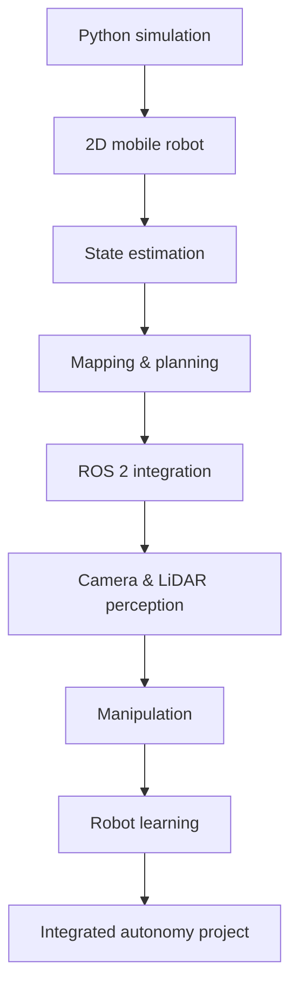

# Robotics for AI Engineers

I'm a data and ML engineer teaching myself robotics, and these are the notes I wish I'd been able to read when I started.

The material I found assumed either much less than I knew — long preambles on Python and linear algebra — or much more, jumping straight to screw theory and Lie groups. Very little was written for someone who is comfortable with Bayesian inference and production systems but has genuinely never had to think about which frame a coordinate is expressed in. So I started writing that, and kept going.

**This is a self-study curriculum, published in case you're on the same path.** Free, no signup, and the code runs in this page.

## Who this is for

Data scientists, data engineers, and ML engineers moving toward robotics and embodied AI. I assume you're comfortable with:

- Python, NumPy, and a deep-learning framework
- Supervised learning and model evaluation
- Data pipelines, Docker, CI/CD

I assume you know **nothing** about coordinate frames, kinematics, feedback control, state estimation, or robotics simulation. That's the gap this is trying to close.

## Why it's built this way

Teaching yourself something has one dominant failure mode: you read an explanation, it makes sense, and you walk away believing you've learned it. Nearly every structural decision here is a defense against that.

1. **Your ML knowledge is the on-ramp.** Every concept arrives attached to something you already understand — Kalman filters as recursive Bayesian inference, costmaps as reward shaping, RRT as the same argument for random over grid search you already accept for hyperparameters.
2. **You write the code, in the page.** Real CPython via Pyodide, with hidden tests. Reading an implementation and writing one turn out to be very different experiences.
3. **The autograders randomize.** A solution tuned to one scenario fails the next — I built them that way after repeatedly catching myself pattern-matching instead of understanding.
4. **Everything converges on one robot.** Each module contributes a real component to an autonomous navigation stack that is *scored*, across many randomized worlds, against a published rubric. "It worked when I ran it" stopped being an acceptable result, and that changed what I learned.

## The ML → robotics bridge

| You already know… | The robotics counterpart |
|---|---|
| Hidden-state models | Robot state estimation |
| Bayesian inference | Kalman and particle filters |
| Data pipelines | Sensor-processing pipelines |
| Feature engineering | Geometric and visual representations |
| Model serving | On-robot inference |
| Distributed systems | ROS 2 nodes, topics, and services |
| Experiment tracking | Simulation experiments |
| Offline evaluation | Closed-loop evaluation |
| Reinforcement learning | Robot policy learning |
| Data drift | Environment and sensor-domain shift |

## The path

## Start here

- New to robotics entirely? Begin with [Module 0: From ML to Robotics](modules/00-transition/index.md).
- Want to see where it ends up first? The [capstone](modules/capstone/index.md) and the [engineering log](capstone-log.md) are the most concrete pages here.
- Comfortable already? Take the [curriculum map](curriculum.md) and pick a track.

## What exists today

Courses I and II — the classical autonomy stack — are complete:

- **33 lessons** across geometry, kinematics & control, state estimation, mapping & SLAM, and planning, each with an interactive quiz and in-browser labs
- **49 coding exercises** and **35 question banks**, every reference solution executed against its own tests in CI
- **Three graded artifacts**: two autograded projects (`python -m grader`, randomized scenarios) and the scenario-evaluated capstone
- **The capstone** in five versions — known map, lidar-only localization, online mapping, navigation among unmapped moving obstacles, and full SLAM with neither a map nor a pose sensor — with an [engineering log](capstone-log.md) of the thirteen debugging campaigns behind them
- **Every module carries the same four rungs** — in-browser exercises, a diagnostic lab where you're handed working-*looking* code with a real bug, an autograded mini-project, and a capstone. 67 lessons, 11 labs, 6 mini-projects, 100 exercises, 3 capstones, all CI-verified
- A [Course I exam](course-1-exam.md) and a researched [frontier map](frontier.md) of where the field is heading

Still to come: Course III (perception, manipulation, robot learning, evaluation & data systems, deployment) and the ROS 2 track.

## Honest caveats

Everything here is **simulation only** — nothing has touched real hardware, and that gap matters. The code is tested, but the teaching is one person's opinion about what makes these ideas click, and my framing of the field is a learner's current understanding rather than expert consensus. The material was written with AI assistance, with every code path executed and verified in CI and every failure documented from real debugging.

If you find something wrong, [please tell me](https://github.com/paulyonghaoli/robotics-for-ai-engineers/issues) — robotics is full of conventions that are easy to state confidently and get backwards, and I'd much rather be corrected than become the source of someone else's bug.

Each lesson carries a status badge: **Draft** → **Technically reviewed** → **Code verified** → **Reproducible**.
