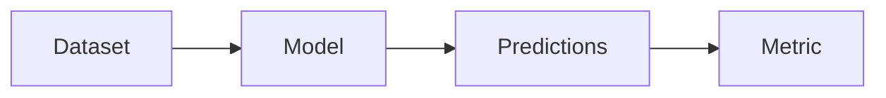
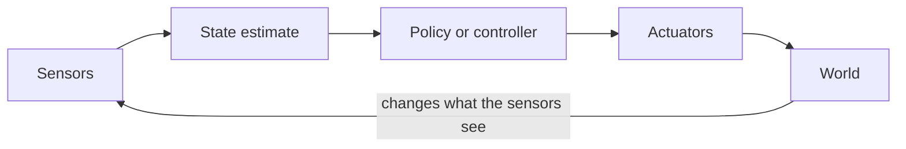

# 0.1 What changes when your model moves a robot

**Status:** Code verified · **Prereqs:** ML practitioner background · **Time:** ~1.5 h · **Verified:** 2026-08-01, Python 3.13

---

## A. Why this matters

You already ship models. You know how to hold out a test set, how to read a
learning curve, how to tell overfitting from underfitting, and how to argue
about metrics in a design review. None of that is wasted here.

And yet the first robotics project almost always goes badly for people with
your background, in a specific and repeatable way: the model looks good by
every measure you know how to compute, and then it fails on the robot in a way
the numbers gave no warning about. The instinct is to conclude the model
needed to be better. Usually it did not. What failed was the *measurement*,
because four assumptions that hold quietly and universally in offline machine
learning stop holding the moment a model's output moves something.

This lesson names those four assumptions. It is the only lesson in the course
with no equations, and it is the one that will save you the most time, because
almost every surprising thing later in the curriculum is one of these four
wearing a costume.

A word on how to read it. Each assumption below is stated, then made concrete
with a number you can check, then connected back to something you already do.
The numbers matter more than the prose — when a claim here has a quantity
attached, the quantity is the argument.

## B. Mental model: the loop

Nearly everything follows from one structural difference. Draw it once and
keep it in your head for the rest of the course.

In offline machine learning, data flows one way. A dataset exists; your model
consumes it and emits predictions; someone or something acts on those
predictions later, elsewhere, and the consequences do not come back to change
the dataset you were scored on.

On a robot, the output re-enters the input.

That backward edge — the world changing what the sensors see next — is the
whole subject. It has a name you will meet constantly:

!!! note "Terms defined here"

    **Open loop** — the system acts without using any feedback about the
    result. A microwave running for 90 seconds is open loop: it does not
    measure how hot the food actually got.

    **Closed loop** — the system measures the result and lets that
    measurement influence the next action. A thermostat is closed loop: it
    reads the temperature and decides again, continuously.

    **Plant** — control theory's name for the thing being controlled, as
    opposed to the controller controlling it. The word is inherited from
    process control, where the plant really was a chemical or power plant. On
    a robot the plant is the robot-plus-world: the part whose behaviour you
    can influence only through actuators, never set directly.

    **State** — the set of numbers that, if you knew them, would let you
    predict what happens next. For a wheeled robot: position, heading,
    velocity. You do not get to observe these directly; see assumption 3.

The rest of this lesson is four consequences of that backward edge.

## C. The four assumptions that stop holding

### 1. Your outputs change your inputs

An ad-ranking model's predictions do not move the users. A robot's predictions
move the robot, and the next sensor reading comes from the *new* position.
Errors therefore compound rather than average out.

This sounds abstract until you attach a number to it, so here is the number.
Suppose a perception model is 95% accurate. In an offline setting the natural
reading is "it will be wrong on 5% of frames, roughly independently, and the
mistakes will wash out." In a closed loop that reading is wrong twice over.

First, the errors are **correlated**, not independent. A model that
misjudges a particular lighting condition will misjudge it on every
consecutive frame in that lighting, because the frames are not independent
draws — they are a trajectory through a world that changes slowly.

Second, and more importantly, the errors are **self-selecting**. Act on a
wrong belief and you move somewhere slightly different from where you should
be. If the model is less reliable in that new region — and it usually is,
because the training data came from a system that did not make that mistake —
then the next prediction is worse, which moves you further, and so on. The
system does not sample the state space uniformly; it *steers itself toward
its own failure modes*.

This is why the field evaluates by driving the course and counting collisions
rather than by computing a score on a held-out set. The offline metric is not
useless — it is a fine regression test, and it will tell you if you have
broken something badly. But it is a unit test, not a verdict.

You will see this concretely in lesson 0.5, where a cloned driving policy
scores a *perfect* 100% action agreement on genuinely held-out data and then
leaves the lane by 50 metres. Nothing is overfitted there; the score is
honest; the score is simply answering a different question from the one that
matters.

If you have worked on recommender systems or any model whose outputs shape
the data collected next, you have met a version of this — it is the feedback
loop that makes A/B testing necessary. Robotics has that problem at 50 Hz,
with physical consequences, and without the option of a holdout population.

### 2. Latency is part of correctness

In batch machine learning, a slow correct answer is still a correct answer.
Your model can take an extra 200 ms and nothing about its accuracy changes.

On a robot, an answer that arrives late is *wrong*, even if it was right when
it was computed. The arithmetic:

> A robot travelling at 2 m/s. An obstacle detector that is perfectly accurate
> but takes 300 ms end to end — camera exposure, transfer, inference,
> post-processing, message passing.
>
> \(2 \text{ m/s} \times 0.3 \text{ s} = 0.6 \text{ m}\)
>
> The detection describes where the obstacle was 60 cm ago. If the obstacle is
> also moving toward you at 2 m/s, the gap has closed by 1.2 m.

Accuracy did not degrade. The answer simply describes a world that no longer
exists. This is why every robotics subsystem carries a **latency budget**:
a stated maximum time from sensor sample to actuator command, allocated across
the stages of the pipeline the way you would allocate an error budget across
services.

!!! note "Terms defined here"

    **Latency budget** — an allocation of a total permitted delay across the
    stages of a pipeline. If the loop must close in 100 ms and perception
    takes 60, everything else — planning, control, actuation, communication —
    must fit in 40.

    **Jitter** — variation in that delay from cycle to cycle. Often worse than
    a large but constant latency, because a constant delay can be compensated
    for and a varying one cannot.

The engineering habit this creates is unfamiliar coming from ML: you will
frequently choose a less accurate model that meets its deadline over a more
accurate one that does not, and this is not a compromise — it is the correct
decision, because the late answer's effective accuracy is lower once you
account for how much the world moved. Module 13 makes this precise and asks
you to compute it.

### 3. The state is hidden and the sensors lie

There is no `SELECT pose FROM robot`. Nothing anywhere in the system contains
the robot's true position.

This is the hardest thing to internalise, because in every dataset you have
ever worked with, the features were simply *given*. Here, position, velocity,
heading and the map are all **beliefs** — quantities inferred from sensor
readings that are noisy, biased, delayed, occasionally missing entirely, and
sometimes confidently wrong.

Concretely, the sensors you will meet:

| Sensor | What it actually gives you | How it lies |
|---|---|---|
| Wheel odometry | Distance each wheel turned | Wheels slip; error accumulates without bound |
| IMU | Acceleration and angular rate | Biased and drifting; integrating it twice compounds the drift |
| GPS | Absolute position, ~metres | Unavailable indoors; multipath near buildings |
| Lidar | Ranges to surfaces | Fails on glass and dark matte surfaces; returns nothing |
| Camera | Pixels | No scale; fails in low light; motion blur |

Not one of them reports position. Position is *computed*, continuously, from
combinations of these, and the computation must carry an explicit
representation of its own uncertainty — otherwise the system cannot tell the
difference between "I am at x = 3.0" and "I am somewhere around x = 3.0, give
or take four metres."

!!! note "Terms defined here"

    **State estimation** — computing a belief about the hidden state from a
    history of noisy observations, along with a measure of how uncertain that
    belief is. Module 3 is entirely about this.

    **Ground truth** — the true value of a quantity. Available in simulation
    and in carefully instrumented labs; *not* available at runtime on a real
    robot. Any algorithm that needs ground truth to work cannot ship.

Here is the good news, and it is genuinely good: this is the single most
transferable thing you already own. If you have worked with hidden Markov
models, Kalman filters, variational inference, or any latent-variable model,
Module 3 will feel like coming home. It is applied Bayesian inference running
at 50 Hz with a hard deadline. The concepts are ones you have; what is new is
the deadline and the consequences of being wrong.

### 4. Mistakes are physical

A bad recommendation wastes a click. A bad trajectory breaks a wrist — the
robot's, or a person's.

This changes the engineering culture in ways that are easy to underestimate
from the outside. Safety stops being a metric to optimise and becomes a
constraint to *prove*. You will encounter machinery that has no analogue in
an ML codebase:

!!! note "Terms defined here"

    **Watchdog** — a timer that must be reset regularly by a healthy system.
    If it expires, something has hung, and the robot is stopped by a mechanism
    that does not depend on the hung component.

    **Envelope** — hard limits on speed, acceleration, force or workspace,
    enforced below the level of the policy, so that even a completely wrong
    command cannot exceed them.

    **Fallback behaviour** — a simple, verifiable action taken when the
    sophisticated system is unavailable or distrusted. Usually "decelerate
    smoothly and stop."

    **E-stop** — emergency stop. A physical, usually hardware-level circuit
    that removes power to the actuators. Deliberately not software.

The pattern in all four is the same: the safe behaviour is enforced by
something *simpler* and more verifiable than the thing it is protecting
against. A learned policy cannot be proven correct, so it is wrapped in
something that can be. You will build exactly this in Module 11.

The cultural consequence: code review on a robotics team reads more like
avionics review than web review, and "move fast and break things" acquires a
literal and unwelcome meaning.

## D. What transfers directly

It is worth being explicit about how much of your existing skill carries over,
because the list is longer than newcomers expect.

| What you already do | Where it lands here |
|---|---|
| Building data pipelines | Sensor pipelines are data pipelines with deadlines (Modules 12, 13) |
| Evaluation rigour, holdout discipline | Scenario suites, seeded replay, statistical care with small n (Module 10) |
| Distributed systems | A robot *is* a distributed system: many processes, one clock, unreliable links (Module 6) |
| Bayesian / latent-variable modelling | State estimation (Module 3) |
| Deployment, versioning, rollback | Fleet deployment and staged rollout (Module 11) |
| Profiling and performance work | Latency budgets and the roofline model (Module 13) |

You are not starting over. You are re-basing onto a system where the feedback
loop is closed, the clock matters, the state is hidden, and the failures are
physical.

## E. Experiment — watch the loop do the damage

Reading about compounding error is much less convincing than watching it. The
exercise below runs the same disturbance twice: once with no feedback, once
with feedback.

Watch for two things. First, that the open-loop error grows without bound
while the closed-loop error stays small — that is feedback doing its job.
Second, and more important, what happens when you break the controller's
assumptions: feedback is not magic, and a loop closed around a wrong belief
degrades faster than no loop at all.

<code-exercise src="ml0-open-vs-closed"></code-exercise>

## F. Failure modes

The characteristic ways this lesson's ideas go wrong in practice:

- **Shipping on an offline metric.** The most common and most expensive.
  Symptom: excellent held-out numbers, poor real-world behaviour, and a team
  that responds by collecting more data. Diagnosed in lesson 0.5.
- **Optimising accuracy past the deadline.** A larger model improves the
  metric and misses the latency budget, making end-to-end behaviour worse
  while the dashboard improves.
- **Treating the state estimate as ground truth.** Using the mean of a belief
  and discarding its variance, so the system cannot tell confident from
  uncertain and behaves identically in both cases.
- **Safety implemented inside the policy.** If the same component that can be
  wrong is also the one enforcing the limits, the limits are not enforced.

## G. Questions

<quiz-bank src="transition-l1-changes"></quiz-bank>

## H. Annotated references

| Reference | Type | Difficulty | Why read it |
|---|---|---|---|
| Thrun, Burgard & Fox, *Probabilistic Robotics*, ch. 1 | book | introductory | The canonical framing of uncertainty as robotics' central problem, rather than as a nuisance to be engineered away |
| Karpathy, *"Software 2.0"*, read alongside robotics-lens critiques | essay | introductory | Useful for locating where learned components legitimately fit inside a safety-constrained stack — and where they do not |
| Any published AV incident postmortem | report | intermediate | Read one and annotate the loop: which assumption above failed first, and what the offline metrics said at the time |

## I. Portfolio extension

Take a model you have already shipped and write one page answering: if its
output moved something physical, which of the four assumptions would break
first, and what would you have to measure to notice? This is a good interview
answer to have ready, and a better way to check you have absorbed this lesson
than any quiz.
