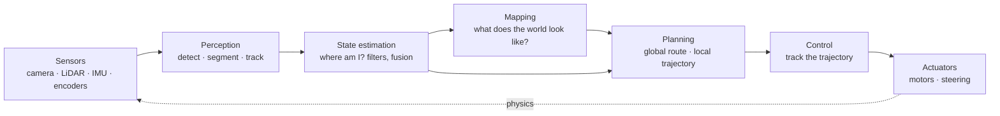

# 0.2 Anatomy of an autonomy stack

**Status:** Technically reviewed · **Prereqs:** lesson 0.1 · **Time:** ~1.5 h

---

## A. Why this matters

Every autonomous robot — warehouse AMR, self-driving car, inspection drone — is a variation of one architecture. Learn it once and every robotics codebase becomes navigable: you'll know what must exist, what talks to what, and where a given bug is likely to live. This architecture is also this curriculum's table of contents.

## B. The loop

The dotted edge is the one ML pipelines don't have: actuation changes the world, which changes the next sensor reading. Everything in Modules 1–6 lives on this diagram.

**Typical rates** (a mobile robot): sensors 10–100 Hz (LiDAR ~10, camera ~30, IMU 100–1000); perception 10–30 Hz; estimation 50–100 Hz; global planning 0.1–1 Hz; local planning 10–20 Hz; control 50–1000 Hz. Note the shape: *the closer to the motors, the faster and dumber; the closer to the goal, the slower and smarter.* This rate hierarchy is a design principle, not an accident — fast layers keep the robot safe while slow layers think.

## C. Where the ML lives

Perception is overwhelmingly learned (detection, segmentation — Module 7). Estimation is classical with learned components creeping in. Planning is classical search/optimization with learned heuristics arriving (Module 5, 9). Control is classical (PID/MPC) except at the research frontier of learned policies (Module 9), where a network may replace planning + control wholesale — the "policy" arrow from sensors to actuation. Production robots today: learned perception, classical everything else, learned components expanding outward. Plan your career accordingly.

## D. The same loop as software

Each block is typically a process (a ROS 2 *node*, Module 6) communicating over pub/sub topics. The diagram *is* a microservice architecture with unusually strict latency contracts — which is why your distributed-systems experience transfers so well, and why Module 6 will feel like meeting an old friend with new vocabulary: topics ≈ message queues, QoS ≈ delivery semantics, bags ≈ event logs, TF ≈ a shared reference-data service.

## E. Reading an unfamiliar robot codebase

The drill, in order: (1) find the launch files — they enumerate the processes; (2) map each process onto the diagram above; (3) find the topic graph (`ros2 topic list`, or grep for publishers) — that's the arrows; (4) find the frames (TF tree) — that's Module 1; (5) only then read algorithm code. Architecture first, algorithms second — the same way you'd approach an unfamiliar data platform through its DAGs before its SQL.

## F. Questions

<quiz-bank src="transition-l2-anatomy"></quiz-bank>

## G. References

| Reference | Type | Difficulty | Why read it |
|---|---|---|---|
| [Nav2 architecture docs](https://docs.nav2.org/concepts/index.html) | docs | introductory | A production autonomy stack's actual block diagram — compare with section B |
| Autoware architecture overview | docs | intermediate | The same loop at self-driving scale |
| [ROS 2 concepts](https://docs.ros.org/en/jazzy/Concepts.html) | docs | introductory | The middleware these blocks run on (full treatment in Module 6) |
