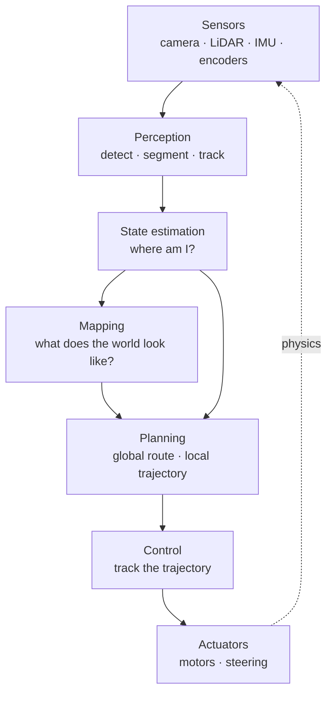

# 0.2 Anatomy of an autonomy stack

**Status:** Technically reviewed · **Prereqs:** lesson 0.1 · **Time:** ~1.5 h

---

## A. Why this matters

Every autonomous robot you will ever open up — a warehouse AMR, a self-driving
car, an inspection drone, a robot arm packing boxes — is a variation on one
architecture. There are only so many ways to arrange "sense, decide, act" when
the acting changes what you sense next, and the field converged on essentially
one arrangement decades ago.

That is unusually good news for someone arriving from another discipline. It
means you can learn the shape once and then navigate almost any robotics
codebase: you will know what *must* exist somewhere, what talks to what, and —
most usefully when debugging — which block a given symptom is likely to live
in. A robot that drifts sideways over minutes and a robot that oscillates
twenty times a second are broken in different blocks, and you can tell which
from the symptom alone once you know the diagram.

It is also, not coincidentally, this curriculum's table of contents.

!!! note "Terms defined here"

    **AMR** — autonomous mobile robot. The warehouse kind: a wheeled base
    that navigates a known building without following a fixed track. Contrast
    **AGV** (automated guided vehicle), which follows a physical line or wire
    and cannot deviate.

    **Autonomy stack** — the whole collection of software between the sensors
    and the motors. "Stack" is used the same way you'd use it for a web
    stack: a set of layers each depending on the one below.

## B. The loop

Read it once block by block, because each name is a term of art that means
something narrower than the English word suggests.

**Sensors** produce raw measurements: pixel arrays, range returns, wheel tick
counts, accelerations. Nothing here is interpreted. A camera does not produce
"a pedestrian"; it produces a 1920×1080 array of numbers.

**Perception** turns those raw measurements into statements about the world:
there is an object here, of this class, this big, moving this way. This is
where most of the deep learning lives, and it is the block your existing
skills map onto most directly (Module 7).

**State estimation** answers *where am I*, continuously, from sensors that
each answer it badly. This is the block with no analogue in offline ML, and
lesson 0.1's third assumption is entirely about it (Module 3).

**Mapping** answers *what does the world look like* and persists it, so the
robot is not rediscovering the same wall every second (Module 4).

**Planning** turns the goal plus the map plus the current state into a
trajectory: a route through the building, then a specific path over the next
few seconds (Module 5).

**Control** turns that intended trajectory into actual motor commands, and
corrects continuously when the robot fails to follow it — which it always
does, because wheels slip and motors lag (Module 2).

**Actuators** apply torque and force. The world responds.

And then the dotted edge — the one an ML pipeline does not have. Actuation
changes the world, which changes the next sensor reading, which changes every
downstream block's input. Everything in Modules 1–6 lives somewhere on this
diagram, and lesson 0.1's four broken assumptions are all consequences of that
dotted line existing.

### The rate hierarchy

Here is the part that surprises people, and it is worth internalising early,
because it explains a great deal of robotics architecture that otherwise looks
arbitrary. **The blocks do not all run at the same speed.** Typical rates for
a mobile robot:

| Block | Typical rate | Period |
|---|---|---|
| IMU | 100–1000 Hz | 1–10 ms |
| Control | 50–1000 Hz | 1–20 ms |
| State estimation | 50–100 Hz | 10–20 ms |
| Camera | ~30 Hz | 33 ms |
| Perception | 10–30 Hz | 33–100 ms |
| LiDAR | ~10 Hz | 100 ms |
| Local planning | 10–20 Hz | 50–100 ms |
| Global planning | 0.1–1 Hz | 1–10 s |

Notice the shape: **the closer to the motors, the faster and dumber; the
closer to the goal, the slower and smarter.** The control loop runs hundreds
of times a second and does something arithmetically trivial. The global
planner runs once every few seconds and does something combinatorially
expensive.

This is a design principle, not an accident, and the reason is safety under
uncertainty. The fast, simple layers are the ones you can reason about,
test exhaustively, and trust. They keep the robot stable and inside its limits
while the slow, clever layers think. If the clever layer stalls for 200 ms,
the fast layer keeps the wheels tracking the last good trajectory and nothing
catastrophic happens. Invert the hierarchy — put the expensive thinking in the
inner loop — and a single slow frame becomes a physical event.

A concrete version of the same argument. Suppose the control loop runs at
100 Hz on a robot moving at 1.5 m/s. Each cycle the robot travels

\[
1.5 \text{ m/s} \times 0.01 \text{ s} = 1.5 \text{ cm}
\]

so the largest correction the loop can be late by is centimetre-scale. Drop
that loop to 10 Hz and the same arithmetic gives 15 cm per cycle — the robot
is now committing to a decision for a distance comparable to its own
clearance margins. Nothing about the algorithm changed; the rate alone moved
it from safe to unsafe.

## C. Where the machine learning actually lives

A fair question on arrival is: if this is a robotics curriculum for ML
engineers, which of these boxes is ML? The honest answer for a robot shipping
today:

| Block | Status in production | Where it's covered |
|---|---|---|
| Perception | **Overwhelmingly learned.** Detection, segmentation, tracking are neural networks and have been for years | Module 7 |
| State estimation | Classical (Kalman-family filters), with learned components appearing at the edges | Module 3 |
| Mapping | Classical geometry; learned place-recognition and loop closure creeping in | Module 4 |
| Planning | Classical search and optimisation; learned heuristics and learned cost functions arriving | Modules 5, 9 |
| Control | Classical (PID, MPC) almost everywhere | Module 2 |
| End-to-end policy | Research frontier: one network from sensors to actuation, replacing planning *and* control | Module 9 |

The summary for a production robot in 2026: **learned perception, classical
everything else, with learned components expanding outward from perception**.
The end-to-end policy — the single network that swallows the middle of the
diagram — is real, is improving quickly, and is not yet how most shipping
robots work.

This matters for how you spend your time. The instinct arriving from ML is to
go straight to the end-to-end policy, because it is the most familiar-looking
and the most exciting. But the teams building those policies evaluate them
against the classical stack, debug them with classical tools, and will expect
you to understand the baseline you are claiming to beat. Lesson 0.3 makes the
career version of this argument.

## D. The same loop, as software

Each block in the diagram is typically a separate operating-system process,
communicating with the others over an asynchronous message bus.

!!! note "Terms defined here"

    **Node** — one process in the robot's software graph, usually
    responsible for one block. "The perception node", "the controller node".

    **Topic** — a named channel that nodes publish to and subscribe to.
    Publishers do not know who is listening, and subscribers do not know who
    is sending. This is ordinary publish/subscribe messaging.

    **QoS (quality of service)** — the delivery contract on a topic: is it
    reliable or best-effort, are old messages kept for late joiners, is there
    a deadline. Getting these wrong is a common and confusing source of
    "my subscriber receives nothing".

    **Bag** — a recording of all messages on selected topics, with
    timestamps, replayable later. The robot's equivalent of an event log,
    and the foundation of offline debugging.

    **TF** — the transform system: a shared, continuously-updated service
    answering "where is frame A relative to frame B, at time t". Module 1 is
    the mathematics behind it.

So the diagram *is* a microservice architecture, with unusually strict latency
contracts and a shared coordinate-system service. If you have built
distributed systems, the mapping is nearly one-to-one:

| You already know | Robotics calls it |
|---|---|
| Message queue / pub-sub topic | Topic |
| Delivery semantics, at-least-once, durability | QoS profile |
| Event log, replayable | Bag |
| Service discovery | Node discovery (handled by the middleware) |
| Shared reference-data service | TF tree |
| Request/response RPC | Service |
| Long-running job with progress and cancellation | Action |

Module 6 covers all of it. The vocabulary is new; the concepts are not.

## E. Reading an unfamiliar robot codebase

This is a practical drill, and it is worth doing in this order rather than the
order instinct suggests. Instinct says open the algorithm files. That is the
last step, not the first.

1. **Find the launch files.** These enumerate which processes actually run,
   and with which parameters. They are the deployment manifest. A codebase may
   contain twenty nodes and launch six of them.
2. **Map each running process onto the diagram in section B.** Most will land
   cleanly. The ones that don't are usually either hardware drivers or
   glue — note them and move on.
3. **Find the topic graph** — the arrows. `ros2 topic list` and
   `ros2 node info` on a running system, or grep for publisher and subscriber
   declarations in a static checkout. This tells you what actually depends on
   what, which is frequently *not* what the architecture document claims.
4. **Find the frames**, i.e. the TF tree. This tells you what coordinate
   systems exist and who is responsible for connecting them. Module 1 is
   entirely about reading this correctly, and a surprising share of robotics
   bugs live here.
5. **Only now read algorithm code**, and only for the block you actually care
   about.

Architecture first, algorithms second. It is the same discipline as
approaching an unfamiliar data platform through its DAGs and table lineage
before reading anybody's SQL — and for the same reason: the structure tells
you where to look, and reading code without it is a random walk.

## F. Failure modes

Characteristic ways this architecture goes wrong, each of which you will meet
properly later:

- **A slow block inside a fast loop.** Someone puts a 200 ms perception call
  inside the control loop's path. The loop rate silently collapses and the
  robot becomes unstable in a way that looks like bad tuning.
- **Two sources of truth for pose.** The estimator publishes one pose, some
  node caches another, and they diverge. Symptoms appear in a block far from
  the cause.
- **Ignoring the dotted edge in test.** Every block is unit-tested with
  recorded inputs, all pass, and the assembled system fails — because
  recorded inputs never respond to the robot's actions. Lesson 0.5, bug 1.
- **QoS mismatch.** Publisher and subscriber disagree on the delivery
  contract, so no messages arrive at all, with no error anywhere. Module 6.

## G. Questions

<quiz-bank src="transition-l2-anatomy"></quiz-bank>

## H. Annotated references

| Reference | Type | Difficulty | Why read it |
|---|---|---|---|
| [Nav2 architecture docs](https://docs.nav2.org/concepts/index.html) | docs | introductory | A production autonomy stack's real block diagram. Compare it against section B and note what they split that we merged |
| Autoware architecture overview | docs | intermediate | The same loop at self-driving scale, where each block becomes a subsystem in its own right |
| [ROS 2 concepts](https://docs.ros.org/en/jazzy/Concepts.html) | docs | introductory | The middleware these blocks run on. Skim now for vocabulary; Module 6 is the full treatment |

## I. Portfolio extension

Pick an open-source robot stack you have never seen — Nav2, Autoware, or any
robot on GitHub with launch files — and run the section E drill on it. Produce
one diagram of its actual topic graph annotated with which block of section B
each node belongs to, and one paragraph on anything that did not fit the
template. The things that don't fit are usually the interesting part.
