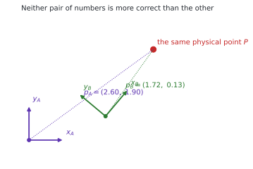
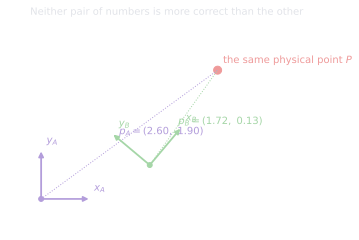
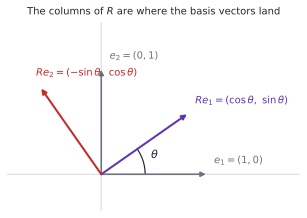
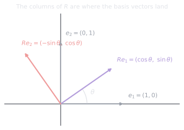
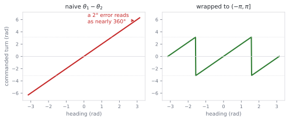
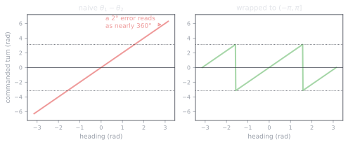
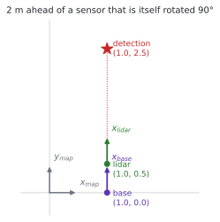
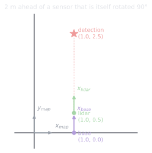

# 1.1 Coordinate frames and rigid transformations

**Status:** Code verified · **Prereqs:** linear algebra, NumPy · **Time:** ~2 h · **Verified:** 2026-08-01, Python 3.13, NumPy ≥ 1.26

---

## A. Why this matters

Every number on a robot is measured relative to something, and the something
differs from sensor to sensor. The LiDAR reports the distance and bearing of
obstacles relative to its own housing, the wheel encoders describe how far the
chassis has rolled relative to where it started, the map stores obstacles
relative to a corner of the building, and an arm reports joint angles relative
to its own shoulder. None of these agree with one another, and the planner
needs all of them expressed in a single common frame before it can make even
the simplest decision.

Reconciling them is the subject of this lesson, and getting it wrong is not an
exotic or occasional failure. It is *the* characteristic robotics bug, and
what makes it expensive is that the symptoms rarely point at the cause. A map
that appears to rotate around the robot as it drives, obstacles that appear
mirrored so that the robot swerves confidently into them, a goal that drifts a
little further away each time you approach it, or a system that works
perfectly in simulation and fails on hardware because a sensor mount is 12 cm
from where the code believes it is — every one of those is a two-line fix once
you recognise what you are looking at, and a lost week if you do not.

The machinery that prevents all of it amounts to about a hundred lines of
code, and the entire remainder of the stack is built on top of it.

!!! note "Terms defined here"

    **Frame** (short for *coordinate frame*) — a point of view, consisting of
    an origin and a set of axes. When we say "the sensor frame" we mean
    positions measured from the sensor's origin, along the sensor's own axes.

    **Pose** — position and orientation taken together, which in 2D means the
    three numbers \((x, y, \theta)\) and in 3D means six. A pose is always
    relative to some frame, so "the robot's pose" is an incomplete statement
    until you say which frame it is expressed in.

    **Rigid transform** — a change of frame that preserves every distance and
    every angle, which means rotation and translation but no scaling, no
    shearing and no reflection. Physical objects move rigidly, which is why
    this restricted class of transformations is the one robotics cares about.

    **Dead reckoning** — estimating where you are by accumulating how far you
    have moved, without reference to anything external. It is cheap and always
    available, and it drifts without bound.

## B. Mental model

### A frame is a point of view

When the LiDAR reports that a point lies at \((2, 0)\), what it means is that
the point is two metres away along the LiDAR's own x-axis. That same physical
point, described from the map's point of view, is a completely different pair
of numbers, and neither description is more correct than the other. They are
two accounts of one fact, told from two positions.

<figure class="rai-fig" markdown>
{.fig-light}
{.fig-dark}
<figcaption markdown>The same point P, described from two frames. Frame B is translated by (1.6, 0.5) and rotated by 50° relative to A, so the numbers differ entirely even though nothing physical has moved.</figcaption>
</figure>

Because both descriptions refer to the same physical point, there must be a
rule for converting between them, and that rule depends only on how the two
frames are arranged relative to each other. That rule is the transform, and
because the frames' relationship is fixed at any given instant, the same rule
converts every point.

### A transform is a sentence about two points of view

We write \(T_{A \leftarrow B}\), rendered in code as `T_A_B`, and we read it
aloud as "frame B, as seen from frame A". The arrow notation is not
decoration, because it gives us the single most useful defensive habit in
robotics: **read subscripts right to left, and cancel adjacent inner
subscripts exactly as you would cancel units in dimensional analysis.**

\[
T_{map \leftarrow sensor} = T_{map \leftarrow base}\; T_{base \leftarrow sensor}
\]

The inner `base` appears once on each side of the multiplication and cancels,
leaving `map ← sensor`, which is what we wanted. The reason this habit is
worth building is that it catches errors before execution rather than after.
If you write

```python
T_map_sensor = T_base_map @ T_base_sensor      # map ← base? base ← sensor?
```

the subscripts do not cancel, because `base` appears on the wrong side of the
first arrow. That line is visibly broken on inspection even though it runs
without complaint and produces numbers that look entirely plausible, and
plausible-looking wrong numbers are precisely what makes frame bugs expensive.

### One transform, two jobs

The idea that confuses people longest is that a single transform does double
duty. It **describes a pose**, in that \(T_{map \leftarrow base}\) *is* where
the robot sits in the map, and it simultaneously **converts data**, in that
multiplying a point expressed in the base frame yields the same physical point
expressed in the map frame.

These sound like two different jobs, and it is reasonable to expect two
different objects to do them. They are the same matrix because "where B is,
seen from A" and "how to re-express B's numbers in A's terms" are the same
information written down once. If you know exactly how frame B is positioned
and oriented relative to frame A, you know everything required to translate
between their vocabularies, and conversely a complete translation rule tells
you exactly where B sits.

## C. Mathematical formulation

### Rotation, and what the columns mean

A rotation by angle \(\theta\) in the plane is the matrix

\[
R(\theta) = \begin{bmatrix} \cos\theta & -\sin\theta \\ \sin\theta & \cos\theta \end{bmatrix}
\]

which is worth understanding structurally rather than memorising, because the
structure is what you will reason with when debugging. The key observation is
that the columns of any matrix are the images of the basis vectors: the first
column is where \((1,0)\) lands and the second column is where \((0,1)\) lands.
So the first column being \((\cos\theta, \sin\theta)\) is just the statement
that the x-axis swings up to angle \(\theta\), and the second column being
\((-\sin\theta, \cos\theta)\) says the y-axis swings by the same amount while
staying perpendicular to it.

<figure class="rai-fig" markdown>
{.fig-light}
{.fig-dark}
<figcaption markdown>Reading a rotation matrix by its columns. Once you see R this way you can write it down from the picture rather than recalling where the minus sign goes, which is the sign error in question 3 below.</figcaption>
</figure>

Two properties of this matrix carry essentially all the weight, and neither
concerns the individual entries:

\[
R^\top R = I \qquad \text{and} \qquad \det(R) = +1
\]

The first says the columns are orthonormal, which is to say mutually
perpendicular and of unit length, and this is exactly what it means for the
transformation to preserve distances and angles. It has a consequence we will
use constantly, namely that \(R^{-1} = R^\top\), so inverting a rotation costs
a transpose and nothing else. The second property distinguishes a rotation
from a reflection, since a reflection also has orthonormal columns but flips
handedness and has determinant \(-1\). The set of matrices satisfying both
conditions is called \(SO(2)\), the special orthogonal group, where "special"
refers to the determinant being \(+1\) rather than \(-1\).

That determinant condition is not pedantry, and question 3 below is a real bug
in which a single misplaced minus sign still yields \(\det = +1\) yet builds
\(R(-\theta)\) instead of \(R(\theta)\). Every self-consistency check you can
think of passes while the entire world is mirrored, which is the lesson's
recurring theme in miniature.

### Adding translation, and why homogeneous coordinates

Rotation is a matrix multiplication and translation is a vector addition, so
the obvious implementation carries two objects around and applies them in a
remembered order. That works, and it is unpleasant to compose: chaining three
frames means tracking three rotations and three translations and getting the
interleaving right every time.

The standard escape is to make translation into a multiplication as well, by
appending a dummy coordinate to every point and a dummy row to every
transform:

\[
\tilde p = \begin{bmatrix} x \\ y \\ 1 \end{bmatrix}, \qquad
T = \begin{bmatrix} R & t \\ 0\ 0 & 1 \end{bmatrix},
\qquad\text{so that}\qquad
\tilde p_A = T_{A \leftarrow B}\, \tilde p_B .
\]

Multiplying out the top row shows that this computes \(R p_B + t\), which is
rotation followed by translation, in one operation. The real payoff, though,
is composition: because both operations now live inside a single matrix,
composing two transforms is simply multiplying two matrices, and a chain of
frames becomes a chain of matrix products with no bookkeeping at all. This
family of matrices is called \(SE(2)\), the special Euclidean group.

The 1 in the last entry of \(\tilde p\) is what causes the translation column
to be applied, and this leads to a distinction that causes real bugs. If you
ever transform a *direction* rather than a *point* — a velocity, say, or a
surface normal — you use a 0 in that slot instead, because a direction should
be rotated but must not be translated. Moving a velocity vector by three
metres is meaningless, and the resulting error is subtle because it vanishes
near the origin and grows with distance from it.

### The inverse, derived rather than quoted

Because \(R\) is orthogonal, a rigid transform has a closed-form inverse and
never requires a general matrix solve:

\[
T^{-1} = \begin{bmatrix} R^\top & -R^\top t \\ 0\ 0 & 1 \end{bmatrix}
\]

The \(-R^\top t\) term looks arbitrary, so it is worth deriving once. We want
the matrix \(S\) satisfying \(ST = I\), and since we already expect the
rotation block to be \(R^\top\), we can write \(S\) with an unknown
translation \(u\) and multiply:

\[
\begin{bmatrix} R^\top & u \\ 0 & 1 \end{bmatrix}
\begin{bmatrix} R & t \\ 0 & 1 \end{bmatrix}
= \begin{bmatrix} R^\top R & R^\top t + u \\ 0 & 1 \end{bmatrix}
= \begin{bmatrix} I & R^\top t + u \\ 0 & 1 \end{bmatrix}
\]

For the result to be the identity we need \(R^\top t + u = 0\), which gives
\(u = -R^\top t\). The intuition behind the algebra is that undoing "rotate,
then translate" means undoing the translation *as measured in the rotated
frame*, which is why the rotation is applied to \(t\) before the negation
rather than after.

### Angles are periodic, and subtraction is not

Angles wrap around, and ordinary subtraction does not know that. If a robot is
currently heading at \(179°\) and the target heading is \(-179°\), then the
naive difference is \(358°\), so a controller that simply subtracts will turn
the robot almost the whole way around to reach a heading that was two degrees
away.

<figure class="rai-fig" markdown>
{.fig-light}
{.fig-dark}
<figcaption markdown>The same heading error computed two ways. The naive difference runs off to nearly ±2π near the wrap point, and a controller that obeys it spins the long way round.</figcaption>
</figure>

The remedy is to wrap the result of every heading subtraction into the
interval \((-\pi, \pi]\):

```python
def wrap_angle(theta):
    return -(np.mod(-theta + np.pi, 2 * np.pi) - np.pi)   # -> (-pi, pi]
```

The interval is half-open deliberately, because \(+\pi\) and \(-\pi\) name the
same heading and exactly one of them has to be chosen if the function is to be
single-valued. This convention is stated once in `CONTRIBUTING.md` and used
throughout the codebase, which is the only workable approach to conventions in
general.

What makes this bug genuinely nasty is that it is intermittent. It appears
only when the heading error happens to cross \(\pm\pi\), which in most test
runs it does not, so the code passes its tests, ships, and then misbehaves
once every few hundred manoeuvres in a way that is hard to reproduce on
demand.

## D. From ML to robotics

| You already know | The robotics version | Where they differ |
|---|---|---|
| Basis change, or projecting an embedding into another space | Transforming a point from `sensor` into `map` | The spaces are physical, so confusing them crashes a robot rather than degrading a metric |
| A DAG of pipeline stages, and data lineage | The transform tree (TF2): a graph of frames with timestamped edges | Edges are time-indexed and interpolated, so querying at the wrong instant is a real and common bug |
| Schema mismatch between two services | Convention mismatch: scalar-first versus scalar-last quaternions, degrees versus radians, `T_A_B` versus `T_B_A` | Same class of bug and same fix — pick one, document it, validate at the boundary |
| Numerical drift in a long float pipeline | Composed rotations slowly ceasing to be orthonormal | Repaired by explicit renormalisation, discussed in lesson 1.2 |

The third row deserves emphasis, because frame-convention bugs really are
schema bugs and your instincts from data engineering transfer directly. The
fix is never cleverness; it is a documented convention plus validation at
every boundary where data crosses between components that were written by
different people at different times.

## E. Minimal implementation

The library implementation lives in
[`robotics_ai/geometry/transforms2d.py`](https://github.com/paulyonghaoli/robotics-for-ai-engineers/blob/main/robotics_ai/geometry/transforms2d.py),
and the essential core is short enough to hold in your head at once.

```python
import numpy as np

def se2(x, y, theta):
    """Pose (x, y, theta) as a 3x3 homogeneous SE(2) transform."""
    c, s = np.cos(theta), np.sin(theta)
    return np.array([[c, -s, x],
                     [s,  c, y],
                     [0,  0, 1.0]])

def se2_inverse(T):
    """Invert: se2_inverse(T_a_b) is T_b_a."""
    R, t = T[:2, :2], T[:2, 2]
    Ti = np.eye(3)
    Ti[:2, :2] = R.T
    Ti[:2, 2] = -R.T @ t
    return Ti

def wrap_angle(theta):
    """Wrap to (-pi, pi]."""
    return -(np.mod(-theta + np.pi, 2 * np.pi) - np.pi)
```

### A worked example, reasoned through by hand

Suppose a robot sits at \((1, 0)\) in the map and faces the \(+y\) direction,
so its heading is \(\theta = 90°\). A LiDAR is bolted 0.5 m ahead of the base,
measured along the base's own x-axis, and it reports a detection 2 m straight
ahead of itself. The question is where that detection lies in the map.

```python
T_map_base   = se2(1.0, 0.0, np.pi / 2)   # robot pose in the map
T_base_lidar = se2(0.5, 0.0, 0.0)         # sensor mount, static
T_map_lidar  = se2_compose(T_map_base, T_base_lidar)

p_lidar = np.array([2.0, 0.0])            # detection, in the sensor frame
p_map   = transform_points(T_map_lidar, p_lidar)
```

Before running any of it, work the answer out by hand, because this is exactly
the reasoning you will be doing at the point where something has gone wrong
and the code cannot be trusted. Since the robot faces \(+y\), the base's
x-axis points along the map's \(+y\) direction, so the sensor's 0.5 m offset
"ahead" along base-x is 0.5 m along map-\(+y\), placing the sensor at
\((1, 0.5)\). The sensor inherits the base's orientation because the mount
adds no rotation, so the sensor's x-axis also points along map-\(+y\), and the
detection 2 m along that axis therefore lands at \((1, 2.5)\).

<figure class="rai-fig" markdown>
{.fig-light}
{.fig-dark}
<figcaption markdown>The worked example, drawn to scale from the same transforms the code composes. The sensor's "2 m straight ahead" points along map +y because the base is rotated, which is the step most often got wrong.</figcaption>
</figure>

Running the code returns `[1.0, 2.5]`, which agrees. Notice that we checked
the subscripts before we checked the numbers: `map←base` composed with
`base←lidar` cancels to `map←lidar`, and had it not cancelled there would have
been no point running anything.

### Practice — write and run code here

Implement the machinery yourself, in the page. **Run** executes your code and
**Submit** also runs the hidden checks, and the first run downloads the Python
runtime, which is about 10 MB.

<code-exercise src="geo-l1-wrap-angle"></code-exercise>

<code-exercise src="geo-l1-compose"></code-exercise>

<code-exercise src="geo-l1-relative-pose"></code-exercise>

## F. Robotics-framework implementation

In ROS 2 this exact machinery is called **TF2**. Any node that knows about a
frame relationship broadcasts `TransformStamped` messages, and consumers query
the tree with `lookup_transform('map', 'lidar', t)`, receiving the composed
chain interpolated to the timestamp they asked for.

Two conventions are worth internalising now, because both cause avoidable
pain later. Quaternions on the ROS wire are **scalar-last**, ordered
`[x, y, z, w]`, whereas this curriculum uses scalar-first `[w, x, y, z]`
internally as most of the literature does, so you convert at the boundary and
only at the boundary. Frame names follow
[REP 105](https://www.ros.org/reps/rep-0105.html), which specifies `map`,
`odom` and `base_link` with sensor frames hanging off `base_link`, and
following the standard is what makes other people's tools work on your robot
without modification.

Module 6 rebuilds this lesson's example as a real TF tree, with the sensor
mount declared in a URDF rather than hard-coded.

## G. Experiment — how much do rotations actually drift?

There is a widely repeated claim that composed rotation matrices drift out of
\(SO(2)\) and must be renormalised, and it is worth measuring rather than
believing, because the size of the effect determines whether you need to care.

Start with the round trip. Transform 1,000 random points from `sensor` to
`map` and back, then measure the maximum error, which should come out around
\(10^{-12}\) and represents floating-point noise and nothing more. That number
is your baseline for "the mathematics is right".

Now compose a small rotation with itself 100,000 times without renormalising
at any point, and track how far \(R R^\top\) strays from the identity. Lesson
1.2 runs this experiment against a quaternion as well and plots the result,
and the honest finding is that in double precision the drift from composition
alone is tiny — parts in \(10^{12}\) after a hundred thousand steps, which is
far below the noise of any real sensor.

The reason production code renormalises anyway is not this. It is that real
systems do not compose clean rotations; they *update* them from noisy
measurements, and those updates inject errors many orders of magnitude larger
than floating-point rounding. To see that version, perturb the rotation by
adding uniform noise of magnitude \(10^{-3}\) before each composition and
repeat. The matrix stops being a rotation quite quickly, and because a
non-orthonormal matrix scales as well as rotates, transformed points slowly
grow or shrink, which shows up as a map that gradually expands — a symptom
almost nobody connects to matrix orthogonality without having seen it once.

## H. Failure modes

**Inverted convention**, meaning `T_B_A` used where `T_A_B` was expected,
produces output that looks plausible and is wrong everywhere except at the
origin, which is exactly why unit tests centred on the origin fail to catch
it. The symptom is that the map appears to rotate around the robot as it
drives.

**Heading subtraction without wrapping** causes the controller to oscillate or
spin the long way round, and it does so intermittently, only when the error
crosses \(\pm\pi\).

**Stale or missing timestamps** matter because transforms are time-indexed, so
pairing a LiDAR scan with a pose from 100 ms earlier smears every obstacle
along the direction of travel. The symptom is walls that look thick or
doubled, with the thickness proportional to speed.

**Numerical drift** in long chains of composed rotations eventually stops them
being orthonormal, and since a non-orthonormal matrix carries scale, the
symptom is a slow and unexplained change in the size of the map.

**Transforming a direction as though it were a point** applies the translation
to a velocity or a surface normal, and because the error is zero at the origin
and grows with distance, the symptom is normals that look sensible near the
robot and nonsensical far from it.

## I. Questions

1. *(Concept)* Why does \(T^{-1}\) have a closed form for rigid transforms but
   not for general affine ones?
2. *(Calculation)* \(T_{map \leftarrow base} = (2, 1, 90°)\) and
   \(T_{base \leftarrow cam} = (0.2, 0, -90°)\). Where is the camera in the
   map frame, and which way does it face?
3. *(Debugging)* A teammate's occupancy grid is mirrored left-right relative
   to reality. Which single-character bug in `rot2` would cause this, and why
   does composition still appear to work?
4. *(System design)* Your robot has 4 sensors, 2 arms and a mobile base. How
   many frames do you define, which transforms are static and which dynamic,
   and where does each get published?

??? note "Answer sketches"
    **1.** The linear block of a rigid transform is orthogonal, so
    \(R^{-1} = R^\top\), which means the inverse is a transpose plus one
    matrix–vector product: exact, \(O(n^2)\), and never singular. The linear
    block of a general affine map carries arbitrary scale and shear, so it has
    no structural inverse and you need an actual solve, which is \(O(n^3)\),
    undefined when the block is singular and numerically fragile when it is
    merely close to singular.

    **2.** Compose as \(T_{map \leftarrow cam} = T_{map \leftarrow base}\,T_{base \leftarrow cam}\).
    The base faces \(+y\), so a mount 0.2 m "ahead" along base-x is 0.2 m
    along map-\(+y\), placing the camera at \((2, 1.2)\), and the orientation
    is \(90° + (-90°) = 0°\), so the camera faces map-\(+x\). Verified
    numerically: position `[2.0, 1.2]`, heading `0.0°`.

    **3.** The minus sign sits on the wrong sine, giving `[[c, s], [-s, c]]`
    instead of `[[c, -s], [s, c]]`, which builds
    \(R(-\theta) = R(\theta)^\top\). Composition still appears to work because
    \(R(-\theta_1)R(-\theta_2) = R(-(\theta_1+\theta_2))\), so the matrices
    remain orthonormal, remain closed under multiplication, and pass inverse
    round-trips to machine precision, which means every self-consistency check
    succeeds. What has actually happened is that the world is reflected about
    the base x-axis, and for a robot facing \(+x\) that reads as a
    left-right mirrored grid. This is the canonical demonstration that
    self-consistency is not correctness.

    **4.** About 14 frames: `map`, `odom`, `base_link`, one frame per sensor,
    an arm-base plus per-link frames for each arm, and a tool frame per arm.
    The mounts — `base_link → sensor_*`, `base_link → arm_*_base` and the tool
    offsets — are static, so they belong in the URDF where
    `robot_state_publisher` latches them once on `/tf_static` rather than
    being hard-coded as offsets in application code. The arms' joint edges are
    dynamic and are published by the same node from `/joint_states`, while
    `odom → base_link` comes from the wheel-odometry node and `map → odom`
    from the localizer. There should be exactly one publisher per edge,
    because two writers on a single edge is the inverted-convention failure
    mode waiting to happen.

### Interactive quiz

<quiz-bank src="geometry-l1-frames"></quiz-bank>

## J. Annotated references

| Reference | Type | Difficulty | Why read it |
|---|---|---|---|
| Lynch & Park, *Modern Robotics*, ch. 3 | book | introductory | The cleanest treatment of rigid-body transforms anywhere, and the authors give the PDF away free |
| [REP 105 — Coordinate Frames for Mobile Platforms](https://www.ros.org/reps/rep-0105.html) | docs | introductory | The frame-naming conventions every ROS robot uses, short enough to read in full |
| [TF2 tutorials](https://docs.ros.org/en/jazzy/Tutorials/Intermediate/Tf2/Tf2-Main.html) | docs | intermediate | How production systems manage transform trees, including the time-indexing this lesson only mentions |
| Barfoot, *State Estimation for Robotics*, ch. 6 | book | advanced | Rotations and poses done rigorously with the Lie-group machinery, best read after Module 3 |

## K. Graded work and portfolio extension

**Graded:** complete the [frame-transforms mini-project](project-frames.md),
worth 100 points and autograded locally with `python -m grader`.

**Portfolio:** build a frame-debugging visualiser, meaning a small matplotlib
tool that renders a transform tree, animates a robot driving while its sensor
observes fixed landmarks, and offers a bug-injection mode covering flipped
conventions, unwrapped angles and stale timestamps so that a viewer can watch
each failure signature appear. It becomes a reusable debugging aid for every
later module, and it makes a genuinely useful open-source artifact because
these failure signatures are hard to picture from a description and
immediately obvious once animated.
