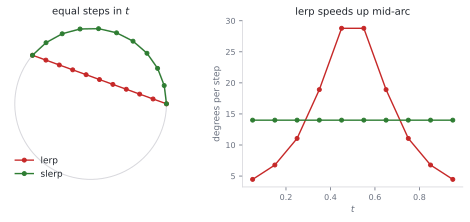
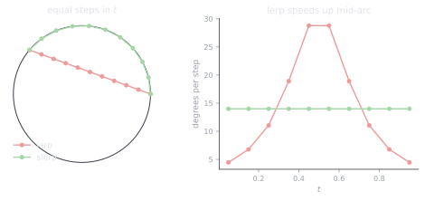
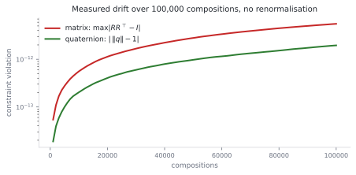
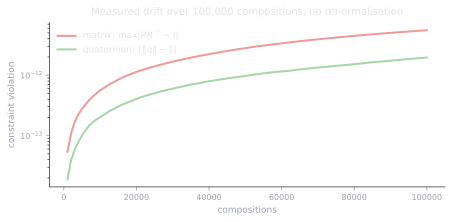

# 1.2 3D rotations: matrices, Euler angles, and why robotics runs on quaternions

**Status:** Code verified · **Prereqs:** lesson 1.1, linear algebra · **Time:** ~2.5 h · **Verified:** 2026-08-01, Python 3.13, NumPy ≥ 1.26

---

## A. Why this matters

In two dimensions an orientation is a single number, and lesson 1.1 showed
that even that single number needs care: it has to be wrapped, subtracted
carefully, and kept to a documented convention. In three dimensions the
situation is qualitatively worse, because an orientation is a point on a
curved three-dimensional surface called \(SO(3)\), and there is a topological
obstruction that shapes everything else in this lesson.

The obstruction is this: **you cannot represent a 3D orientation with three
numbers without introducing a singularity somewhere.** This is not a statement
that nobody has found a convenient scheme yet, but a fact about the geometry
of the space, closely related to the reason every flat map of the Earth
distorts something. Any three-parameter description of orientation must
therefore break down at some orientations, and the field's response was to
adopt a four-number representation carrying one constraint.

Every representation is consequently a compromise, and it is worth seeing them
side by side before committing to one.

| Representation | Numbers | Constraints | Main problem |
|---|---|---|---|
| Rotation matrix | 9 | 6 | Many constraints to maintain; expensive to repair when violated |
| Euler angles | 3 | 0 | **Gimbal lock**, plus roughly 24 different ordering conventions in circulation |
| Axis–angle | 3 or 4 | 0 or 1 | Clean to state, awkward to compose |
| **Unit quaternion** | **4** | **1** | Double cover; unfamiliar arithmetic |

Robotics settled on the last row, and the consequences are everywhere you
look: your IMU integrates orientation as a quaternion, TF2 puts quaternions on
the wire, and every attitude estimator and 3D pose message in ROS is a
quaternion. When a drone flips upside down because somebody routed Euler
angles through ±90° of pitch, this lesson is the postmortem.

!!! note "Terms defined here"

    **DOF (degrees of freedom)** — the number of independent numbers required
    to specify a configuration. A 3D orientation has 3 DOF, which is why a
    four-number quaternion needs exactly one constraint to remove the extra.

    **\(SO(3)\)** — the set of all 3D rotations, formally the 3×3 matrices
    with \(R^\top R = I\) and \(\det R = +1\). Exactly the definition from
    lesson 1.1, one dimension higher.

    **Manifold** — a space that looks flat when you examine a small patch of
    it but is curved globally. The surface of the Earth is a two-dimensional
    manifold and \(SO(3)\) is a three-dimensional one, and in both cases you
    cannot cover the whole thing with a single flat chart without something
    going wrong somewhere.

    **Gimbal lock** — the singularity in Euler angles, occurring at
    orientations where two of the three rotation axes align so that one degree
    of freedom disappears from the representation even though the physical
    system can still move in that direction.

    **Attitude** — orientation, in the aerospace and inertial-navigation
    literature. The same quantity under a different name.

## B. Mental model

### A quaternion is axis–angle in disguise

To rotate by an angle \(\theta\) about a unit axis \(\hat n\), the quaternion
is

\[
q = \left[\cos\tfrac{\theta}{2},\; \sin\tfrac{\theta}{2}\,\hat{n}\right] = [w, x, y, z]
\]

and that is the entire construction. The part that looks arbitrary is the
halving of the angle, and it has a precise cause that we return to in question
1: rotating a vector with a quaternion is a **two-sided** operation,
\(v' = q\,v\,q^{*}\), so the quaternion's angle is applied twice, once by each
factor, and the half-angle is exactly what makes the sandwich come out to
\(\theta\) rather than \(2\theta\).

What you buy for that oddity is worth the trouble. Composing two rotations
becomes multiplying two quaternions, with no trigonometry and no special
cases. The representation is smooth at every orientation, so there is no
configuration at which the arithmetic degenerates and no equivalent of gimbal
lock. And interpolation becomes natural, because a unit quaternion lives on
the unit sphere in four dimensions, so interpolating between two orientations
amounts to walking the great-circle arc between two points on that sphere at
constant speed, an operation known as **slerp**, for spherical linear
interpolation.

### The double cover, which is genuinely strange

A quaternion \(q\) and its negation \(-q\) encode **the same rotation**, and
this is not a convention that could have been chosen differently. The sphere
in four dimensions wraps twice around the space of three-dimensional
rotations, so every orientation has exactly two quaternion representations
that differ only in sign.

There is a physical consequence you can verify: rotating an object through
360° returns it to where it started, but its quaternion has flipped sign, and
only after 720° does the quaternion return to its original value. This is
harmless right up until the moment you average, interpolate or compare
quaternions without accounting for it, at which point it produces spectacular
failures. Averaging \(q\) and \(-q\) yields zero, which is not a rotation at
all, and a tracking filter that does not sign-align consecutive estimates
reports phantom 360° flips while the physical sensor moved smoothly.

## C. Mathematical formulation

### Composition: the Hamilton product

\[
q_1 q_2 = \begin{bmatrix}
w_1 w_2 - \mathbf{v}_1 \cdot \mathbf{v}_2 \\
w_1 \mathbf{v}_2 + w_2 \mathbf{v}_1 + \mathbf{v}_1 \times \mathbf{v}_2
\end{bmatrix}
\]

where \(\mathbf v\) denotes the vector part. This product is defined so that
it matches matrix order, meaning \(R(q_1 q_2) = R(q_1)\,R(q_2)\), and
therefore \(q_1 q_2\) applies \(q_2\) **first**, which is the same
right-to-left reading as the subscript cancellation in lesson 1.1.

For a unit quaternion the inverse is simply the conjugate
\(q^{*} = [w, -\mathbf{v}]\), obtained by negating the vector part, so
inverting a rotation is free in exactly the same way that transposing an
orthogonal matrix was free.

### Converting to a rotation matrix

\[
R(q) = \begin{bmatrix}
1-2(y^2+z^2) & 2(xy - wz) & 2(xz + wy) \\
2(xy + wz) & 1-2(x^2+z^2) & 2(yz - wx) \\
2(xz - wy) & 2(yz + wx) & 1-2(x^2+y^2)
\end{bmatrix}
\]

Every entry is quadratic in the components, which is why an unnormalised
quaternion is quietly dangerous. If \(\|q\| = 1.01\) then the resulting matrix
carries roughly 2% of scale, and because it is still very nearly a rotation
nothing anywhere throws an error; the only observable consequence is that
transformed point clouds slowly grow.

### Interpolation: slerp

\[
\mathrm{slerp}(q_0, q_1, t) = \frac{\sin((1-t)\Omega)}{\sin\Omega}\, q_0 + \frac{\sin(t\Omega)}{\sin\Omega}\, q_1
\]

with \(\Omega = \arccos(q_0 \cdot q_1)\), computed **after** flipping the sign
of \(q_1\) when the dot product is negative. That sign flip is the double
cover again, and omitting it makes the interpolation take the long way round,
which can mean up to 358° of unnecessary rotation.

The formula conceals two practical details. As \(\Omega \to 0\) the
denominator vanishes, so an implementation must fall back to ordinary linear
interpolation followed by normalisation, and because the two agree to first
order the seam is invisible. More importantly, slerp produces **constant
angular velocity**, which is what makes it the correct choice for replaying
recorded motion, whereas naive linear interpolation of the four components
speeds up in the middle of the arc.

<figure class="rai-fig" markdown>
{.fig-light}
{.fig-dark}
<figcaption markdown>Interpolating 140° with eleven equally spaced values of t. Slerp turns by the same amount every step, while lerp crawls at the ends and accelerates through the middle — which is the "pinch" you see in animation when someone has used the wrong one.</figcaption>
</figure>

## D. From ML to robotics

A unit quaternion behaves very much like a normalised embedding, in that both
live on a hypersphere, both are compared by dot product, and both require
renormalisation after arithmetic or they degrade silently. Slerp is precisely
the geodesic interpolation that you may already know as the correct way to
interpolate in a latent space, and naive linear interpolation is wrong here
for the same reason it is wrong there.

The question of why a three-DOF quantity needs four numbers has a familiar
flavour too, because it is the same trade that over-parameterisation makes in
machine learning. Minimal three-parameter charts necessarily contain
singularities, which is a theorem rather than an engineering failure, and
spending a fourth dimension buys a globally smooth, singularity-free
representation at the cost of one constraint plus the double cover.

Convention chaos, finally, is schema drift wearing different clothes.
Scalar-first ordering `[w,x,y,z]` is used by this curriculum, by Eigen and by
most of the literature, while scalar-last `[x,y,z,w]` is used by ROS messages
and by SciPy, and both are entirely correct. Mixing them is the robotics
equivalent of a silently reordered CSV column, where everything runs and
nothing is right, although the resulting error is at least a scramble rather
than a subtle offset, which perversely makes it easier to notice.

### Gimbal lock, made concrete

It is easy to nod along to "a singularity in the parameterisation" without
being able to picture it, so it is worth walking through a specific case.

Take the common aerospace convention, in which you rotate first about \(z\)
for yaw, then about the new \(y\) for pitch, then about the new \(x\) for
roll. Now pitch the nose up to exactly 90°. The aircraft's x-axis is now
pointing along the world's z-axis, which is the very axis that the yaw
rotation used, so yaw and roll have become the same physical motion. You still
have three knobs, but they now produce only two independent effects, and one
degree of freedom has vanished from the representation.

The aircraft can of course still rotate in the direction that was lost, since
nothing has happened to the physics. It is the *description* that has
degenerated, so a controller working in Euler angles either stalls or produces
an enormous correction as the parameterisation snaps through the singularity,
and that is the mechanism by which a drone flips.

## E. Minimal implementation

The library lives at
[`robotics_ai/geometry/rotations3d.py`](https://github.com/paulyonghaoli/robotics-for-ai-engineers/blob/main/robotics_ai/geometry/rotations3d.py),
and the essential core is three functions.

```python
import numpy as np

def quat_from_axis_angle(axis, angle):
    """Unit quaternion for `angle` radians about `axis`, scalar-first."""
    axis = axis / np.linalg.norm(axis)
    half = 0.5 * angle
    return np.concatenate(([np.cos(half)], np.sin(half) * axis))

def quat_multiply(q1, q2):
    """Hamilton product. quat_multiply(a, b) applies b FIRST."""
    w1, x1, y1, z1 = q1; w2, x2, y2, z2 = q2
    return np.array([
        w1*w2 - x1*x2 - y1*y2 - z1*z2,
        w1*x2 + x1*w2 + y1*z2 - z1*y2,
        w1*y2 - x1*z2 + y1*w2 + z1*x2,
        w1*z2 + x1*y2 - y1*x2 + z1*w2,
    ])

def quat_rotate(q, v):
    """Rotate 3-vector v by unit quaternion q, via the sandwich product."""
    qv = np.concatenate(([0.0], v))
    q_conj = q * np.array([1.0, -1, -1, -1])
    return quat_multiply(quat_multiply(q, qv), q_conj)[1:]
```

### A worked example

Consider rotating the vector \((1, 0, 0)\) by 90° about the z-axis, and work
it through by hand before running anything. The angle is 90°, so the
half-angle appearing in the quaternion is 45°, and since the axis is
\((0,0,1)\) the quaternion is
\(q = [\cos 45°, 0, 0, \sin 45°] \approx [0.7071, 0, 0, 0.7071]\). A 90°
rotation about \(z\) should carry \(+x\) onto \(+y\), so we expect the answer
\((0, 1, 0)\), and `quat_rotate(q, [1,0,0])` returns exactly that to machine
precision.

Notice that neither the axis nor the angle appears directly in the four
numbers, because the axis has been scaled by \(\sin(\theta/2)\) and the angle
is buried inside a cosine. Reading a quaternion by eye is a skill you will not
develop and do not need, so when you are debugging, convert to axis–angle and
look at that instead.

### Practice — write and run code here

<code-exercise src="geo-l2-quat-compose"></code-exercise>

<code-exercise src="geo-l2-slerp"></code-exercise>

## F. Robotics-framework implementation

ROS 2 sends orientation as `geometry_msgs/Quaternion`, whose fields are
ordered `x, y, z, w`, making it **scalar-last**. The only sustainable response
is to convert at the boundary, in exactly one place, and never in application
code:

```python
def to_ros(q_wxyz):                      # our convention -> wire format
    w, x, y, z = q_wxyz
    return Quaternion(x=x, y=y, z=z, w=w)
```

SciPy's `Rotation.from_quat` is also scalar-last by default, while Eigen and
this curriculum are scalar-first, and there is no prospect of winning that
argument. There is only converting in one place and validating at ingest.
Module 6 revisits the question when we build a real TF tree, and the
[frame-debugging lab](06-lab-frame-debugging.md) contains a deliberately
mixed-convention bug for you to find.

## G. Experiment — measuring drift, and what it actually shows

The standard justification for quaternions is that rotation matrices drift out
of \(SO(3)\) under repeated composition, so it is worth measuring the effect
rather than repeating the claim, because the size of it determines whether it
should influence any decision you make.

Compose a small rotation with itself 100,000 times, once as a matrix and once
as a quaternion, renormalising neither, and track \(\|R R^\top - I\|\) for the
matrix and \(\bigl|\,\|q\| - 1\,\bigr|\) for the quaternion.

<figure class="rai-fig" markdown>
{.fig-light}
{.fig-dark}
<figcaption markdown>Measured, not asserted. After 100,000 compositions the matrix violates orthonormality by 5.5×10⁻¹² and the quaternion violates its norm by 2.0×10⁻¹². The quaternion is about three times better, and both are negligible.</figcaption>
</figure>

The result is more interesting than the folklore. In double precision, drift
from composition alone is **not** a practical problem for either
representation, since parts in \(10^{12}\) after a hundred thousand steps is
several orders of magnitude below the noise of any real sensor. If you have
been told that matrices rot and quaternions do not, the data does not support
the strong form of that claim.

So the real argument for quaternions in an estimator is not the magnitude of
the drift but two other things. The first is the cost of repair: restoring a
quaternion's constraint is a single division by its norm, whereas restoring a
matrix's six constraints requires Gram–Schmidt or an SVD, which is orders of
magnitude more expensive and therefore gets skipped in the inner loop. The
second, and more important in practice, is that real systems do not compose
clean rotations at all; they *update* orientation from noisy gyroscope
measurements, and those updates inject errors vastly larger than floating-point
rounding. Under that regime the constraint is violated constantly, the repair
happens every step, and its cost is what decides the design.

## H. Failure modes

**Convention mismatch** between scalar-first and scalar-last orderings
produces rotations that are scrambled rather than slightly wrong, and code
full of internal round-trips can appear to work correctly until it crosses a
library boundary, which is why the bug usually surfaces during integration far
from its cause.

**Forgetting the double cover** shows up as phantom 360° jumps in a filter
whose consecutive estimates are not sign-aligned, and averaging \(q\) with
\(-q\) produces zero, which is not a rotation.

**Unnormalised quaternions** arise after long integration, and because
`quat_to_matrix` is quadratic in the components, the resulting matrix silently
carries scale and transformed point clouds slowly grow or shrink. The symptom
matches matrix drift from lesson 1.1 while the cause is entirely different.

**Naive lerp in place of slerp** across large angular differences makes the
interpolated orientation accelerate through the middle of the arc while its
norm dips, which is visible in animation as a pinch.

**Euler angles as internal state** are perfectly acceptable as human-readable
input and output and catastrophic in the core of a pipeline near ±90° of
pitch, where gimbal lock collapses a degree of freedom.

## I. Questions

1. *(Concept)* Why do quaternions use half-angles, and what specifically goes
   wrong with \(q = [\cos\theta, \sin\theta\,\hat{n}]\)?
2. *(Calculation)* Compute the quaternion for a 180° rotation about the
   z-axis, and verify it by rotating \((1, 0, 0)\).
3. *(Debugging)* An attitude estimator's output occasionally spins 360° in a
   single frame while the physical IMU moved smoothly. What is the bug?
4. *(System design)* Your logging format stores orientations. Choose a
   representation and justify it against interpolation for replay, storage
   size, human debuggability, and convention safety across three consumer
   teams.

??? note "Answer sketches"
    **1.** Rotation is the two-sided product \(v' = q\,v\,q^{*}\), so the
    quaternion's angle is applied twice, once by \(q\) and once by \(q^{*}\),
    and the half-angle is what makes the sandwich come out to \(\theta\). With
    \(q = [\cos\theta, \sin\theta\,\hat n]\) the sandwich rotates by
    \(2\theta\), so every rotation doubles, and worse, quaternion
    multiplication no longer corresponds to composing the rotations that its
    factors name, which destroys the property that made the algebra useful.

    **2.** A 180° rotation about \(\hat n = (0,0,1)\) has half-angle 90°, so
    \(q = [\cos 90°, 0, 0, \sin 90°] = [0, 0, 0, 1]\). Rotating \((1,0,0)\)
    means reading the first column of \(R(q)\) with \(w = x = y = 0\) and
    \(z = 1\), which is
    \([1-2(y^2+z^2),\; 2(xy+wz),\; 2(xz-wy)] = [1-2,\;0,\;0] = (-1,0,0)\), so
    \(+x\) flips to \(-x\) as a half-turn about \(z\) must.

    **3.** Consecutive estimates have crossed the double cover, because the
    filter or its output serialiser is not enforcing
    \(q_k \cdot q_{k-1} \ge 0\), and the fix is to sign-align each output
    against the previous one. The giveaway is in the symptom itself: the jump
    is *exactly* 360° and occupies a *single* frame, and no physical motion
    can do that, so the fault must lie in the representation rather than in
    the sensor.

    **4.** Store unit quaternions, scalar-first, with the ordering and the
    frame pair named in the schema header and validated at ingest. That gives
    four floats, direct slerp-ability for replay, no gimbal lock, and one
    documented convention, which is what prevents three consumer teams from
    each guessing differently. Canonicalise the sign on write so that
    \(w \ge 0\) and the double cover never reaches a consumer, and normalise
    on write so that no reader inherits a scale-carrying rotation matrix.
    Human debuggability is the only genuine loss, and you recover it in the
    log *viewer* by displaying derived roll–pitch–yaw beside the raw
    quaternion, never by storing Euler angles as the source of truth.

### Interactive quiz

<quiz-bank src="geometry-l2-quats"></quiz-bank>

## J. Annotated references

| Reference | Type | Difficulty | Why read it |
|---|---|---|---|
| Lynch & Park, *Modern Robotics*, ch. 3.2–3.3 | book | introductory | Rotation matrices and exponential coordinates, cleanly presented and free |
| Sola, *"Quaternion kinematics for the error-state Kalman filter"* (2017) | paper | intermediate | The reference every estimation engineer keeps open; read §1–2 now and the remainder during Module 3 |
| Shoemake, *"Animating rotation with quaternion curves"* (1985) | paper | intermediate | The original slerp paper, short and readable, and the source of the technique |
| [REP 103 — Standard Units and Coordinate Conventions](https://www.ros.org/reps/rep-0103.html) | docs | introductory | ROS's conventions including quaternion ordering, about two pages long |

## K. Graded work and portfolio extension

**Graded:** the [frame-transforms mini-project](project-frames.md) covers this
module's 2D core, and quaternion tasks join the Module 1 final assignment.

**Portfolio:** turn the section G experiment into a short written analysis
comparing matrix and quaternion drift with and without renormalisation,
including the cost per step of each repair. It makes a strong short piece
precisely because the honest conclusion contradicts the folklore, and
demonstrating that you measured before claiming is worth more than agreeing
with the received wisdom.
