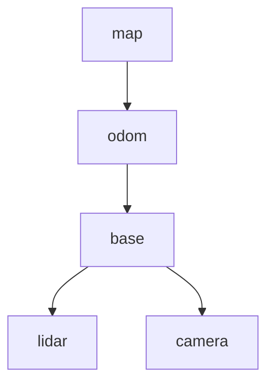

# 1.3 Composing frames: the transform tree

**Status:** Code verified · **Prereqs:** lesson 1.1 · **Time:** ~2 h · **Verified:** 2026-08-01, Python 3.13, NumPy ≥ 1.26

---

## A. Why this matters

A real robot has dozens of frames — every sensor, every wheel, every joint, the map, the odometry origin. Nobody stores all pairwise transforms; they'd be redundant and instantly inconsistent. Instead the frames form a **tree**: each frame has one parent, and any transform you need is *composed on demand* along the path between two frames. This is exactly what ROS 2's TF2 does at runtime, tens of thousands of lookups per second, and it is why a robot's URDF is a tree, why "TF timeout" errors dominate ROS forums, and why REP 105 gives mobile robots the peculiar `map → odom → base_link` chain you're about to understand.

## B. Mental model

The tree is a **single source of truth with derived views**. Store only parent→child edges; derive everything else. A lookup `T_target_source` walks from both frames up to their **lowest common ancestor**, composing edges on the way — edges walked "upstream" get inverted:



`lookup(lidar, camera)` = up from `camera` to `base`, then down into `lidar` — one edge composed, one edge inverted. Subscript cancellation from lesson 1.1 still runs the show; the tree just automates it.

The strangest-looking part of REP 105: the robot's pose is split across **two** edges. `odom → base` is continuous but drifts (wheel odometry); `map → odom` is the localization *correction* — it jumps when the localizer updates, so that `map → base` is accurate while `odom → base` stays smooth for controllers. Two consumers, two guarantees, one tree.

## C. Mathematical formulation

For frames \(a, b\) with lowest common ancestor \(c\), where \(\mathrm{up}(x)\) composes the parent-edge transforms from \(x\) up to \(c\):

\[
T_{a \leftarrow b} \;=\; \big(T_{c \leftarrow a}\big)^{-1}\, T_{c \leftarrow b}
\qquad
T_{c \leftarrow x} = T_{c \leftarrow p_k} \cdots T_{p_1 \leftarrow x}
\]

Uniqueness is the tree property: exactly one path exists between any two frames, so any two correctly-composed lookups agree. Add one redundant edge (a cycle) and consistency is no longer guaranteed by construction — it becomes a calibration problem.

## D. From ML to robotics

- **The transform tree is a lineage DAG** restricted to a tree: derived data (any `T_a_b`) is computed from source-of-truth edges, never stored. If you've built dbt-style pipelines, "store edges, derive lookups" is the same normalization instinct.
- **`map → odom` as a slowly-updated correction layer** resembles a batch model correcting a fast streaming heuristic: the streaming layer (odometry) is low-latency but drifts; the correction layer (localization) is accurate but jumpy; the composition gives consumers both.
- **Frame misconfiguration ≈ schema mismatch across services.** TF2's runtime errors ("frame does not exist", extrapolation into the past) are the robotics version of contract violations between microservices.

## E. Minimal implementation

The library version is [`robotics_ai/geometry/transform_tree.py`](https://github.com/paulyonghaoli/robotics-for-ai-engineers/blob/main/robotics_ai/geometry/transform_tree.py) — ~50 lines, tested, cycle-rejecting. The core of `lookup`:

```python
def lookup(self, target, source):
    up_t, up_s = self._path_to_root(target), self._path_to_root(source)
    common = next(f for f in up_s if f in up_t)      # lowest common ancestor
    T_cs = np.eye(3)                                 # compose source -> ancestor
    for f in up_s[: up_s.index(common)]:
        T_cs = self._parent[f][1] @ T_cs
    T_ct = np.eye(3)                                 # compose target -> ancestor
    for f in up_t[: up_t.index(common)]:
        T_ct = self._parent[f][1] @ T_ct
    return se2_inverse(T_ct) @ T_cs                  # T_target_source
```

### Practice — write and run code here

<code-exercise src="geo-l3-lookup"></code-exercise>

<code-exercise src="geo-l3-map-odom"></code-exercise>

## F. Robotics-framework implementation

TF2 adds what our static tree lacks: **time**. Every edge is a timestamped buffer; `lookup_transform('map', 'lidar', t)` interpolates each edge at time `t`, so a scan taken 80 ms ago is projected with the pose from 80 ms ago (the stale-timestamp failure mode from lesson 1.1, solved properly). Static mounts are published once on a latched topic; dynamic edges stream at odometry rate. Module 6 builds this tree for our robot from a URDF.

## G. Experiment

Build a 6-frame tree and verify the consistency property: `lookup(a, c)` equals `lookup(a, b) @ lookup(b, c)` for every triple of frames, to machine precision. Then simulate drift: perturb the `odom → base` edge by a random walk over 500 steps while periodically resetting `map → odom` so that the composed `map → base` matches ground truth — you have just reinvented the REP 105 architecture and can watch the "jump" land in the correction edge, not the smooth one.

## H. Failure modes

- **Two parents / cycles:** publishing `base` under both `map` and `odom` directly makes lookups order-dependent; TF2 will take the latest writer and your robot teleports.
- **The `map → odom` jump consumed downstream:** a controller reading `map → base` sees localization corrections as instantaneous velocity spikes. Controllers should consume `odom → base`; planners consume `map → base`.
- **Extrapolation errors:** asking for a transform at a time newer than the latest edge data — the classic "TF extrapolation into the future" — usually means a sensor's clock is ahead or a publisher died.
- **Silent unit/handedness mismatch in a single edge** poisons every lookup through it; symptoms appear far from the cause. Bisect by checking each edge against physical measurement.

## I. Questions

1. *(Concept)* Why does REP 105 interpose `odom` between `map` and `base_link` instead of publishing `map → base_link` directly?
2. *(Calculation)* With `map→odom` = (5, 0, 0°), `odom→base` = (1, 2, 90°), `base→lidar` = (0.5, 0, 0°): where is the LiDAR in the map?
3. *(Debugging)* Every frame downstream of `base` is wrong by the same rotation, but `odom → base` checks out against ground truth. Which edge do you inspect next and why?
4. *(System design)* A robot arm on a mobile base with a wrist camera: draw the frame tree, mark which edges are static, and state which node publishes each dynamic edge.

??? note "Answer sketch for Q2"
    Compose left to right: base is at (6, 2) facing +y; the LiDAR mounts 0.5 m along base-x, which points along map +y → (6, 2.5, 90°). (This is the library test case.)

### Interactive quiz

<quiz-bank src="geometry-l3-tree"></quiz-bank>

## J. References

| Reference | Type | Difficulty | Why read it |
|---|---|---|---|
| [REP 105 — Coordinate Frames for Mobile Platforms](https://www.ros.org/reps/rep-0105.html) | docs | introductory | The `map/odom/base_link` contract, from the source |
| [TF2 design](https://docs.ros.org/en/jazzy/Concepts/Intermediate/About-Tf2.html) | docs | intermediate | Time-varying trees, buffers, interpolation |
| Foote, *"tf: The Transform Library"* (2013) | paper | intermediate | Short paper behind TF — the design rationale in 6 pages |

## K. Graded work & portfolio extension

**Graded:** the `chain_poses` task in the [frame-transforms mini-project](project-frames.md) is this lesson's dead-reckoning core.

**Portfolio:** extend `TransformTree` with timestamps and linear interpolation between samples — a mini-TF2 in ~150 lines, benchmarked against real TF2 lookups in Module 6. A genuinely instructive artifact to walk through in an interview.
