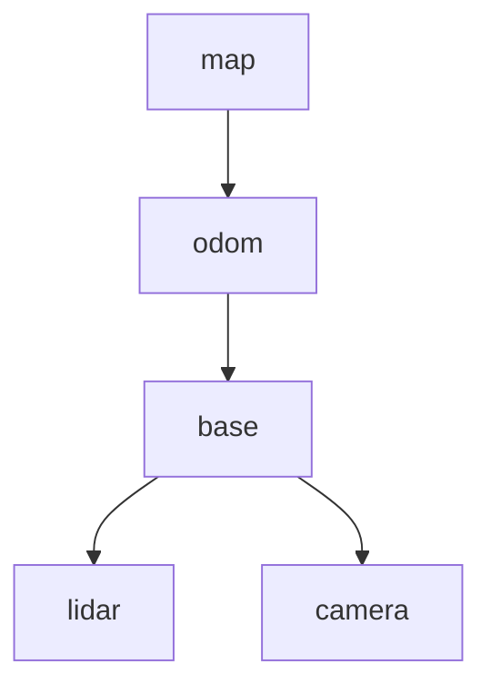

# 1.3 Composing frames: the transform tree

**Status:** Code verified · **Prereqs:** lesson 1.1 · **Time:** ~2 h · **Verified:** 2026-08-01, Python 3.13, NumPy ≥ 1.26

---

## A. Why this matters

Lesson 1.1 gave you two frames and one transform between them. A real robot
has dozens of frames: every sensor, every wheel, every joint of every arm, the
map, the odometry origin, and an optical frame for each camera that differs
from its body frame by an annoying 90° rotation.

The obvious approach — store the transform between every pair — fails
immediately. With \(n\) frames there are \(n(n-1)/2\) pairs, so 30 frames means
435 transforms to keep mutually consistent, updated at 100 Hz, by different
processes. They would be inconsistent within a second, and there would be no
principled way to say which one was right.

So robotics does what you would do with any redundant dataset: **normalise
it.** The frames form a **tree** — each frame has exactly one parent — and any
transform you need is *composed on demand* along the path between two frames.
Nothing derived is ever stored.

This is precisely what ROS 2's TF2 does at runtime, tens of thousands of
lookups per second. It is why a robot's URDF is a tree, why "TF timeout" and
"extrapolation into the future" dominate ROS forums, and why REP 105 gives
mobile robots the peculiar `map → odom → base_link` chain that this lesson
will make sensible.

!!! note "Terms defined here"

    **Transform tree** — the graph of frames, with one directed parent→child
    edge carrying each relationship. One parent per frame, no cycles.

    **Lowest common ancestor (LCA)** — for two frames, the nearest frame that
    is an ancestor of both. Lookups route through it.

    **Odometry** — an estimate of pose built by accumulating motion (wheel
    encoders, IMU). Smooth and continuous; drifts without bound.

    **Localisation** — estimating pose against a map, e.g. by matching a
    LiDAR scan. Accurate but discrete: it corrects in jumps.

    **URDF** — Unified Robot Description Format. An XML file describing a
    robot's links and joints, from which the static part of the tree is
    generated.

## B. Mental model

The tree is a **single source of truth with derived views.** Store only
parent→child edges; derive everything else on demand.



A lookup `T_target_source` walks from *both* frames up to their lowest common
ancestor, composing edges along the way. Edges walked upstream get inverted.

So `lookup(lidar, camera)` goes up from `camera` to `base` — inverting that
edge — then down into `lidar`. Two edges touched, one inverted. Subscript
cancellation from lesson 1.1 still runs the show; the tree just automates it,
and guarantees the cancellation is possible.

### Why the pose is split across two edges

This is the part of REP 105 that looks arbitrary and is not. The robot's pose
in the map is **not** one edge. It is the composition of two:

- **`odom → base`** comes from wheel odometry. It is continuous,
  differentiable, available at high rate, and it **drifts without bound**.
  After ten minutes it may be metres wrong.
- **`map → odom`** is the *localisation correction*. It is updated whenever
  the localiser matches a scan against the map, and it **jumps** when it does.

Compose them and `map → base` is accurate. Take `odom → base` alone and it is
smooth. Two consumers with incompatible requirements, satisfied by one tree:

| Consumer | Needs | Reads |
|---|---|---|
| Controller | smooth, differentiable, no jumps | `odom → base` |
| Planner, mapping | globally accurate | `map → base` (composed) |

A controller that differentiates `map → base` will see each localisation
correction as an instantaneous velocity spike and respond to it, which is a
real and unpleasant failure. Putting the discontinuity in an edge the
controller does not read is the entire design.

## C. Mathematical formulation

For frames \(a, b\) with lowest common ancestor \(c\):

\[
T_{a \leftarrow b} \;=\; \big(T_{c \leftarrow a}\big)^{-1}\, T_{c \leftarrow b}
\qquad\text{where}\qquad
T_{c \leftarrow x} = T_{c \leftarrow p_k} \cdots T_{p_1 \leftarrow x}
\]

— the chain of parent edges from \(x\) up to \(c\).

**Uniqueness comes from the tree property.** Exactly one path exists between
any two frames, so any two correctly-composed lookups necessarily agree. This
is not a numerical accident; it is structural, and it is the reason the whole
scheme is trustworthy.

Add one redundant edge — say, publish `base` under `map` *as well as* under
`odom` — and you have created a cycle. Now two paths exist, they will disagree
by measurement error, and consistency stops being guaranteed by construction
and becomes a calibration problem you have to solve continuously. TF2 responds
by taking the most recent writer, which makes the robot appear to teleport
between two poses. This is failure mode 1 in section H, and it is common.

## D. From ML to robotics

**The transform tree is a lineage DAG restricted to a tree.** Derived data —
any `T_a_b` — is computed from source-of-truth edges and never stored. If you
have built dbt-style pipelines, "store edges, derive views" is exactly the
normalisation instinct you already have, applied to geometry.

**`map → odom` is a slow correction layer over a fast heuristic.** The
pattern will be familiar from streaming systems: a low-latency approximate
layer (odometry) plus a slower authoritative correction (localisation), with
consumers choosing which guarantee they need. Lambda architecture, with
coordinate frames.

**Frame misconfiguration is a schema mismatch across services.** TF2's runtime
errors — "frame does not exist", "extrapolation into the past" — are contract
violations between processes that were developed separately and agreed on a
name but not on a meaning.

## E. Minimal implementation

The library version is
[`robotics_ai/geometry/transform_tree.py`](https://github.com/paulyonghaoli/robotics-for-ai-engineers/blob/main/robotics_ai/geometry/transform_tree.py)
— about 50 lines, tested, and it rejects cycles at insertion time rather than
discovering them at lookup. The core:

```python
def lookup(self, target, source):
    up_t, up_s = self._path_to_root(target), self._path_to_root(source)
    common = next(f for f in up_s if f in up_t)      # lowest common ancestor
    T_cs = np.eye(3)                                 # compose source -> ancestor
    for f in up_s[: up_s.index(common)]:
        T_cs = self._parent[f][1] @ T_cs
    T_ct = np.eye(3)                                 # compose target -> ancestor
    for f in up_t[: up_t.index(common)]:
        T_ct = self._parent[f][1] @ T_ct
    return se2_inverse(T_ct) @ T_cs                  # T_target_source
```

Read the last line against the formula in section C: `T_ct` inverted, times
`T_cs`. The subscripts cancel through \(c\).

### A worked lookup

Using the chain `map → odom = (5, 0, 0°)`, `odom → base = (1, 2, 90°)`,
`base → lidar = (0.5, 0, 0°)`, where is the LiDAR in the map?

1. `map → base`: the first edge is a pure translation, so the base sits at
   \((5,0) + (1,2) = (6, 2)\), with heading \(0° + 90° = 90°\).
2. The base faces \(+y\), so the LiDAR's 0.5 m offset along the *base's*
   x-axis points along map \(+y\).
3. **The LiDAR is at \((6, 2.5)\), facing \(90°\).**

This is the library's own test case, so if your implementation disagrees, the
test will tell you before the robot does.

### Practice — write and run code here

<code-exercise src="geo-l3-lookup"></code-exercise>

<code-exercise src="geo-l3-map-odom"></code-exercise>

## F. Robotics-framework implementation

TF2 adds the one thing our static tree lacks: **time**.

Every edge is a timestamped ring buffer rather than a single value, and
`lookup_transform('map', 'lidar', t)` interpolates each edge on the path to
the requested time before composing. So a scan captured 80 ms ago is
transformed with the pose from 80 ms ago — which is the stale-timestamp
failure mode from lesson 1.1, solved properly rather than ignored.

Two practical consequences:

- **Static edges are published once** on a latched topic (`/tf_static`), so
  late-joining nodes still receive them. Mount offsets and calibration values
  belong here, declared in the URDF, never hard-coded in application code.
- **Dynamic edges stream** at their producer's rate, and lookups outside the
  buffered window fail loudly rather than silently extrapolating.

Module 6 builds this tree for our robot from a URDF.

## G. Experiment — rebuild REP 105 and watch the jump land

**Consistency.** Build a six-frame tree and verify that
`lookup(a, c) == lookup(a, b) @ lookup(b, c)` for every triple, to machine
precision. This is the tree property made concrete, and it is worth seeing
hold exactly rather than approximately.

**Drift and correction.** Now simulate the real architecture. Perturb the
`odom → base` edge with a random walk over 500 steps — that is dead reckoning
drifting. Periodically reset `map → odom` so that the composed `map → base`
matches ground truth again.

Plot two things: `odom → base` and `map → base`, over time. You will see the
first stay smooth while drifting away from truth, and the second stay accurate
while stepping discontinuously at each correction. **You have just reinvented
REP 105**, and you can see precisely why the jump has to land in the
correction edge rather than in the edge a controller differentiates.

## H. Failure modes

- **Two parents, or a cycle.** Publishing `base` under both `map` and `odom`
  makes lookups order-dependent. TF2 takes the latest writer and the robot
  teleports between two poses. *Prevention:* exactly one publisher per edge,
  enforced socially and by the tree structure.
- **The `map → odom` jump consumed downstream.** A controller reading
  `map → base` sees localisation corrections as velocity spikes and fights
  them. *Symptom:* the robot twitches every time the localiser updates.
- **Extrapolation errors.** Asking for a transform newer than the latest edge
  data. Usually means a sensor's clock is ahead of the robot's, or a publisher
  died and nobody noticed. *This is why it is the most-reported ROS error:* it
  is the symptom of half a dozen different underlying faults.
- **A silent unit or handedness mismatch in one edge** poisons every lookup
  that routes through it, and the symptoms appear far from the cause. *Fix:*
  bisect — check each edge independently against a physical measurement.

## I. Questions

1. *(Concept)* Why does REP 105 interpose `odom` between `map` and
   `base_link` instead of publishing `map → base_link` directly?
2. *(Calculation)* With `map→odom` = (5, 0, 0°), `odom→base` = (1, 2, 90°),
   `base→lidar` = (0.5, 0, 0°): where is the LiDAR in the map?
3. *(Debugging)* Every frame downstream of `base` is wrong by the same
   rotation, but `odom → base` checks out against ground truth. Which edge do
   you inspect next, and why?
4. *(System design)* A robot arm on a mobile base with a wrist camera: draw
   the frame tree, mark which edges are static, and state which node publishes
   each dynamic edge.

??? note "Answer sketches"
    **1.** Two consumers need incompatible guarantees from the same pose.
    `odom → base_link` is continuous and differentiable but drifts without
    bound; `map → odom` is the localiser's discrete correction, so every
    localisation jump lands in *that* edge and leaves `odom → base_link`
    smooth. Controllers take the smooth edge, planners take the composed
    `map → base_link`. Publishing `map → base_link` directly would force the
    jumps into the edge controllers differentiate — producing velocity
    spikes — and in any case `base_link` can only have one parent.

    **2.** Compose in order: the base is at \((6, 2)\) facing \(+y\); the
    LiDAR mounts 0.5 m along base-x, which points along map \(+y\), giving
    \((6, 2.5, 90°)\). This is the library's test case.

    **3.** `map → odom`. A *common-mode* error — the same rotation on every
    child of `base` — cannot come from the per-sensor mount edges, because
    those are independent and would each be wrong differently. It must sit on
    an edge shared by all the paths, and `odom → base` has already been
    cleared. Look for a constant yaw offset out of the localiser: a wrong
    initial-pose heading, or degrees published where radians were expected.

    **4.** Tree: `map → odom → base_link`, with
    `base_link → arm_base → link_1 … link_6 → wrist → camera_link → camera_optical_frame`,
    plus the base's own sensor frames hanging off `base_link`. **Static**
    edges: `base_link → arm_base`, `wrist → camera_link`, and the
    optical-frame rotation — mount and calibration values that belong in the
    URDF and get latched once on `/tf_static`. **Dynamic** edges:
    `map → odom` from the localiser, `odom → base_link` from the
    wheel-odometry node, and each `link_i → link_{i+1}` from
    `robot_state_publisher` fed by the arm driver's `/joint_states`.

### Interactive quiz

<quiz-bank src="geometry-l3-tree"></quiz-bank>

## J. Annotated references

| Reference | Type | Difficulty | Why read it |
|---|---|---|---|
| [REP 105 — Coordinate Frames for Mobile Platforms](https://www.ros.org/reps/rep-0105.html) | docs | introductory | The `map/odom/base_link` contract from the source. Read it once properly; it is short and it settles a lot of arguments |
| [TF2 design](https://docs.ros.org/en/jazzy/Concepts/Intermediate/About-Tf2.html) | docs | intermediate | Time-varying trees, buffers and interpolation — the part this lesson simplifies away |
| Foote, *"tf: The Transform Library"* (2013) | paper | intermediate | The design rationale in six readable pages, including why a tree rather than a graph |

## K. Graded work and portfolio extension

**Graded:** the `chain_poses` task in the
[frame-transforms mini-project](project-frames.md) is this lesson's
dead-reckoning core.

**Portfolio:** extend `TransformTree` with timestamps and linear interpolation
between samples — a mini-TF2 in roughly 150 lines, benchmarked against real
TF2 lookups in Module 6. It is a genuinely instructive artifact to walk
through in an interview, because the interesting decisions (buffer length,
what to do on extrapolation, static versus dynamic) are all forced on you by
the implementation.
