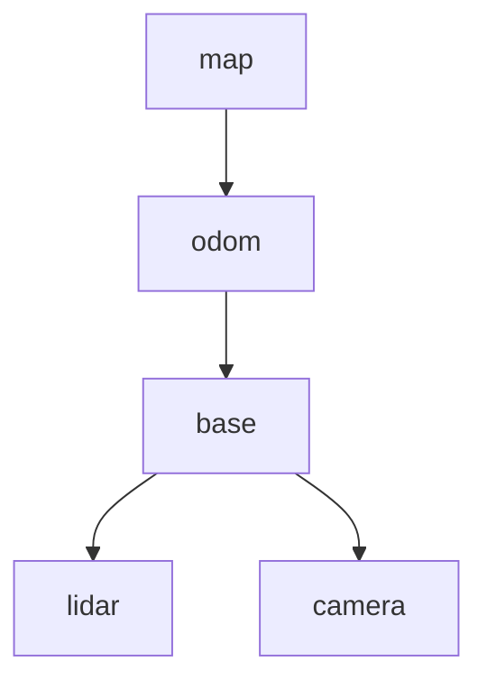
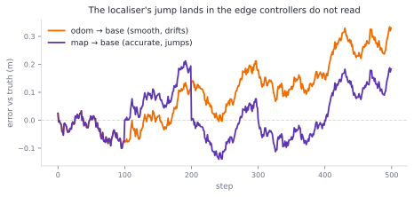
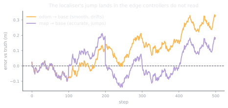

# 1.3 Composing frames: the transform tree

**Status:** Code verified · **Prereqs:** lesson 1.1 · **Time:** ~2 h · **Verified:** 2026-08-01, Python 3.13, NumPy ≥ 1.26

---

## A. Why this matters

Lesson 1.1 dealt with two frames and one transform between them, which is
enough to understand the mathematics and nowhere near enough to run a robot. A
real machine has dozens of frames, because every sensor, every wheel, every
joint of every arm, the map, the odometry origin and an optical frame for each
camera all need one, and they all need to be related to one another.

The obvious approach of storing the transform between every pair fails
immediately once you count them. With \(n\) frames there are \(n(n-1)/2\)
pairs, so a modest robot with 30 frames would need 435 transforms kept
mutually consistent, updated at 100 Hz, by half a dozen processes that do not
know about each other. They would disagree within a second, and worse, there
would be no principled way to decide which of two disagreeing values was
correct.

Robotics therefore does what you would do with any redundant dataset, which is
to normalise it. The frames are arranged into a **tree** in which each frame
has exactly one parent, and any transform you need is composed on demand along
the path between two frames, so nothing derived is ever stored. This is
precisely what ROS 2's TF2 does at runtime, tens of thousands of times per
second, and it explains why a robot's URDF is a tree, why "extrapolation into
the future" is one of the most-reported errors in the ecosystem, and why
REP 105 gives mobile robots the initially peculiar `map → odom → base_link`
chain that the rest of this lesson will make sensible.

!!! note "Terms defined here"

    **Transform tree** — the graph of frames, in which one directed
    parent-to-child edge carries each relationship. Every frame has exactly
    one parent and there are no cycles.

    **Lowest common ancestor (LCA)** — for a pair of frames, the nearest frame
    that is an ancestor of both. Every lookup routes through it.

    **Odometry** — an estimate of pose built by accumulating measured motion
    from wheel encoders and inertial sensors. It is smooth, continuous and
    always available, and it drifts without bound.

    **Localisation** — estimating pose by comparing sensor data against a map,
    for instance by matching a LiDAR scan. It is accurate but discrete,
    because it corrects in jumps whenever a new match succeeds.

    **URDF** — Unified Robot Description Format, an XML description of a
    robot's links and joints from which the static portion of the tree is
    generated automatically.

## B. Mental model

The tree is a single source of truth with derived views, in exactly the sense
you would use those words about a database. Only parent-to-child edges are
stored, and every other relationship is computed when somebody asks for it.



A lookup of `T_target_source` walks from both frames up to their lowest common
ancestor, composing edges as it goes, and any edge that is walked upstream
gets inverted along the way. Asking for `lookup(lidar, camera)` therefore goes
up from `camera` to `base`, inverting that edge, and then back down into
`lidar`, touching two edges and inverting one of them. The subscript
cancellation from lesson 1.1 is still what makes this correct, and the tree's
contribution is to automate the bookkeeping and to guarantee that a
cancellation exists at all.

### Why the pose is split across two edges

The part of REP 105 that looks arbitrary on first encounter is that a mobile
robot's pose in the map is not a single edge but the composition of two, and
the reason is that two different consumers need incompatible guarantees from
the same quantity.

The `odom → base` edge comes from wheel odometry, so it is continuous,
differentiable, available at high rate, and drifting without bound, which
after ten minutes of driving may leave it metres away from the truth. The
`map → odom` edge is the localisation correction, updated whenever the
localiser successfully matches sensor data against the map, and it jumps
discontinuously when it does. Composing the two gives an accurate
`map → base`, while reading `odom → base` alone gives a smooth one.

<figure class="rai-fig" markdown>
{.fig-light}
{.fig-dark}
<figcaption markdown>Simulated odometry drift with a localiser correcting every hundred steps. Each correction is a discontinuity, and the architecture's whole purpose is to decide which edge absorbs it.</figcaption>
</figure>

That distinction matters because a controller which differentiates
`map → base` will see every localisation correction as an instantaneous
velocity spike and will try to respond to it, producing a robot that twitches
each time the localiser updates. Putting the discontinuity into an edge that
the controller does not read is the entire design, and it is why the table
below is worth memorising.

| Consumer | Requirement | Reads |
|---|---|---|
| Controller | smooth and differentiable, no jumps | `odom → base` |
| Planner, mapping, goal tracking | globally accurate | `map → base` (composed) |

## C. Mathematical formulation

For frames \(a\) and \(b\) with lowest common ancestor \(c\), the lookup is

\[
T_{a \leftarrow b} \;=\; \big(T_{c \leftarrow a}\big)^{-1}\, T_{c \leftarrow b}
\qquad\text{where}\qquad
T_{c \leftarrow x} = T_{c \leftarrow p_k} \cdots T_{p_1 \leftarrow x}
\]

denotes the chain of parent edges running from \(x\) up to \(c\). Read the
first expression against the subscript-cancellation rule and it says what you
would expect: go from \(b\) up to the common ancestor, then come back down to
\(a\) by inverting the other chain.

The property that makes the whole scheme trustworthy is **uniqueness**, and it
follows directly from the tree structure. Exactly one path exists between any
two frames, so any two correctly composed lookups must agree, and this is
guaranteed structurally rather than achieved numerically.

Adding a single redundant edge destroys that guarantee, which is worth
understanding rather than merely avoiding. Suppose somebody publishes `base`
under `map` as well as under `odom`, creating a cycle. Two distinct paths now
exist between `map` and `base`, they will disagree by whatever the measurement
error happens to be, and consistency stops being a structural property and
becomes a calibration problem that must be solved continuously and never
quite is. TF2's response is to accept the most recent writer, so the robot
appears to teleport between two poses at whatever rate the two publishers
happen to interleave.

## D. From ML to robotics

The transform tree is a lineage DAG restricted to a tree, in which any derived
value is computed from source-of-truth edges rather than stored, so if you
have built dbt-style pipelines then "store the edges, derive the views" is
precisely the normalisation instinct you already have, applied to geometry
instead of to tables.

The `map → odom` edge is recognisably a slow correction layer sitting over a
fast approximate one, which is a pattern familiar from streaming systems: a
low-latency layer that is approximate, an authoritative layer that is slower,
and consumers choosing whichever guarantee their job requires. It is a lambda
architecture expressed in coordinate frames.

Frame misconfiguration, finally, is a schema mismatch between services. TF2's
runtime errors about a frame not existing, or about extrapolation into the
past, are contract violations between processes that were written separately
and agreed on a name without agreeing on a meaning.

## E. Minimal implementation

The library version lives at
[`robotics_ai/geometry/transform_tree.py`](https://github.com/paulyonghaoli/robotics-for-ai-engineers/blob/main/robotics_ai/geometry/transform_tree.py),
runs to about fifty lines, and rejects cycles at insertion time rather than
discovering them during a lookup.

```python
def lookup(self, target, source):
    up_t, up_s = self._path_to_root(target), self._path_to_root(source)
    common = next(f for f in up_s if f in up_t)      # lowest common ancestor
    T_cs = np.eye(3)                                 # compose source -> ancestor
    for f in up_s[: up_s.index(common)]:
        T_cs = self._parent[f][1] @ T_cs
    T_ct = np.eye(3)                                 # compose target -> ancestor
    for f in up_t[: up_t.index(common)]:
        T_ct = self._parent[f][1] @ T_ct
    return se2_inverse(T_ct) @ T_cs                  # T_target_source
```

The final line is the formula from section C written in code, with `T_ct`
inverted and multiplied by `T_cs`, and the subscripts cancelling through the
common ancestor.

### A worked lookup

Take the chain `map → odom = (5, 0, 0°)`, `odom → base = (1, 2, 90°)` and
`base → lidar = (0.5, 0, 0°)`, and work out where the LiDAR sits in the map
before running anything.

The first edge is a pure translation with no rotation, so composing it with
the second places the base at \((5,0) + (1,2) = (6, 2)\) with a heading of
\(0° + 90° = 90°\). Because the base now faces \(+y\), the LiDAR's 0.5 m
offset along the base's own x-axis points along the map's \(+y\) direction,
which puts the LiDAR at \((6, 2.5)\) still facing \(90°\). This is the
library's own test case, so an implementation that disagrees will be caught by
the test suite rather than by the robot.

### Practice — write and run code here

<code-exercise src="geo-l3-lookup"></code-exercise>

<code-exercise src="geo-l3-map-odom"></code-exercise>

## F. Robotics-framework implementation

TF2 supplies the one thing our static tree lacks, which is time. Every edge is
a timestamped ring buffer rather than a single current value, and
`lookup_transform('map', 'lidar', t)` interpolates each edge along the path to
the requested instant before composing them, so a scan captured 80 ms ago is
transformed using the pose from 80 ms ago. That is the stale-timestamp failure
mode from lesson 1.1, solved properly rather than ignored.

Two consequences follow for how you structure a system. Static edges are
published once on a latched topic, `/tf_static`, so that nodes joining later
still receive them, which is where mount offsets and calibration values belong
and is why they should be declared in the URDF rather than hard-coded in
application logic. Dynamic edges stream continuously at whatever rate their
producer manages, and a lookup outside the buffered window fails loudly
instead of silently extrapolating, which is a deliberate and correct choice
even though it generates the ecosystem's most common error message.

## G. Experiment — rebuild REP 105 and watch the jump land

Start with consistency. Build a six-frame tree and verify that
`lookup(a, c)` equals `lookup(a, b) @ lookup(b, c)` for every triple of
frames, to machine precision. The tree property makes this hold exactly rather
than approximately, and seeing that in output is worth more than accepting it
from the argument in section C.

Then simulate the real architecture. Perturb the `odom → base` edge with a
random walk over 500 steps, which is what dead reckoning does, and
periodically reset `map → odom` so that the composed `map → base` agrees with
ground truth again. Plot both against time, and you will see the first drift
away smoothly while the second stays accurate by stepping discontinuously at
each correction, which is exactly the figure in section B. Having rebuilt it
yourself, the reason the jump must land in the correction edge rather than in
the edge a controller differentiates becomes difficult to forget.

## H. Failure modes

**Two parents, or a cycle**, makes lookups order-dependent, because TF2 accepts
the latest writer and the robot appears to teleport between two poses. The
prevention is exactly one publisher per edge, which is a social convention as
much as a technical one.

**Consuming the `map → odom` jump downstream** happens when a controller reads
`map → base` and differentiates it, so that each localisation correction
arrives as a velocity spike. The symptom is a robot that twitches whenever the
localiser updates, and it is usually misdiagnosed as a controller tuning
problem.

**Extrapolation errors** occur when something asks for a transform newer than
the latest data on an edge, which usually means a sensor's clock is ahead of
the robot's or that a publisher has died unnoticed. This is the most-reported
error in the ecosystem precisely because it is the shared symptom of half a
dozen unrelated faults.

**A silent unit or handedness mismatch on one edge** poisons every lookup that
routes through it, and because the symptoms appear far from the cause the only
reliable approach is to bisect, checking each edge independently against a
physical measurement.

## I. Questions

1. *(Concept)* Why does REP 105 interpose `odom` between `map` and
   `base_link` instead of publishing `map → base_link` directly?
2. *(Calculation)* With `map→odom` = (5, 0, 0°), `odom→base` = (1, 2, 90°) and
   `base→lidar` = (0.5, 0, 0°), where is the LiDAR in the map?
3. *(Debugging)* Every frame downstream of `base` is wrong by the same
   rotation, but `odom → base` checks out against ground truth. Which edge do
   you inspect next, and why?
4. *(System design)* A robot arm on a mobile base with a wrist camera: draw
   the frame tree, mark which edges are static, and state which node publishes
   each dynamic edge.

??? note "Answer sketches"
    **1.** Because two consumers need incompatible guarantees from the same
    pose. The `odom → base_link` edge is continuous and differentiable while
    drifting without bound, whereas `map → odom` carries the localiser's
    discrete correction, so every localisation jump lands in that edge and
    leaves `odom → base_link` smooth. Controllers therefore take the smooth
    edge and planners take the composed one. Publishing `map → base_link`
    directly would force the jumps into the very edge that controllers
    differentiate, producing velocity spikes, and in any case `base_link` can
    only have one parent.

    **2.** Composing in order puts the base at \((6, 2)\) facing \(+y\), and
    the LiDAR's 0.5 m offset along base-x therefore points along map-\(+y\),
    giving \((6, 2.5, 90°)\). This is the library's test case, verified
    numerically.

    **3.** Inspect `map → odom`. A common-mode error, meaning the same
    rotation appearing on every child of `base`, cannot originate in the
    per-sensor mount edges, because those are independent and would each be
    wrong in their own way. It must therefore sit on an edge shared by all the
    affected paths, and `odom → base` has already been cleared. Look for a
    constant yaw offset from the localiser, most often a wrong initial-pose
    heading or degrees published where radians were expected.

    **4.** The tree is `map → odom → base_link`, with
    `base_link → arm_base → link_1 … link_6 → wrist → camera_link → camera_optical_frame`,
    plus the base's own sensor frames hanging off `base_link`. The static
    edges are `base_link → arm_base`, `wrist → camera_link` and the
    optical-frame rotation, all of which are mount and calibration values that
    belong in the URDF and get latched once on `/tf_static`. The dynamic edges
    are `map → odom` from the localiser, `odom → base_link` from the
    wheel-odometry node, and each `link_i → link_{i+1}` from
    `robot_state_publisher` driven by the arm's `/joint_states`.

### Interactive quiz

<quiz-bank src="geometry-l3-tree"></quiz-bank>

## J. Annotated references

| Reference | Type | Difficulty | Why read it |
|---|---|---|---|
| [REP 105 — Coordinate Frames for Mobile Platforms](https://www.ros.org/reps/rep-0105.html) | docs | introductory | The `map/odom/base_link` contract from the source, short enough to read properly and settles a great many arguments |
| [TF2 design](https://docs.ros.org/en/jazzy/Concepts/Intermediate/About-Tf2.html) | docs | intermediate | Time-varying trees, buffers and interpolation, which is the part this lesson simplifies away |
| Foote, *"tf: The Transform Library"* (2013) | paper | intermediate | The design rationale in six readable pages, including the argument for a tree rather than a general graph |

## K. Graded work and portfolio extension

**Graded:** the `chain_poses` task in the
[frame-transforms mini-project](project-frames.md) is this lesson's
dead-reckoning core.

**Portfolio:** extend `TransformTree` with timestamps and linear interpolation
between samples, producing a miniature TF2 in roughly 150 lines that can be
benchmarked against the real thing in Module 6. It makes an instructive
artifact to walk through in an interview because the interesting decisions —
how long a buffer to keep, what to do when a query falls outside it, how to
distinguish static from dynamic edges — are all forced on you by the
implementation rather than chosen for effect.
