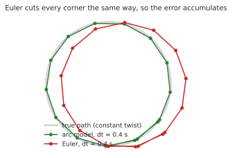
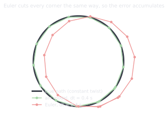
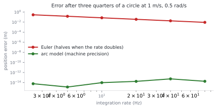
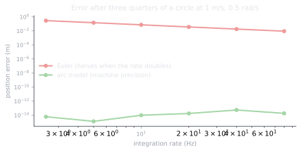

# 1.4 Twists: how robots describe velocity

**Status:** Code verified · **Prereqs:** lessons 1.1, 1.3 · **Time:** ~2 h · **Verified:** 2026-08-01, Python 3.13, NumPy ≥ 1.26

---

## A. Why this matters

Poses describe where a robot is, and twists describe how it is moving, which
turns out to be the quantity that most of the software actually traffics in.
Every velocity command you will ever send a mobile robot is a twist, wheel
odometry is nothing but twist integration, and the `odom → base` edge from
lesson 1.3 — the one that controllers depend on being smooth — is produced by
integrating twists several hundred times a second for as long as the robot is
switched on.

What makes this worth a full lesson rather than twenty minutes is that the
difference between a cheap integration and a correct one is about six lines of
code, and it shows up directly as localisation error in Module 3. Not as a
rounding difference that a filter will absorb, but as a systematic accumulating
drift that a filter fundamentally cannot remove, for reasons this lesson will
make precise.

!!! note "Terms defined here"

    **Twist** — a velocity expressed in the robot's own body frame, written in
    2D as \((v_x, v_y, \omega)\) for forward speed, sideways speed and turn
    rate.

    **Body frame** — the frame attached to the robot and moving with it, so
    that "forward" means the robot's forward regardless of where that
    currently points in the map.

    **Differential drive** — the configuration used by most indoor robots, in
    which two independently driven wheels produce both motion and steering by
    running at different speeds.

    **Wheelbase**, written \(b\) — the distance between the two driven wheels.

    **Dead reckoning** — estimating pose by accumulating measured motion,
    introduced in lesson 1.1 and computed here.

## B. Mental model

A 2D twist gives the robot's velocity in its own frame, where \(v_x\) is
forward speed, \(v_y\) is speed to the left and is zero for any robot that
cannot slide sideways, and \(\omega\) is the counter-clockwise turn rate.

The central insight of the lesson is worth stating carefully, because it is
not obvious and everything else follows from it: **a constant twist does not
move the robot in a straight line, it drives the robot along a circular arc.**

The reason becomes clear if you follow the motion for an instant. The robot is
moving forward at \(v_x\) and simultaneously rotating at \(\omega\), so an
instant later it is still moving forward at \(v_x\), but "forward" now points
in a slightly different direction because the robot turned while it was
travelling. Integrating that behaviour traces out a circle of radius

\[
r = \frac{v_x}{\omega}
\]

Straight-line integration, usually called Euler integration, ignores the
turning that happens during the step and therefore cuts the corner of the arc.

<figure class="rai-fig" markdown>
{.fig-light}
{.fig-dark}
<figcaption markdown>Fifteen steps of 0.4 s at 1 m/s and 1.2 rad/s. The arc model lands on the true circle at every step, while Euler traces a polygon inscribed in it, cutting each corner in the same direction.</figcaption>
</figure>

The error at each individual step is small, and it is also systematic, because
it always cuts the same way for a given turn direction. Small and systematic
is the worst possible combination for a quantity you intend to accumulate a
million times, and section D explains why.

### Differential drive makes it concrete

Two wheel speeds \((v_r, v_l)\) and a wheelbase \(b\) give

\[
v_x = \frac{v_r + v_l}{2}, \qquad \omega = \frac{v_r - v_l}{b}, \qquad v_y = 0
\]

and both formulas are worth reading physically rather than memorising. The
forward speed is the average of the two wheels, which follows because if both
wheels do the same thing then the robot simply travels at that speed. The turn
rate is the difference between the wheels divided by their separation, which
captures the fact that a given speed difference turns a wide robot slowly and
a narrow robot sharply.

## C. Mathematical formulation

Integrating a constant body twist \((v_x, 0, \omega)\) over a step
\(\Delta t\), starting from the pose \((x, y, \theta)\), the **exact** or
**arc** model for \(\omega \neq 0\) is

\[
\begin{aligned}
x' &= x + \frac{v_x}{\omega}\big(\sin(\theta + \omega \Delta t) - \sin\theta\big) \\
y' &= y - \frac{v_x}{\omega}\big(\cos(\theta + \omega \Delta t) - \cos\theta\big) \\
\theta' &= \theta + \omega \Delta t
\end{aligned}
\]

whereas the **Euler** approximation is simply

\[
x' = x + v_x \cos\theta\, \Delta t, \qquad
y' = y + v_x \sin\theta\, \Delta t, \qquad
\theta' = \theta + \omega\,\Delta t .
\]

The difference between them is entirely in when the heading is evaluated,
since Euler reads the heading once at the start of the step and pretends it
held throughout, while the arc model accounts for the heading changing during
the step.

As \(\omega \to 0\) the arc model reduces to Euler, which is reassuring, but
the formula divides by \(\omega\), so an implementation **must** guard that
division or straight-line driving produces `NaN`. Every production
implementation carries that guard, and forgetting it is failure mode 1.

For readers who like to know where things sit, the arc formula is the
closed-form exponential map \(\exp: \mathfrak{se}(2) \to SE(2)\), which is the
same \(\exp\) and \(\log\) pair that appears throughout SLAM libraries. You do
not need any of that vocabulary to use the formula correctly, and this
curriculum introduces it only where it earns its keep.

Velocities also change with frames, since a body-frame twist relates to
world-frame velocity through the current rotation,
\(\dot{p}_{world} = R(\theta)\,(v_x, v_y)^\top\). Forgetting that rotation
produces a robot that drives along the world x-axis regardless of where it is
pointing, which is failure mode 2 and is unmistakable once you have seen it.

## D. From ML to robotics

Choosing between Euler and the exact model is a discretisation-error trade of
exactly the kind you meet in ODE solvers, neural ODEs and physics-informed
models, but robotics adds a consequence that changes how much it matters. The
error here is **biased**, because it cuts the corner the same way every step,
so it accumulates as \(O(N)\) systematic drift rather than washing out as an
\(O(\sqrt N)\) random walk the way zero-mean noise would.

That distinction governs what happens downstream. A filter can shrink
zero-mean noise by averaging and can represent it honestly as process
covariance, whereas a bias that is not part of the motion model is
indistinguishable from real motion, so it enters the state estimate and stays
there permanently. Unbiased error can be filtered; biased error must be
modelled.

The motion model you choose here is also, quite literally, the process model
\(f(x_t, u_t)\) that the Kalman and particle filters of Module 3 will use, so
sloppy integration now becomes unexplained innovation later, which is the same
class of mistake as serving a model with different preprocessing from the one
it was trained with.

Finally, `cmd_vel` is an action-space contract, and learned policies in
Module 9 emit twists exactly as classical planners do. Reinforcement learning
for a mobile robot usually means learning a function that outputs
\((v_x, \omega)\) at 20 Hz, so everything in this lesson applies unchanged to
the learned stack.

## E. Minimal implementation

```python
import numpy as np

def integrate_twist(pose, v, omega, dt):
    """Exact (arc) integration of a body twist (v, 0, omega) over dt."""
    x, y, theta = pose
    if abs(omega) < 1e-9:                       # straight-line limit
        return (x + v * np.cos(theta) * dt,
                y + v * np.sin(theta) * dt,
                theta)
    r = v / omega
    return (x + r * (np.sin(theta + omega * dt) - np.sin(theta)),
            y - r * (np.cos(theta + omega * dt) - np.cos(theta)),
            theta + omega * dt)
```

Nine lines with one guard, exact for any constant twist at any timestep. The
Euler version is shorter and wrong in a way that costs a metre over the length
of a warehouse.

### Practice — write and run code here

<code-exercise src="geo-l4-diff-drive"></code-exercise>

<code-exercise src="geo-l4-euler-vs-arc"></code-exercise>

## F. Robotics-framework implementation

In ROS 2 a twist is a `geometry_msgs/Twist`, using `linear.x` and `angular.z`
for a planar robot, and it is published on `cmd_vel`. The full chain runs as
follows: a planner or policy publishes a twist, the base driver converts it to
wheel speeds using the inverse of the differential-drive equations from
section B, the wheels turn while encoders measure what actually happened, and
the odometry node integrates those *measured* wheel speeds into a pose that it
publishes as the `odom → base` edge from lesson 1.3.

The distinction between the last two steps is worth dwelling on, because
odometry integrates what the wheels did rather than what was commanded, and
the difference between those two quantities is called slip. It is one of the
main reasons the motion model has to be treated as a prior rather than as
truth.

`ros2_control`'s `diff_drive_controller` is this lesson shipped as production
C++.

## G. Experiment — measuring the integration error properly

The obvious experiment is to drive a full circle and measure how far from the
starting point each model believes it ended up, and it is worth explaining why
that experiment does not work, because the reason is instructive.

Euler integration over exactly one full revolution traces a regular polygon
whose vertices are equally spaced in heading, and such a polygon closes
exactly by symmetry, so the closure error comes out as zero and the experiment
reports that Euler is perfect. The path is visibly wrong throughout — it is a
polygon inscribed in the circle rather than the circle — but the endpoint
happens to be right, so closure error measures nothing useful here.

Measure the position error at three quarters of a revolution instead, where
the two models have genuinely diverged, and compare against the analytic arc
endpoint.

<figure class="rai-fig" markdown>
{.fig-light}
{.fig-dark}
<figcaption markdown>Position error after three quarters of a circle at 1 m/s and 0.5 rad/s. The arc model stays at roughly 10⁻¹⁴ regardless of rate, while Euler goes 0.142 m at 5 Hz, 0.071 m at 10 Hz and 0.035 m at 20 Hz — halving with each doubling, which is first-order behaviour.</figcaption>
</figure>

Two findings come out of this, and the second is the one to remember. The arc
model is exact at every rate for a constant twist, with an error of about
\(10^{-14}\) that does not depend on \(\Delta t\) at all, which is what
"closed form" means in practice. Euler's error is **first order**, meaning it
is proportional to \(\Delta t\), so halving the rate exactly doubles the
error rather than quadrupling it.

Then add noise to the wheel speeds and repeat, and you will find that at
50 Hz the noise dominates the discretisation error entirely. That is the
result which answers the practical question of how fast odometry should run:
fast enough that discretisation sits below your noise floor, and no faster,
because beyond that point you are spending CPU to publish quantisation noise.

## H. Failure modes

**Dividing by \(\omega\) near zero** makes the arc formula explode during
straight-line motion, producing `NaN` poses that propagate into the TF tree
and poison every downstream lookup, usually surfacing as an error message
pointing somewhere entirely unrelated.

**Integrating in the wrong frame** means applying \((v_x, v_y)\) in world
coordinates without rotating by \(R(\theta)\), which sends the robot along the
world x-axis regardless of its heading and is unmistakable once observed.

**Assuming \(v_y = 0\) holds on a real floor** ignores wheel slip, carpet and
the possibility of the robot being picked up and moved, which is why the
motion model must be treated as a prior rather than as truth and is the whole
reason Module 3 exists.

**Taking the timestep from the wrong clock**, by using the intended `dt`
instead of the measured elapsed time between encoder reads, converts scheduler
jitter directly into position drift and produces the puzzling symptom of
odometry accuracy that depends on system load.

## I. Questions

1. *(Concept)* Why is Euler-integration error in dead reckoning worse than
   sensor noise of comparable magnitude?
2. *(Calculation)* With \(v_r = 1.2\) and \(v_l = 0.8\) m/s and a wheelbase of
   0.5 m, compute \(v_x\), \(\omega\) and the turning radius.
3. *(Debugging)* A robot commanded to drive straight slowly veers left
   according to odometry but drives straight according to an external tracker.
   List two distinct causes and how to distinguish them.
4. *(System design)* Odometry can run at 20, 50 or 200 Hz. What trades off,
   and what would make you pick each?

??? note "Answer sketches"
    **1.** Because Euler cuts the corner of the arc the same way every step,
    the error is a signed bias tied to the turn direction, so over \(N\) steps
    it accumulates as \(O(N)\) while zero-mean sensor noise accumulates only as
    \(O(\sqrt N)\). The more important half of the answer is what happens
    downstream: a filter can shrink noise by averaging and can carry it as
    process covariance, whereas a bias absent from the motion model is
    indistinguishable from real motion and therefore enters the estimate and
    remains there.

    **2.** \(v_x = (1.2 + 0.8)/2 = 1.0\) m/s and
    \(\omega = (1.2 - 0.8)/0.5 = 0.8\) rad/s, giving a radius of
    \(v_x/\omega = 1.25\) m.

    **3.** The odometry is wrong rather than the motion, and the two candidate
    causes are mismatched effective wheel radii or encoder scale, which makes
    equal true wheel speeds report as \(v_r \neq v_l\) so that
    \(\omega = (v_r - v_l)/b\) comes out non-zero, or a yaw-rate bias in the
    gyroscope if odometry fuses an IMU. Distinguish them by time against
    distance: park the robot for a minute, and a heading that drifts while
    stationary is gyro bias, because a wheel-scale error accrues only with
    distance travelled. As a second check, drive the same path in reverse,
    which flips a wheel-scale veer to the other side while a gyro bias
    continues drifting the same way.

    **4.** Run at 50 Hz. With the arc model at 50 Hz the discretisation error
    is already below encoder quantisation noise, which is the section G
    result, whereas 20 Hz adds integration error on fast turns and latency to
    whatever controller consumes `odom → base`, and 200 Hz mostly publishes
    quantisation noise while quadrupling TF buffer traffic and CPU for no
    accuracy gain. Go to 200 Hz only when an EKF fusing a high-rate IMU wants
    matched prediction steps, and drop to 20 Hz only on a bandwidth-starved
    link or a genuinely slow robot.

### Interactive quiz

<quiz-bank src="geometry-l4-twists"></quiz-bank>

## J. Annotated references

| Reference | Type | Difficulty | Why read it |
|---|---|---|---|
| Lynch & Park, *Modern Robotics*, ch. 3.3 & 13.2 | book | intermediate | Twists done properly, with the differential-drive model given its own chapter |
| Thrun et al., *Probabilistic Robotics*, ch. 5 | book | intermediate | Velocity and odometry motion models, best read before Module 3 rather than during it |
| [`diff_drive_controller` docs](https://control.ros.org/jazzy/doc/ros2_controllers/diff_drive_controller/doc/userdoc.html) | docs | intermediate | This lesson as shipped production C++, including the parameters you will actually have to set |

## K. Graded work and portfolio extension

**Graded:** twist integration is the motion model inside the Module 3
localisation project, so getting it right here is a dependency rather than an
option.

**Portfolio:** write up the section G experiment as a notebook with the
error-against-rate plot, including the observation that closure error is the
wrong metric and why. It is small, complete and quantitative, and it
demonstrates that you distinguish discretisation error from noise and that you
noticed a measurement which flattered the wrong model — both of which are
precisely what estimation interviews probe.
