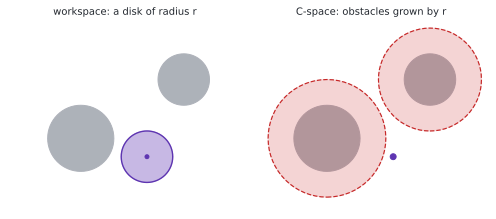
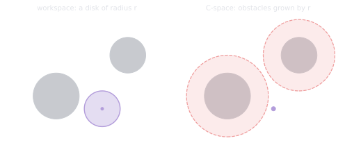
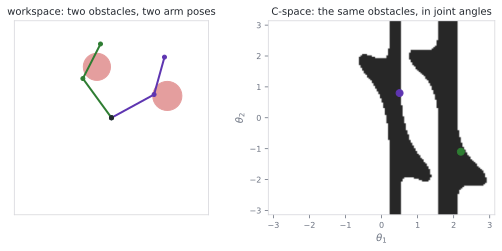
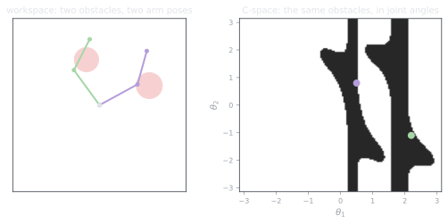

# 1.5 Configuration space: where planning actually happens

**Status:** Code verified · **Prereqs:** lessons 1.1, 1.4 · **Time:** ~2 h · **Verified:** 2026-08-01, Python 3.13, NumPy ≥ 1.26

---

## A. Why this matters

Path planning looks as though it happens in the world, and it does not. It
happens in configuration space, and this single change of representation is
what makes every planning algorithm in Module 5 stop looking like a collection
of unrelated tricks.

The problem it solves is easy to state. A robot is not a point but a shape,
and whether it collides depends on its position, its orientation and, for an
arm, every one of its joint angles simultaneously. Planning a route therefore
means asking, at every pose along the way, whether one complicated shape
overlaps some other complicated shapes, and that is an awkward question to
search over because the answer depends on all the variables at once and has no
useful structure.

Configuration space converts it into a question that does have structure, by a
change of representation substantial enough to deserve being called a trick.

!!! note "Terms defined here"

    **Configuration**, written \(q\) — the complete set of numbers needed to
    fully pose the robot.

    **Configuration space** (**C-space**, \(\mathcal{C}\)) — the space of all
    possible configurations. For a circular vacuum robot it is \((x, y)\), for
    a car it is \((x, y, \theta)\), and for a seven-joint arm it is
    seven-dimensional joint space.

    **Workspace** — ordinary physical space, where the obstacles actually sit.
    It is not the same thing as configuration space, and conflating the two
    causes several of the failure modes below.

    **DOF (degrees of freedom)** — the number of independent numbers required
    to specify a configuration, usually but not always equal to
    \(\dim \mathcal{C}\).

    **Holonomic and nonholonomic** — a holonomic robot can move instantly in
    any direction of its configuration space, whereas a car cannot slide
    sideways and is therefore nonholonomic, having fewer controls than
    configuration dimensions.

## B. Mental model

The trick is that **the robot becomes a point**, because all the geometry of
its body is absorbed into the shape of the obstacles.

A disk robot of radius \(r\) navigating among walls is exactly equivalent to a
point navigating among those same walls inflated by \(r\). That equivalence is
worth verifying rather than accepting, and the verification is one sentence:
the disk collides with an obstacle precisely when its centre comes within
\(r\) of that obstacle, so "the disk collides" and "the centre lies inside the
\(r\)-inflated obstacle" are two statements of the same fact. Nothing has been
approximated.

<figure class="rai-fig" markdown>
{.fig-light}
{.fig-dark}
<figcaption markdown>The same planning problem stated twice. On the right the robot has no size, which is what makes the search tractable, and the dashed circles are exactly Nav2's inflation layer.</figcaption>
</figure>

This is why occupancy grids in Nav2 carry an inflation layer, which is not a
safety margin bolted on afterwards but the configuration-space transformation
itself, shipped as a product feature.

For an arm the same trick applies and the result is considerably stranger. A
chair standing in the workspace becomes a curved blob in joint-angle space,
consisting of every combination of joint angles that would put some part of
the arm inside the chair, and that blob bears no resemblance whatsoever to a
chair. It is nonetheless exactly the forbidden region, so a planner searching
joint space needs only to avoid it.

<figure class="rai-fig" markdown>
{.fig-light}
{.fig-dark}
<figcaption markdown>Two circular obstacles, computed on a 140×140 grid of joint angles. The shaded region is every configuration in which some part of the arm intersects an obstacle, and the shape of the free corridors between the bands is the shape of the planning problem.</figcaption>
</figure>

### Topology matters

A revolute joint's angle lives on a circle rather than a line, so \(-179°\)
and \(+179°\) are two degrees apart rather than 358. A two-link arm's
configuration space is consequently not a square but a **torus**: walking off
the right-hand edge of the \((\theta_1, \theta_2)\) square brings you back on
the left, and walking off the top brings you back at the bottom.

Planners that ignore this take absurd long-way-around routes through joint
space, and if that sounds familiar it should, because it is the `wrap_angle`
bug from lesson 1.1 reappearing one level up the stack.

## C. Mathematical formulation

Let \(A(q)\) be the set of workspace points the robot's body occupies at
configuration \(q\), and let \(\mathcal{O}\) be the workspace obstacles. Then

\[
\mathcal{C}_{obs} = \{ q \in \mathcal{C} \mid A(q) \cap \mathcal{O} \neq \emptyset \},
\qquad
\mathcal{C}_{free} = \mathcal{C} \setminus \mathcal{C}_{obs}
\]

and a path is a continuous map \(\tau : [0,1] \to \mathcal{C}_{free}\). That
is the entire formalism, and planning is the problem of finding a continuous
curve through the free set.

For a disk robot, \(\mathcal{C}_{obs}\) is precisely \(\mathcal{O}\) dilated by
the robot's radius, an operation formally known as a Minkowski sum, which is
section B's argument written in symbols.

The dimensions are where the difficulty lives.

| Robot | \(\dim \mathcal{C}\) |
|---|---|
| Disk robot on a plane | 2 |
| Planar rigid body such as a car | 3, that is \(SE(2)\) |
| \(n\)-joint arm | \(n\) |
| Mobile base with a 6-joint arm and a gripper | 10 |

And now the fact that determines how planning algorithms are built. Explicitly
constructing \(\mathcal{C}_{obs}\) becomes intractable beyond two or three
dimensions, because gridding a seven-dimensional joint space at one-degree
resolution requires \(360^7 \approx 10^{17.8}\) cells, which cannot be built,
stored or searched by any means.

Planners therefore do not build it. They sample individual configurations and
collision-check them one at a time, and that single constraint is the entire
reason sampling-based planning — RRT, PRM and everything else in Module 5 —
takes the form it does.

## D. From ML to robotics

Configuration space is a feature space in which a hard problem becomes an easy
one, in the same sense that a kernel trick is. The transformation shrinks the
robot to a point and grows the obstacles to absorb its shape, turning "does
this complicated shape at this pose overlap those complicated shapes" into "is
this point inside the forbidden set".

The curse of dimensionality is entirely literal here, and the numbers in
section C make it concrete. This is the same combinatorial explosion that
pushed machine learning toward sampling and stochastic methods, and it pushed
robotics toward sampling-based planners for identical reasons, the two fields
having discovered the problem independently.

Membership of \(\mathcal{C}_{free}\), finally, is a binary classifier you query
rather than a dataset you enumerate, since collision checkers are reasonably
cheap oracles and planners are active-learning loops deciding where to query
next. If you have built an active-learning system then RRT will feel
structurally familiar, because it is choosing informative samples under a
query budget.

## E. Minimal implementation

Here is a two-link arm and the brute-force computation of its
configuration-space obstacle map.

```python
import numpy as np

def arm_points(theta1, theta2, l1=1.0, l2=0.8, n=20):
    """Sample points along both links of a planar 2-link arm."""
    elbow = np.array([l1 * np.cos(theta1), l1 * np.sin(theta1)])
    hand = elbow + [l2 * np.cos(theta1 + theta2), l2 * np.sin(theta1 + theta2)]
    t = np.linspace(0, 1, n)[:, None]
    return np.vstack([t * elbow, elbow + t * (hand - elbow)])

def in_collision(theta1, theta2, circles):
    """circles: list of (cx, cy, r) workspace obstacles."""
    pts = arm_points(theta1, theta2)
    return any(np.min(np.hypot(pts[:, 0] - cx, pts[:, 1] - cy)) < r
               for cx, cy, r in circles)
```

Evaluating `in_collision` across a grid of joint angles produces the figure in
section B, and it is worth doing yourself rather than merely looking at,
because the transformation from two innocuous circles into a pair of curved
connected bands is the kind of thing that becomes intuitive only after you
have generated it once.

Note the `n=20`, which checks each link at twenty sample points. A
sufficiently thin obstacle can slip between those samples, which is failure
mode 4 below.

### Practice — write and run code here

<code-exercise src="geo-l5-cspace"></code-exercise>

## F. Robotics-framework implementation

Nav2's costmap inflation layer is section C shipped as a product, taking
obstacles from the occupancy grid and dilating them by the robot's footprint
radius, plus a decaying cost skirt that biases the planner toward the middle
of corridors so that the robot does not hug walls it is technically clear of.

MoveIt 2 never constructs \(\mathcal{C}_{obs}\) at all, because for a
seven-degree-of-freedom arm there is no alternative. It wraps a collision
checker, FCL, and lets sampling-based planners from OMPL query it, which is
exactly the oracle pattern described in section D.

## G. Experiment — watch the corridor pinch shut

Build the configuration-space map for two workspace obstacles, and then vary
the **robot** rather than the world.

Increase the collision margin, which is equivalent to fattening the links,
from 0 to 0.2 m in steps, regenerating the map at each value. You will watch
\(\mathcal{C}_{obs}\) grow and the free corridor between the two obstacle
bands narrow until it pinches off completely, at which moment the planning
problem becomes infeasible without a single workspace obstacle having moved.

Then restore the margin and move one obstacle by 0.3 m, and watch a
topologically new corridor open where none existed before.

That pairing of obstacle geometry on one side with C-space topology on the
other is the intuition planning engineers carry in their heads, and it is
almost impossible to acquire from equations. Twenty minutes spent generating
these plots is worth a chapter of reading.

## H. Failure modes

**Planning with the wrong footprint** produces one of two opposite problems.
An inflation radius smaller than the true robot yields plans that are declared
valid and scrape the walls, while a radius larger than necessary makes
doorways the robot physically fits through impassable in configuration space.
Both are common, and the second is usually reported as "the planner is broken"
while the first is reported as "the robot is careless".

**Ignoring joint topology** by treating \(\theta \in [-\pi, \pi]\) as an
interval rather than a circle makes configurations either side of \(\pm\pi\)
appear maximally distant, so planners detour absurdly or oscillate.

**Applying workspace-distance intuition in configuration space** is the
dangerous one. Two arm poses whose hands nearly touch can be enormously far
apart in joint space, as with an elbow-up and an elbow-down solution, and
interpolating between them sweeps the entire arm through the workspace and
possibly through a person.

**Sampling collisions too sparsely along the links**, as the `n=20` above
does, lets thin obstacles slip between sample points so that the checker
reports free space which is not free. Production checkers use swept volumes or
conservative padding instead.

## I. Questions

1. *(Concept)* Why does inflating obstacles by the robot radius let us plan
   for a point, and what breaks for a non-circular robot?
2. *(Calculation)* How many DOF has a mobile manipulator consisting of a
   differential-drive base, a 6-joint arm and a 1-DOF gripper, and what is
   \(\dim \mathcal{C}\)?
3. *(Debugging)* An arm planner produces paths in which the elbow swings
   wildly between adjacent waypoints although the hand barely moves. What is
   the likely metric bug?
4. *(System design)* Your warehouse robot is rectangular, 1.2 × 0.6 m.
   Circular inflation by which radius is safe, what do you lose, and what
   would fix it?

??? note "Answer sketches"
    **1.** For a disk robot the occupied set \(A(q) = \mathrm{disk}(q, r)\)
    merely translates with \(q\) without changing shape, so it intersects an
    obstacle exactly when \(q\) lies within \(r\) of that obstacle, making
    \(\mathcal{C}_{obs}\) precisely \(\mathcal{O}\) dilated by \(r\) with
    nothing approximated. For a non-circular robot \(A(q)\) depends on
    \(\theta\) as well, so no single two-dimensional dilation can be correct:
    inflating by the circumscribed radius is conservative and blocks gaps the
    robot would fit through, inflating by the inscribed radius admits genuine
    collisions, and the honest fix is to keep \(\theta\) as a dimension and
    check the true footprint.

    **2.** The differential-drive base contributes \(SE(2)\), so three
    configuration dimensions, the arm adds six and the gripper one, giving
    \(\dim \mathcal{C} = 10\). The term "DOF" is ambiguous here, because the
    base is nonholonomic and has only two controls \((v_x, \omega)\), so there
    are nine independent velocity inputs against a ten-dimensional
    configuration space. That mismatch is exactly why the base's motion is
    planned with the twist model from lesson 1.4 rather than as free motion in
    \((x, y, \theta)\).

    **3.** Distance is being measured in the workspace, using end-effector
    position or pose, rather than in configuration space, so an elbow-up and
    an elbow-down configuration whose hands nearly coincide are scored as
    neighbours despite being far apart in joint space. The fix is to use a
    joint-space metric for both edge cost and interpolation, meaning a
    weighted \(L_2\) over the joint angles with each difference wrapped to
    \((-\pi, \pi]\) so that the torus topology is respected.

    **4.** The safe choice is the circumscribed radius, half the diagonal,
    which is \(\sqrt{0.6^2 + 0.3^2} \approx 0.67\) m. What you lose is every
    narrow aisle the robot could traverse lengthwise, since those become
    blocked in configuration space although the robot fits. The fix is to plan
    in \((x, y, \theta)\) with the true footprint, which is Nav2's
    footprint-based collision checking, paying one extra dimension of search
    to get the aisles back.

### Interactive quiz

<quiz-bank src="geometry-l5-cspace"></quiz-bank>

## J. Annotated references

| Reference | Type | Difficulty | Why read it |
|---|---|---|---|
| LaValle, *Planning Algorithms*, ch. 4 | book | intermediate | The canonical configuration-space chapter, free online from the author |
| Lynch & Park, *Modern Robotics*, ch. 2 | book | introductory | C-space, DOF counting and topology with a gentler on-ramp than LaValle |
| [Nav2 costmap concepts](https://docs.nav2.org/concepts/index.html) | docs | introductory | Inflation layers as shipped engineering, including the cost skirt this lesson only mentions |

## K. Graded work and portfolio extension

**Graded:** configuration-space collision checking returns as the core of the
Module 5 planning project.

**Portfolio:** render the two-link arm's configuration-space map beside its
workspace, as two subplots sharing a cursor so that hovering over a
configuration shows the corresponding arm pose. Built as an interactive
matplotlib figure or a small web demo, this is arguably the single most
explanatory robotics visual you can put in front of an interviewer, because it
renders a concept that takes ten minutes to explain obvious in about four
seconds.
