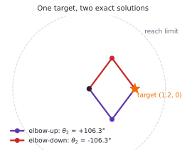
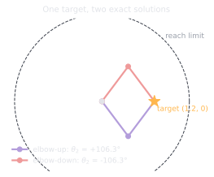

# 2.1 Forward and inverse kinematics: the 2-link arm

**Status:** Code verified · **Prereqs:** Module 1 · **Time:** ~2 h · **Verified:** 2026-08-01, Python 3.13, NumPy ≥ 1.26

---

## A. Why this matters

A robot speaks two languages at once and needs a dictionary between them. The
motors control **joint space**, meaning the angles \(\theta_1, \theta_2,
\dots\) that each actuator can command directly, while everything you actually
care about lives in **task space**, meaning where the hand is and which way it
points. Kinematics is that dictionary.

Translating in one direction is easy and in the other direction is not.
Forward kinematics takes joint angles and produces a pose, which is a matter
of composing the transforms you already built in Module 1 and is essentially
free. Inverse kinematics takes a desired pose and produces joint angles, and
that is where all the difficulty lives: there may be several correct answers,
there may be none, and near certain configurations the problem becomes
numerically vicious. Every pick-and-place operation, every reach and every
footstep begins with an inverse-kinematics solve, so these pathologies are not
edge cases but daily working conditions.

!!! note "Terms defined here"

    **Joint space** — the vector of joint variables the actuators control
    directly, one entry per joint.

    **Task space** — the space the task is described in, usually the position
    and orientation of the end effector.

    **End effector** — the business end of the arm: gripper, tool, or hand.

    **Workspace** — the set of poses the end effector can physically reach.

    **Singularity** — a configuration where the arm loses the ability to move
    its end effector in some direction, no matter how the joints move.

    **Redundancy** — having more joints than the task requires, so that
    infinitely many joint configurations achieve the same end-effector pose.

## B. Mental model

Forward kinematics is composition of transforms, which is lesson 1.1 applied
down a chain: place a frame at each joint, rotate by that joint's angle,
translate along the link, and repeat until you reach the tool. You have
already done this exercise, and nothing new is required.

Inverse kinematics is root finding. You are looking for the \(\theta\) that
satisfies \(FK(\theta) = p_{target}\), and for a two-link arm a closed-form
solution exists via the law of cosines, while for a general arm you iterate.
The workhorse iteration should feel immediately familiar to anyone who has
trained a model, because it is gradient descent in all but name: the Jacobian
\(J = \partial FK / \partial \theta\) tells you how the hand moves per unit of
joint motion, and you step the joints by the pseudoinverse of that Jacobian
applied to the task-space error, repeating until the error vanishes. If you
have implemented backpropagation and a gradient step, you have implemented
damped-least-squares inverse kinematics without knowing it.

The two-link arm generally admits **two** solutions for any reachable target,
usually called elbow-up and elbow-down, which is your first concrete taste of
the configuration-space branches from lesson 1.5.

<figure class="rai-fig" markdown>
{.fig-light}
{.fig-dark}
<figcaption markdown>Both configurations put the hand exactly on the target, and both are exact solutions rather than approximations. Which one a numerical solver returns depends entirely on where it started, which is the cause of failure mode 3 below.</figcaption>
</figure>

## C. Mathematical formulation

Forward kinematics for link lengths \(l_1\) and \(l_2\) is a direct
consequence of adding two rotated segments:

\[
p = \begin{bmatrix} l_1 \cos\theta_1 + l_2 \cos(\theta_1 + \theta_2) \\ l_1 \sin\theta_1 + l_2 \sin(\theta_1 + \theta_2) \end{bmatrix}
\]

Note that the second link's angle is \(\theta_1 + \theta_2\) rather than
\(\theta_2\), because joint angles in a serial chain are measured relative to
the previous link and therefore accumulate.

The closed-form inverse comes from the law of cosines. Writing

\[
D = \frac{\|p\|^2 - l_1^2 - l_2^2}{2 l_1 l_2}
\]

the target is reachable exactly when \(|D| \le 1\), and the solutions are

\[
\theta_2 = \pm\arccos D, \qquad
\theta_1 = \operatorname{atan2}(y, x) - \operatorname{atan2}\!\big(l_2 \sin\theta_2,\; l_1 + l_2 \cos\theta_2\big) .
\]

The \(\pm\) is precisely the elbow-up and elbow-down pair from the figure, and
the reachability test is worth keeping visible in your implementation, because
a solver that silently returns its best effort for an unreachable target is
failure mode 1.

For arms with more than two joints there is generally no closed form, and the
production default is **damped least squares**:

\[
\Delta\theta = J^\top (J J^\top + \lambda^2 I)^{-1} \, e
\]

The damping term \(\lambda\) is Tikhonov regularisation, and it exists to keep
the step bounded near singularities where \(J\) loses rank and the undamped
pseudoinverse would command infinite joint speed. Question 1 works through
what it buys and what it costs.

## D. From ML to robotics

Numerical inverse kinematics is literally optimisation, minimising
\(\|FK(\theta) - p\|^2\) by following the Jacobian, so every instinct you have
about step sizes, convergence stalls and local minima transfers directly.
Damped least squares is ridge regression applied to the update step, and it
behaves the way ridge regression behaves.

Singularities are ill-conditioning with a physical interpretation. A
fully-extended arm cannot move its hand radially outward no matter how fast
the joints turn, and the Jacobian at that configuration is rank-deficient in
exactly the way a nearly-singular design matrix is, with the same remedy.

The elbow-up and elbow-down branches are multimodality, and the consequence is
one you will meet again in Module 9. Gradient methods find *a* solution, and
which one they find depends on initialisation, so a regression model trained
to predict joint angles from task-space targets inherits the problem: asked to
fit both modes, it averages between them and produces a configuration that
satisfies neither. That is one of the concrete mechanisms behind naive
behaviour cloning failing on multimodal data.

## E. Minimal implementation

Forward kinematics you can write straight from section C. The numerical
inverse is barely longer:

```python
import numpy as np

def jacobian(theta, l1=1.0, l2=0.8):
    t1, t12 = theta[0], theta[0] + theta[1]
    return np.array([
        [-l1*np.sin(t1) - l2*np.sin(t12), -l2*np.sin(t12)],
        [ l1*np.cos(t1) + l2*np.cos(t12),  l2*np.cos(t12)],
    ])

def ik_step(theta, target, lam=0.1):
    e = target - fk(theta)
    J = jacobian(theta)
    return theta + J.T @ np.linalg.solve(J @ J.T + lam**2 * np.eye(2), e)
```

Reading the Jacobian's columns physically is worth a moment, because it makes
the singularity obvious later. Column \(j\) is how the tip moves when joint
\(j\) rotates by a unit amount, which geometrically is the lever arm from that
joint to the tip, rotated by ninety degrees. When the arm is straight, both
lever arms point the same way, both columns become parallel, and the matrix
loses rank.

### Practice — write and run code here

<code-exercise src="ctl-l1-fk"></code-exercise>

<code-exercise src="ctl-l1-ik"></code-exercise>

## F. Robotics-framework implementation

Real arms describe their kinematic chain in a **URDF**, covered in Module 6,
and generic forward and inverse kinematics run through KDL or MoveIt 2's
kinematics plugins. Production solvers such as TRAC-IK, or the analytic
IKFast, handle six and seven degrees of freedom with joint limits and
collision constraints layered on top, which Module 8 covers properly. The
two-link core you are building here is an honest miniature of all of it, in
the sense that every pathology in section H appears at full scale unchanged.

## G. Experiment — watch the singularity bite

Run numerical inverse kinematics to a sequence of targets sweeping from well
inside the workspace out to just past its boundary, so that \(\|p\|\)
approaches and then exceeds \(l_1 + l_2\). Log two quantities at each target:
the number of iterations required to converge, and the largest joint speed
commanded along the way. Repeat the sweep with \(\lambda \in \{0, 0.01,
0.1\}\).

Undamped inverse kinematics explodes at the boundary, commanding joint
velocities that on real hardware mean a protective stop at best and a stripped
gearbox at worst, while damped inverse kinematics degrades gracefully and
simply fails to reach the last few millimetres. Then check which branch you
converged to from different initialisations, and you will find that the
elbow-up and elbow-down basins of attraction are large, clean and entirely
determined by the seed.

## H. Failure modes

**Unreachable targets**, meaning \(|D| > 1\), make the closed form fail
loudly, which is good, while numerical inverse kinematics stalls at the
workspace boundary and silently returns its best effort, which is not. Always
check the residual rather than trusting that convergence occurred.

**Singularity commands** arise near full extension, where undamped inverse
kinematics requests enormous joint velocities, and on hardware that is a
safety stop or a mechanical failure rather than a numerical curiosity.

**Branch flips mid-trajectory** happen when inverse kinematics is solved
independently for each waypoint without warm-starting from the previous
solution, so that adjacent points land on opposite branches and the arm
thrashes between elbow-up and elbow-down. Warm-start from the previous
solution and stay on one branch.

**Degrees against radians** remains undefeated as a source of absurd arm
poses, and it is worth an explicit assertion at every boundary rather than a
comment.

## I. Questions

1. *(Concept)* Why does damping make inverse kinematics robust at
   singularities, and what does it cost away from them?
2. *(Calculation)* With \(l_1 = l_2 = 1\) and a target at \((1.2, 0)\),
   compute \(D\) and both \(\theta_2\) solutions.
3. *(Debugging)* Your solver converges, but the elbow alternates between two
   configurations on successive calls. Why, and what is the fix?
4. *(System design)* A 6-DOF arm has infinitely many inverse-kinematics
   solutions for most poses. Name two useful secondary objectives to spend
   that redundancy on.

??? note "Answer sketches"
    **1.** Near a singularity the smallest singular value \(\sigma_{min}(J)\)
    approaches zero and the pseudoinverse's \(1/\sigma\) factor blows up, so
    damping replaces that factor with \(\sigma/(\sigma^2 + \lambda^2)\), which
    is bounded above by \(1/(2\lambda)\) and therefore keeps joint speeds
    finite. Away from singularities you pay the ridge-regression price: the
    step is shrunk and biased toward zero, so convergence is slower and the
    residual never quite reaches zero unless you anneal \(\lambda\) as the
    error shrinks.

    **2.** \(D = (1.2^2 - 1 - 1)/(2 \cdot 1 \cdot 1) = (1.44 - 2)/2 = -0.28\),
    giving \(\theta_2 = \pm\arccos(-0.28) = \pm 1.855\) rad, which is
    \(\pm 106.3°\). The two solutions are symmetric about the line from the
    base to the target, and both appear in the section B figure.

    **3.** Branch flipping. The solver is being re-initialised on each call,
    and because the two branches are equally valid minima it converges to
    whichever one its starting point falls nearest. Fix it by warm-starting
    from the previous solution, or by committing to one branch — fixing the
    sign of \(\theta_2\) — and rejecting any solution that crosses it.

    **4.** Maximising manipulability, which pushes \(\sigma_{min}(J)\) up and
    keeps the arm away from singularities, and staying away from joint limits.
    Both enter through the null-space projector,
    \(\Delta\theta = J^{+} e + (I - J^{+}J)\,\nabla h\), so they cost nothing
    in task-space accuracy because the second term moves the arm only in
    directions that leave the tip stationary. Collision clearance and
    remaining near the previous configuration are the other two you meet in
    production.

### Interactive quiz

<quiz-bank src="control-l1-kinematics"></quiz-bank>

## J. Annotated references

| Reference | Type | Difficulty | Why read it |
|---|---|---|---|
| Lynch & Park, *Modern Robotics*, ch. 4 & 6 | book | intermediate | Forward kinematics via products of exponentials, and numerical inverse kinematics done rigorously |
| Buss, *"Introduction to IK with Jacobian transpose, pseudoinverse and DLS"* | tutorial | introductory | The classic practical note on inverse kinematics, short and readable, and the source of the damping argument |
| [MoveIt 2 kinematics docs](https://moveit.picknik.ai/main/doc/examples/kinematics/kinematics_tutorial.html) | docs | intermediate | Where these solvers live in production and which knobs they expose |

## K. Graded work and portfolio extension

**Graded:** inverse kinematics joins the Module 2 project as a reaching task
scored on convergence rate, final residual and behaviour near singularities.

**Portfolio:** build an animated two-link reacher that traces a sequence of
targets with a live Jacobian-conditioning readout, colouring the arm by
\(\sigma_{min}(J)\). Singularities become visible as the arm reddens at full
extension, which turns an abstract numerical condition into something a viewer
grasps immediately.
