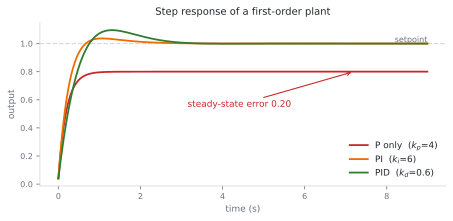
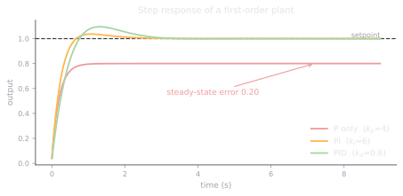
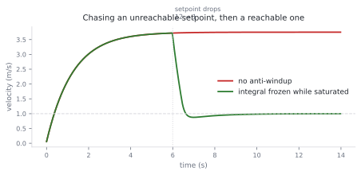
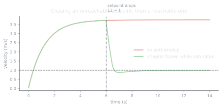

# 2.2 PID control, properly

**Status:** Code verified · **Prereqs:** lesson 1.4 · **Time:** ~2.5 h · **Verified:** 2026-08-01, Python 3.13, NumPy ≥ 1.26

---

## A. Why this matters

PID runs the world. It sets your robot's wheel speeds, holds a drone's
attitude, drives every joint of every industrial arm, and regulates the oven
in your kitchen, and it has done so for the better part of a century without
being displaced by anything cleverer. It is routinely dismissed as "the simple
controller", which is true of the equation and false of the implementation,
because there are five distinct ways to get it wrong and production code has
to defend against all of them.

Those five are unwrapped angles, derivative kick, integral windup, the wrong
timestep and noise amplified through the derivative term, and each of them
produces a robot that behaves badly in a way that looks like a tuning problem
and is not. This lesson is PID as production engineering rather than as a
formula, because the capstone's trajectory follower runs through it and so do
about half the incidents in Module 11.

!!! note "Terms defined here"

    **Plant** — the system being controlled, as opposed to the controller
    acting on it. Defined at length in lesson 0.1; repeated here because
    everything below refers to it.

    **Setpoint** — the value you want the plant's output to reach, written
    \(r\).

    **Steady-state error** — the gap that remains between output and setpoint
    once everything has settled and stopped changing.

    **Saturation** — the actuator hitting a physical limit, so that
    commanding more produces no more.

    **Windup** — the integral term continuing to accumulate while the
    actuator is saturated and therefore cannot act on it.

## B. Mental model

The three terms respond to three different time horizons of the same error
signal, and reading them that way makes their behaviour predictable rather
than something to be discovered by tuning.

**P is the present.** It pushes in proportion to the error right now, which
makes it behave like a spring: it always pulls toward the setpoint, it
undershoots any persistent disturbance, and if the gain is large it
oscillates.

**I is the past.** It accumulates error over time and pushes against the
accumulation, which is what eliminates steady-state error, because the
integral effectively learns whatever constant disturbance is present. It is
also what causes windup, since an integral that keeps accumulating while the
actuator cannot respond is recording a debt that will be repaid violently.

**D is the future.** It responds to the rate at which error is changing, so it
brakes before the output overshoots. It provides damping, and because
differentiation amplifies high frequencies it also amplifies measurement
noise, which is the trade-off that section G asks you to measure.

An analogy that lands well for anyone arriving from machine learning is that
the integral term is a bias corrector learned online, with much the same
staleness pathologies as a running mean in batch normalisation, while the
derivative term behaves like momentum-based damping on the correction.

## C. Mathematical formulation

\[
u(t) = k_p\, e(t) + k_i \int_0^t e(\tau)\, d\tau + k_d\, \dot{e}(t)
\]

What the equation does not show is the three guards that separate a working
implementation from a textbook one, and they are exactly what
`robotics_ai.control.PID` implements.

**Clamp the output** to the actuator limits \([u_{min}, u_{max}]\), because
commanding a value the hardware cannot produce means the controller's model of
its own effect on the world is wrong.

**Guard the integral against windup**, by clamping it or by freezing
accumulation whenever the output is saturated. Without this, a saturated
actuator lets the integral grow without bound, and the system overshoots
enormously once the error finally reverses.

**Avoid derivative kick.** The very first sample has no history, so its
derivative must be defined as zero rather than computed against a missing
value, and more generally it is better to differentiate the *measurement*
rather than the error, so that a step change in the setpoint does not produce
an impulse in the derivative term.

### Why P alone cannot remove steady-state error

This is worth deriving rather than asserting, because the conclusion is
counter-intuitive until you see it in one line. At equilibrium a first-order
plant requires \(u = y\) to hold its position. A proportional controller
supplies \(u = k_p(r - y)\), and setting those equal gives

\[
k_p (r - y) = y \quad\Longrightarrow\quad y = \frac{k_p}{1 + k_p}\, r
\]

which is strictly less than \(r\) for any finite gain. Raising \(k_p\) shrinks
the gap without ever closing it, and the underlying reason is structural
rather than numerical: a proportional controller commands zero output at zero
error, so the only way it can sustain the non-zero effort that a disturbance
requires is to sustain a non-zero error alongside it. Eliminating the error
requires a term that can hold a non-zero output while the error is zero, which
is precisely what the integral does.

<figure class="rai-fig" markdown>
{.fig-light}
{.fig-dark}
<figcaption markdown>Measured, not sketched. With k_p = 4 the proportional controller settles at exactly 0.80, which is k_p/(1+k_p) as derived above. Adding the integral reaches the setpoint; adding the derivative damps the overshoot on the way.</figcaption>
</figure>

## D. From ML to robotics

Tuning gains resembles tuning learning rates more than it resembles anything
else you have done. Too large a \(k_p\) oscillates in the same way that too
large a learning rate does, \(k_d\) damps in much the way momentum correction
does, and the integral behaves as a slow secondary learner. As with learning
rates there are published recipes, Ziegler–Nichols being the famous one, and
as with learning rates the people who are good at it tune by looking at the
shape of the response rather than by applying the recipe.

Windup is optimiser-state corruption. A saturated actuator paired with a
growing integral is the same failure as stale momentum in an optimiser after
gradients have been clipped: the accumulated state no longer reflects
anything real, and recovery takes about as long as the corruption did.

It is also worth noticing that PID is a three-parameter policy which is
model-free, interpretable and provable, and that combination is why it has not
been replaced by a network in the inner loop despite forty years of people
trying. Learned policies in Module 9 typically output setpoints *for* PIDs
rather than motor currents directly, which means this lesson remains load
bearing even in a fully learned stack.

## E. Minimal implementation

The library version lives at
[`robotics_ai/control/pid.py`](https://github.com/paulyonghaoli/robotics-for-ai-engineers/blob/main/robotics_ai/control/pid.py),
implementing clamping, anti-windup and a kick-free first step, and it is
tested including a saturation-recovery case that fails without the guard.

### Practice — write and run code here

<code-exercise src="ctl-l2-pid"></code-exercise>

<code-exercise src="ctl-l2-tune"></code-exercise>

## F. Robotics-framework implementation

In ROS 2, `ros2_control` hosts PID loops inside `joint_trajectory_controller`
and `diff_drive_controller`, with gains living in YAML parameters that can be
retuned live through the parameter interface, which is how tuning is actually
done on hardware rather than by editing and rebuilding.

The capstone closes its loop in the same shape: the planner produces a
reference trajectory, a PID acts on cross-track and heading error, and the
result is published as `cmd_vel`.

## G. Experiment — find the oscillation, then pay for the damping

Work on the mass simulator from the exercise above, in three stages.

First raise \(k_p\) until the output oscillates without decaying, and note the
period of that oscillation. Those two numbers, the gain at which sustained
oscillation begins and its period, are all Ziegler–Nichols needs, so apply the
recipe and then improve on it by hand. The point of doing both is to see how
mediocre the recipe's result is and how much a few minutes of looking at the
response shape buys.

Then add measurement noise with a standard deviation of about a centimetre and
watch the derivative term convert it into actuator chatter, which on real
hardware means audible buzzing and a warm motor. Fix it with a low-pass filter
on the derivative, with a smoothing factor around 0.1, and then measure what
you paid for that fix in lost damping. There is no setting that gives you both,
and knowing the shape of that trade is most of what separates someone who can
tune a controller from someone who can only follow a recipe.

## H. Failure modes

**Integral windup** is the classic. A saturated actuator chasing an
unreachable setpoint lets the integral grow for seconds, and the accumulated
value then drives an enormous overshoot once conditions change.

<figure class="rai-fig" markdown>
{.fig-light}
{.fig-dark}
<figcaption markdown>The cart's actuator saturates at ±1, so a setpoint of 12 is unreachable and the integral accumulates the whole time. When the setpoint drops to a reachable 1, the unguarded controller has to burn off everything it accumulated before it can respond.</figcaption>
</figure>

The guards are an integral clamp, conditional integration, or back-calculation,
and the exercise `ctl-l7-bug-windup` in the Module 2 lab makes you find this
one from its symptom.

**Derivative acting on noisy measurements** produces chattering actuators and
motors that run hot, and the guard is a filtered derivative or, quite often,
dropping to PI and accepting the slower response.

**An unwrapped heading error fed into a PID** is lesson 1.6's second bug
wearing different clothes, and it is worth stating plainly that the controller
is innocent here: the error computation is guilty, and no amount of retuning
will help.

**Retuning that masks a plant change** is the subtle one. If gains that worked
last week suddenly do not, suspect the robot before the controller, because a
new payload, a sagging battery or a worn tyre changes the plant, and tuning
around a hardware fault buries it rather than fixing it.

## I. Questions

1. *(Concept)* Why can't P-only control reject a constant disturbance, no
   matter how large the gain?
2. *(Calculation)* A P-controller on a first-order plant with \(k_p = 4\):
   what fraction of the setpoint is reached at steady state?
3. *(Debugging)* A drone's altitude hold works in hover but porpoises
   violently after aggressive climbs. Which term, and which pathology?
4. *(System design)* Why do arms run a fast inner velocity PID inside a slower
   outer position loop rather than a single position PID?

??? note "Answer sketches"
    **1.** Because a proportional controller's output is strictly proportional
    to the error, the constant effort needed to cancel a constant disturbance
    has to be bought with a permanent error of \(e = d/k_p\), since at zero
    error the controller commands zero. Raising \(k_p\) shrinks that offset,
    following \(y = \frac{k_p}{1+k_p} r\), but never removes it, and only a
    term capable of sustaining non-zero output at zero error can.

    **2.** \(y/r = k_p/(1 + k_p) = 4/5 = 0.8\), so 80% of the setpoint and a
    20% steady-state error. The figure in section C is this number measured
    rather than derived, and the two agree exactly.

    **3.** Integral windup. During the climb the thrust saturates, altitude
    error accumulates in the integral, and once the drone reaches altitude the
    accumulated term drives it past the hover point, after which the cycle
    repeats as porpoising. Clamp the integral or freeze accumulation while the
    actuator is saturated.

    **4.** Cascade control, because the inner loop rejects torque-level
    disturbances such as friction, gravity loading, back-EMF and gearbox
    stiction inside its own fast time constant, before any of them surface as
    position error. It also hands the outer loop a plant that behaves like a
    clean integrator of commanded velocity, which is trivial to tune. A single
    position PID would have to cover fast actuator dynamics and slow position
    dynamics with one set of gains, so it inevitably gets detuned to the
    slower one, and cascading additionally provides velocity and acceleration
    limiting for free at the interface between the loops.

### Interactive quiz

<quiz-bank src="control-l2-pid"></quiz-bank>

## J. Annotated references

| Reference | Type | Difficulty | Why read it |
|---|---|---|---|
| Åström & Murray, *Feedback Systems*, ch. 11 | book | intermediate | PID with the theory behind the recipes rather than the recipes alone, and free online |
| [`ros2_control` PID docs](https://control.ros.org/jazzy/index.html) | docs | intermediate | Where the gains live in production and how they are retuned on a running robot |
| Ziegler & Nichols (1942) | paper | introductory | The original tuning recipe, eighty years old and still the standard starting point |

## K. Graded work and portfolio extension

**Graded:** the tuning exercise enforces quantitative step-response
specifications for settle time and overshoot, using the same rubric style that
the capstone's control scoring uses.

**Portfolio:** write up the section G noise study, covering derivative-induced
chatter, the filtered-derivative fix and the damping it costs. Controls
interviewers ask about precisely this trade-off, and having measured it puts
you ahead of a candidate who can only describe it.
