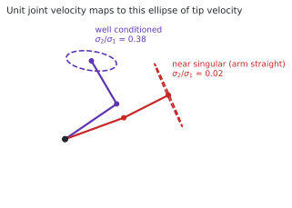
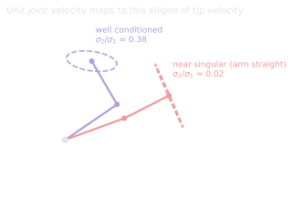

# 2.3 Jacobians and differential kinematics

**Status:** Code verified · **Prereqs:** lesson 2.1 · **Time:** ~2 h · **Verified:** 2026-08-02, Python 3.13, NumPy ≥ 1.26

---

## A. Why this matters

The Jacobian is the arm's exchange rate between the two languages of lesson
2.1. Where forward kinematics relates joint *positions* to hand *position*,
the Jacobian relates joint *velocities* to hand *velocity* through the
relation \(\dot{p} = J(\theta)\, \dot{\theta}\), and because control happens in
velocities rather than positions, almost everything that moves an arm smoothly
runs through this one matrix.

That includes velocity control directly, the inverse kinematics you built in
lesson 2.1, the mapping between hand forces and joint torques, and the whole
question of which motions an arm can and cannot perform from its current pose.
When a robot arm suddenly cannot move the way you asked it to, the diagnosis
is almost always found by looking at the Jacobian's conditioning, which makes
this lesson unusually high-leverage for debugging.

!!! note "Terms defined here"

    **Differential kinematics** — the relationship between joint velocities
    and end-effector velocity, as opposed to the positional relationship of
    lesson 2.1.

    **Manipulability ellipsoid** — the set of end-effector velocities
    achievable with unit joint velocity. An ellipse in the plane, an ellipsoid
    in three dimensions.

    **Singular value** — from the SVD of \(J\); the lengths of the
    manipulability ellipse's semi-axes.

    **Condition number** — the ratio \(\sigma_{max}/\sigma_{min}\), measuring
    how differently the arm responds to the easiest and hardest task
    directions.

    **Statics** — the relationship between forces and torques when nothing is
    accelerating.

## B. Mental model

At any configuration, each column of the Jacobian is the contribution of one
joint, in the sense that column \(i\) is exactly the hand velocity produced by
unit velocity on joint \(i\) alone. Since the hand's total velocity is the sum
of those contributions weighted by how fast each joint turns, the set of hand
velocities reachable with unit joint velocity is the image of the unit ball
under \(J\), which is an ellipse.

That ellipse is the single most useful object in this lesson. A fat, nearly
circular ellipse means the arm is agile in every direction and the
configuration is comfortable. A pencil-thin ellipse means the arm is near a
**singularity**, where some task-space direction has become effectively
unreachable no matter how hard the motors work, and the ellipse's axes are
precisely the singular values of \(J\), so every intuition you have about the
SVD applies here without translation.

<figure class="rai-fig" markdown>
{.fig-light}
{.fig-dark}
<figcaption markdown>The same arm, two configurations. Bent, the ratio of smallest to largest singular value is 0.38 and the arm moves comfortably in every direction. Nearly straight, that ratio falls to 0.025, so the hand is roughly forty times harder to move in one direction than in the other.</figcaption>
</figure>

## C. Mathematical formulation

For the two-link arm of lesson 2.1, writing \(s_1 = \sin\theta_1\) and
\(s_{12} = \sin(\theta_1 + \theta_2)\) and similarly for cosines:

\[
J = \begin{bmatrix}
-l_1 s_1 - l_2 s_{12} & -l_2 s_{12} \\
\;\;\, l_1 c_1 + l_2 c_{12} & \;\;\, l_2 c_{12}
\end{bmatrix},
\qquad
\det J = l_1 l_2 \sin\theta_2
\]

The determinant is worth dwelling on because it is unusually clean. It depends
on \(\theta_2\) alone and vanishes exactly when \(\theta_2 \in \{0, \pi\}\),
meaning the arm is fully stretched out or fully folded back on itself, and
those are the only two singular configurations this arm has. Near them
\(\sigma_{min}(J) \to 0\), and since inverting \(J\) to achieve a commanded
hand velocity requires joint speeds proportional to \(1/\sigma_{min}\), the
demanded speeds grow without bound. That is lesson 2.1's exploding inverse
kinematics, now with a diagnosis rather than a symptom.

### The statics dual

The same matrix, transposed, maps hand forces back to joint torques:

\[
\tau = J^\top F
\]

This is not an approximation or a coincidence but a consequence of
conservation of power, worked through in question 1. Its practical
consequence is worth internalising because it runs counter to intuition: a
fully stretched arm, which is *worst* at moving its hand radially, is
correspondingly *best* at resisting radial loads, because a force along the
arm produces almost no moment about either joint. This is the same reason you
instinctively carry a heavy box with straight arms rather than bent ones.

### The sweep, with numbers — and a disagreement between two measures

Section G asks you to sweep \(\theta_2\) and watch three quantities tell one
story. Here is that sweep run for this arm (\(l_1 = 1.0\), \(l_2 = 0.8\)),
with a fourth column: the joint speed demanded to move the hand at a fixed
1 cm/s in the *worst* direction, which is the minor axis of the ellipse.

| \(\theta_2\) | \(\sigma_{min}\) | \(\det J = l_1 l_2 \sin\theta_2\) | \(\|\dot\theta\|\) for 1 cm/s, worst direction |
|---|---|---|---|
| 5° | 0.035 | 0.070 | **0.282 rad/s** |
| 15° | 0.106 | 0.207 | 0.094 |
| 30° | 0.210 | 0.400 | 0.048 |
| 60° | 0.406 | 0.693 | 0.025 |
| 90° | 0.573 | **0.800** | 0.018 |
| **120°** | **0.693** | 0.693 | **0.014** |
| 150° | 0.497 | 0.400 | 0.020 |
| 170° | 0.169 | 0.139 | 0.059 |

Two readings. The first is the expected one: between a nearly-straight arm at
5° and a comfortable bend, the joint speed needed for the same worst-direction
hand speed varies by a factor of **twenty**. The \(1/\sigma_{min}\) blow-up is
not an asymptotic statement about a measure-zero configuration — it is already
costing you an order of magnitude at 15°, which is a posture arms pass through
constantly.

The second reading is the interesting one, and it is easy to miss:
**the two columns disagree about the best posture.** The determinant peaks at
exactly 90°, but \(\sigma_{min}\) peaks near 120°. Both are legitimate
manipulability measures, and they are answering different questions. The
determinant is the *area* of the ellipse — a geometric mean of capability over
all directions — while \(\sigma_{min}\) is the *minor axis*, the guaranteed
speed in the single worst direction. At 90° this arm's ellipse has more area
but is more eccentric; at 120° it is smaller and rounder. If your requirement
is written as "at least \(v\) in *any* direction" — and question 4 shows that
real requirements usually are — then \(\sigma_{min}\) is the measure that
matches the contract, and optimising Yoshikawa's \(\sqrt{\det JJ^\top}\)
instead will quietly park the arm in a posture that fails the spec in one
direction while excelling in others. The general lesson travels well beyond
arms: when someone says "maximise manipulability," ask which norm.

### Checking a Jacobian without trusting yourself

The finite-difference check from section D deserves its three lines here,
because it is the single highest-value unit test in kinematics code:

```python
def jac_fd(fk, theta, eps=1e-6):
    n = len(theta)
    J = np.zeros((2, n))
    for j in range(n):
        d = np.zeros(n); d[j] = eps
        J[:, j] = (fk(theta + d) - fk(theta - d)) / (2 * eps)
    return J

assert np.allclose(jacobian(theta), jac_fd(fk, theta), atol=1e-5)
```

Central differences give error \(O(\epsilon^2)\) against forward differences'
\(O(\epsilon)\), which is why the two-sided form is worth its second function
evaluation. Run the assert over a few dozen random configurations, not one:
a sign error in a single trigonometric term can vanish at special angles
(\(\sin 0 = -\sin 0\)) and a check at \(\theta = 0\) proves nothing. This is
the same discipline as gradient-checking a hand-written backward pass, and it
catches the same class of bug — the one that makes the system *almost* work,
which section H already named as the worst kind.

## D. From ML to robotics

The manipulability ellipsoid is principal component analysis of instantaneous
capability, with singular values playing the role of explained variance and a
singularity being rank collapse.

The condition number \(\sigma_{max}/\sigma_{min}\) plays exactly its usual
role, in that ill-conditioning amplifies noise. Small amounts of joint jitter
turn into wild hand motion near a singularity for precisely the reason that
badly scaled regression amplifies noise in the poorly determined direction.

Finite-difference checking of a hand-derived Jacobian, which is what lesson
3.3's exercise asks you to do, is gradient checking from the era before
automatic differentiation. Robotics still lives in that era for defensible
reasons, chiefly speed in a hard real-time loop and auditability of code that
can injure someone.

## E. Minimal implementation and practice

The analytic Jacobian is the eight lines of section C. The exercise builds it,
validates it against finite differences, and traces \(\sigma_{min}\) across
the workspace so that you can watch singularities emerge rather than being
told where they are.

<code-exercise src="ctl-l3-jacobian"></code-exercise>

## F. Robotics-framework implementation

MoveIt 2 exposes `getJacobian()` on each move group, and KDL computes it
directly from the URDF chain, so you will rarely differentiate forward
kinematics by hand in production. What production systems do add is
continuous monitoring: manipulability is evaluated as the arm moves, and
low-\(\sigma_{min}\) regions are either avoided during planning or traversed
with damped commands, which is lesson 2.1's damped least squares now equipped
with the vocabulary to explain itself.

## G. Experiment — three views of the same fact

Sweep \(\theta_2\) from 0 to \(\pi\) at a fixed \(\theta_1\), and plot three
quantities on a shared axis: \(\sigma_{min}(J)\), \(\det J\), and the joint
speeds that undamped inverse kinematics requests in order to achieve a fixed
hand velocity of 1 cm/s.

All three tell the same story in different units, which is the point of doing
all three. The determinant vanishes at the endpoints, the smallest singular
value vanishes with it, and the requested joint speed blows up as
\(1/\sigma_{min}\). Seeing the three curves together is what converts
"singularities are bad" into a quantitative statement you can put a threshold
on, which is exactly what question 4 asks for.

## H. Failure modes

**Commanding a task velocity through a singularity** produces joint-speed
spikes, actuator saturation and usually a protective stop. The remedies are to
damp the command, as in lesson 2.1, or to reroute the trajectory around the
singular region entirely.

**Using a Jacobian expressed in the wrong frame**, such as applying a
base-frame Jacobian to a tool-frame velocity command, produces silent
geometric nonsense. This is Module 1's convention discipline reappearing, and
it has the same fix: name the frame in the variable and validate at the
boundary.

**Forgetting the statics dual** means choosing load-carrying configurations on
hand-velocity criteria alone, which can select a pose that moves beautifully
and demands enormous holding torque. The two criteria genuinely conflict, and
which one matters depends on whether the arm is moving or holding.

## I. Questions

1. *(Concept)* Why does \(\tau = J^\top F\) use the transpose rather than the
   inverse?
2. *(Calculation)* For \(l_1 = l_2 = 1\) and \(\theta = (0, \pi/2)\), compute
   \(\det J\).
3. *(Debugging)* Near full extension your arm tracks radial commands with
   large error but tangential commands cleanly. Explain this through \(J\)'s
   column space.
4. *(System design)* You must specify a workspace region in which a two-link
   arm guarantees 0.5 m/s in *any* direction with joint speeds capped at
   2 rad/s. State the criterion in terms of \(\sigma_{min}\).

??? note "Answer sketches"
    **1.** It follows from conservation of power, also called the principle of
    virtual work. The power delivered at the joints must equal the power
    delivered at the hand, so \(\tau^\top \dot\theta = F^\top \dot p = F^\top
    J \dot\theta\), and since this has to hold for *every* \(\dot\theta\) the
    matrices must match, giving \(\tau = J^\top F\). No inversion appears
    anywhere in that derivation, which is why the statics map continues to work
    for non-square and singular \(J\), exactly where \(J^{-1}\) does not exist.

    **2.** \(\det J = l_1 l_2 \sin\theta_2 = 1 \cdot 1 \cdot \sin(\pi/2) = 1\),
    which is the maximum for these link lengths, so a right angle at the elbow
    is as far from singular as this arm gets.

    **3.** At full extension \(\theta_2 \to 0\), and the two columns of \(J\)
    become nearly parallel because both lever arms point the same way, so both
    columns describe tangential motion perpendicular to the arm. The column
    space has effectively collapsed onto the tangential direction, which makes
    tangential commands cheap while radial commands lie almost outside the
    range of \(J\). Formally \(\sigma_{min} \approx 0\), the requested joint
    speeds scale as \(1/\sigma_{min}\), and whatever caps them — damping, or
    actuator saturation — surfaces as radial tracking error.

    **4.** The worst-case direction is the minor axis of the manipulability
    ellipse, so with \(\|\dot\theta\| \le 2\) rad/s the speed guaranteed in
    *every* direction is \(2\,\sigma_{min}(J)\), and the criterion is
    therefore \(\sigma_{min}(J) \ge 0.5/2 = 0.25\). Certify the region by
    evaluating \(\sigma_{min}\) on a grid over configuration, which for this
    arm is governed by \(\theta_2\) alone, and admitting only poses that clear
    the bound. That excludes a band around both \(\theta_2 = 0\) and
    \(\theta_2 = \pi\), and the width of those bands is the honest answer to
    "how much of the workspace is actually usable".

### Interactive quiz

<quiz-bank src="control-l3-jacobians"></quiz-bank>

## J. Annotated references

| Reference | Type | Difficulty | Why read it |
|---|---|---|---|
| Lynch & Park, *Modern Robotics*, ch. 5 | book | intermediate | Jacobians, the statics duality and manipulability, in the canonical treatment |
| Yoshikawa, *"Manipulability of Robotic Mechanisms"* (1985) | paper | intermediate | Where the ellipsoid came from, and why this particular measure rather than another |

## K. Graded work and portfolio extension

**Graded:** the Jacobian machinery reappears in the Module 2 project and again
in lesson 3.3, where the same object shows up as an observation Jacobian
inside the extended Kalman filter.

**Portfolio:** animate the manipulability ellipse riding on the two-link arm
as it sweeps the workspace. The pinch at full extension is probably the most
instructive ten seconds of arm kinematics you can put in front of anyone,
because it makes a numerical condition into something visible.
