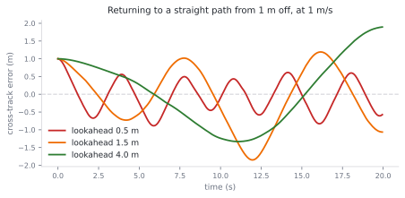
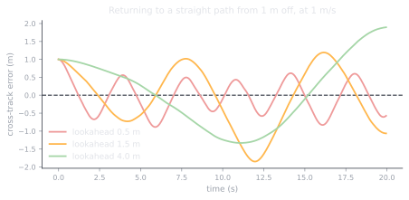

# 2.4 Trajectory tracking: pure pursuit

**Status:** Code verified · **Prereqs:** lessons 1.4, 2.2 · **Time:** ~2 h · **Verified:** 2026-08-01, Python 3.13, NumPy ≥ 1.26

---

## A. Why this matters

The planner in Module 5 hands you a path, which is a polyline of waypoints
through free space, and the robot is never actually on it. Disturbances push
it off, model error means the commanded motion is not quite the achieved
motion, and the planner's own discretisation guarantees an offset even in a
perfect world. Path tracking is the controller that closes that gap
continuously, and it is the literal last hop between every piece of autonomy
software above it and the motors below.

This lesson's controller is the one the capstone drives with, and Nav2's
`RegulatedPurePursuitController` ships essentially the same algorithm to
thousands of real robots, so the thirty lines here are unusually close to
production.

!!! note "Terms defined here"

    **Path** — a geometric sequence of waypoints with no timing information.

    **Trajectory** — a path *with* timing, so that each point has a time at
    which the robot should be there. Pure pursuit tracks paths; timing is
    handled separately by the speed command.

    **Cross-track error** — the signed lateral distance from the robot to the
    path. The headline tracking metric.

    **Lookahead distance** — how far ahead along the path the controller aims,
    written \(L\). The controller's one real tuning knob.

    **Curvature**, written \(\kappa\) — the reciprocal of the turning radius,
    so a straight line has zero curvature and a tight turn has large
    curvature.

## B. Mental model

**Pure pursuit is how you ride a bicycle.** You do not stare at the front
wheel, which is what tracking the nearest path point amounts to, because doing
so produces exactly the wobbling that a nervous cyclist exhibits. You look
some distance ahead at a point on the path and steer a smooth arc toward it,
continuously updating as you go.

Formally, the controller picks the path point one lookahead distance \(L\)
ahead, expresses it in the body frame as \((x_b, y_b)\), and commands the
curvature of the circular arc that passes through the robot and that point
while remaining tangent to the current heading:

\[
\kappa = \frac{2 y_b}{L^2}, \qquad \omega = v \, \kappa
\]

The lateral offset \(y_b\) does all the work here. A goal dead ahead has
\(y_b = 0\) and produces zero curvature, so the robot drives straight, while a
goal off to the left produces a leftward arc. The elegance of the trick is
that the longitudinal component drops out entirely, which question 1 explains.

The lookahead is the only knob that matters, and it trades in the same way a
learning rate does. A short lookahead tracks tightly and is prone to
oscillation, while a long lookahead is smooth and cuts corners, and the
library's test suite asserts the direction of that trade so it cannot silently
invert.

<figure class="rai-fig" markdown>
{.fig-light}
{.fig-dark}
<figcaption markdown>The same manoeuvre — recovering to a straight path from a metre off at 1 m/s — under three lookaheads. The trade is visible rather than asserted: 0.5 m overshoots and rings, 4.0 m converges smoothly but slowly, and 1.5 m is the compromise.</figcaption>
</figure>

## C. Mathematical formulation

Given a pose \((x, y, \theta)\) and a path \(\{p_i\}\), the procedure is to
find the nearest vertex, walk forward along the path to the first vertex at
distance at least \(L\), transform that vertex into the body frame using
\(T^{-1}_{world \leftarrow base}\) — which is lesson 1.1's machinery applied
without modification — and then apply the curvature law.

The complementary quantity is the **cross-track error**, defined as the signed
lateral component of the nearest path point expressed in the body frame. It is
the number you plot when tuning, the number the capstone's rubric scores, and,
in the PID-based alternative follower, the error signal you would feed to the
controller from lesson 2.2.

Three edge cases must be owned by the implementation rather than discovered in
the field. At the end of the path there is no vertex \(L\) ahead, so the
lookahead point must clamp to the final vertex. A goal at zero distance must
return zero curvature rather than dividing by zero. And pure pursuit by itself
never *stops*, because the steering law has no notion of arrival, so goal
detection and a stopping controller live outside it — which is failure mode 4.

### The stability boundary, measured

Question 4 derives that speed-scaled lookahead holds the preview *time*
constant, and lesson 2.7's third bug shows a fixed lookahead failing as speed
rises. Both arguments deserve the actual boundary. The table below is the
worst late-run cross-track error, in metres, for a robot recovering to a
straight path from 0.5 m off, with a fixed 0.2 s actuation delay between
command and wheels — zero means it converged, anything else means it was still
oscillating at the end of the run.

| Speed | L=0.3 | L=0.5 | L=0.9 | L=1.35 | L=2.0 |
|---|---|---|---|---|---|
| 0.5 m/s | 0 | 0 | 0 | 0 | 0 |
| 1.0 | **0.75** | 0 | 0 | 0 | 0 |
| 1.5 | 1.24 | **0.32** | 0 | 0 | 0 |
| 2.0 | 1.94 | 1.31 | 0 | 0 | 0 |
| 3.0 | 8.64 | 2.22 | **1.70** | 0 | 0 |

Read down any column and you watch a fixed lookahead die as speed rises; read
along the boundary between oscillation and convergence and you find it sits at
a nearly constant **lookahead time** of \(L/v \approx 0.45\)–0.6 s. Repeating
the v = 2.0 row at different delays pins the relationship down:

| Actuation delay | Minimum stable L at 2.0 m/s | Minimum preview time |
|---|---|---|
| 0.1 s | 0.5 m | 0.25 s |
| 0.2 s | 0.9 m | 0.45 s |
| 0.4 s | 2.0 m | 1.0 s |

The minimum stable preview time is roughly **2 to 2.5 times the actuation
delay**, which turns the folk rule \(L = k v\) into a design equation: measure
your command-to-wheels delay, multiply by 2.5, and that is the smallest \(k\)
you may use — with corner-cutting from section H setting the ceiling from the
other side. A rule with its validity region attached is worth far more than
the rule alone, which is exactly the point of the portfolio task in
section K.

One confession that doubles as a warning: the first version of the script
that produced this table showed *every* configuration unstable, including
ones the no-delay experiment had already shown converging. The cause was
failure mode 3 below — a global nearest-point search aliasing onto path
points beside and behind the robot. The lesson's own bug bit the measurement
of the lesson, and the fix was the monotonic forward search that section H
prescribes.

## D. From ML to robotics

The lookahead behaves like a discount horizon. Reacting only to the nearest
point is greedy and unstable, while aiming far ahead smooths behaviour at the
cost of ignoring near-term error, which is precisely the bias that a
reinforcement-learning discount factor trades.

It is also worth registering that pure pursuit is a policy with two
parameters, \(L\) and \(v\), because that provides a useful calibration for
Module 9. A network that replaces this controller has to beat a thirty-line
baseline with two knobs before it has earned the GPU it runs on, and stating
the baseline in those terms makes the comparison honest.

Finally, the path is a reference distribution and tracking error is
serving-time drift. Monitoring cross-track error across a fleet is the same
activity as monitoring prediction drift across a serving population, with the
same dashboards and the same percentile thinking, and Module 10 makes that
correspondence literal.

## E. Minimal implementation

The library lives at
[`robotics_ai/control/tracking.py`](https://github.com/paulyonghaoli/robotics-for-ai-engineers/blob/main/robotics_ai/control/tracking.py),
providing `pure_pursuit`, `lookahead_point` and `cross_track_error`, tested
closed-loop on both straight-line convergence and circle tracking.

### Practice — write and run code here

<code-exercise src="ctl-l4-pursuit"></code-exercise>

## F. Robotics-framework implementation

Nav2's `RegulatedPurePursuitController` is this algorithm plus a regulation
layer that production demands: it slows down for high curvature, slows down
near obstacles, slows down approaching the goal, and scales the lookahead with
speed according to \(L = k v\), which is the standard refinement and the
subject of question 4. Its configuration parameters read like this lesson's
vocabulary, including `lookahead_dist`,
`use_velocity_scaled_lookahead_dist` and
`regulated_linear_scaling_min_radius`, so having read this lesson you can tune
it.

## G. Experiment — the figure-eight

Track a figure-eight, built as two tangent circles so that the curvature
changes sign at the crossing, with \(L \in \{0.5, 1.0, 2.5\}\), and plot
cross-track error over a full lap.

The short lookahead oscillates after the sign flip, because it is reacting to
a large lateral offset with a tight arc and then overshooting. The long
lookahead cuts both lobes, because its aim point tunnels across the inside of
each curve. Then implement speed-scaled lookahead and watch the compromise
outperform both fixed settings across the whole lap.

Twenty minutes on this and you will never again have to remember which way the
trade goes, because you will have watched both failure modes happen.

## H. Failure modes

**Corner cutting** on sharp turns with a long lookahead occurs because the aim
point tunnels across the inside of the corner, and the robot dutifully drives
the chord rather than the arc. Bound \(L\), or regulate speed by curvature so
that tight corners are taken slowly with a correspondingly short lookahead.

**Oscillation** with a short lookahead at speed is the eyes-on-the-front-wheel
failure, and it gets worse as speed rises for the reason question 4 derives.

**Nearest-vertex aliasing on self-crossing paths** is the subtle one. At the
figure-eight's crossing, a naive global nearest-point search can snap onto the
*other* branch, which passes within centimetres, so the lookahead point comes
from the wrong lobe until the robot moves clear. Production followers track
progress along the path index monotonically, searching only forward of the
last matched index and within a bounded window.

**No goal logic** means pure pursuit will happily orbit the final waypoint
forever, since nothing in the steering law knows the journey is over. Pair it
with an arrival check and a stopping controller.

## I. Questions

1. *(Concept)* Why does the pure-pursuit law use only the lateral body
   coordinate of the goal, and what does a purely longitudinal goal imply?
2. *(Calculation)* With the goal in the body frame at \((1.8, 0.6)\) and
   \(v = 1\) m/s, compute \(\kappa\), \(\omega\) and the arc radius.
3. *(Debugging)* Your robot tracks well everywhere except immediately after
   the figure-eight crossing, where it briefly steers toward the wrong lobe.
   Diagnose it.
4. *(System design)* For speed-scaled lookahead \(L = kv\), derive what stays
   constant as speed varies, and explain why that is the stabilising property.

??? note "Answer sketches"
    **1.** The law computes the curvature of the unique circle passing through
    the robot and the goal while tangent to the current heading, and that
    circle's radius is \(L^2/(2 y_b)\). Once the chord length has been pinned
    at \(L\), the longitudinal component is already accounted for by that
    constraint, so only the lateral offset carries steering information. A
    purely longitudinal goal has \(y_b = 0\), meaning the goal is dead ahead,
    which gives zero curvature and a straight-line command.

    **2.** \(L^2 = 1.8^2 + 0.6^2 = 3.6\), so \(\kappa = 2(0.6)/3.6 = 1/3\)
    per metre, \(\omega = v\kappa = 1/3\) rad/s, and the arc radius is
    \(1/\kappa = 3\) m.

    **3.** Nearest-vertex aliasing at the self-crossing. The global
    nearest-point search snaps onto the other branch of the eight, which passes
    within centimetres of the robot, so the lookahead point is drawn from the
    wrong lobe until the robot has moved clear of the intersection. The fix is
    to track progress along the path monotonically, searching for the nearest
    vertex only forward of the last matched index and within a bounded window.

    **4.** What stays constant is the **lookahead time**, \(L/v = k\), so the
    robot always previews a fixed number of seconds ahead regardless of how
    fast it is going. That is the stabilising property, because at a fixed
    \(L\) doubling the speed halves the time available to complete the
    corrective arc, which raises the effective loop gain with speed until the
    system oscillates. Holding preview time fixed makes closed-loop damping
    speed-invariant, and note as a cross-check that
    \(\omega = v\kappa = 2 y_b / (k^2 v)\), so the commanded turn rate
    actually *falls* as speed rises.

### Interactive quiz

<quiz-bank src="control-l4-tracking"></quiz-bank>

## J. Annotated references

| Reference | Type | Difficulty | Why read it |
|---|---|---|---|
| Coulter, *"Implementation of the Pure Pursuit Path Tracking Algorithm"* (1992, CMU) | report | introductory | The original write-up, nine pages and entirely readable |
| [Nav2 `RegulatedPurePursuitController` docs](https://docs.nav2.org/configuration/packages/configuring-regulated-pp.html) | docs | intermediate | The production regulation layer, parameter by parameter |
| Snider, *"Automatic Steering Methods for Autonomous Automobile Path Tracking"* (2009) | report | intermediate | Pure pursuit against Stanley and kinematic controllers, which is the comparison to read before choosing |

## K. Graded work and portfolio extension

**Graded:** cross-track error is a headline metric in the capstone rubric, and
this controller is what drives the capstone.

**Portfolio:** the figure-eight lookahead study from section G, presented as an
animated robot with a breadcrumb trail for each lookahead value. Three short
animations explain the trade better than any paragraph can, including this
one.
