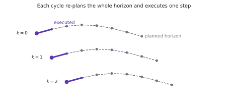
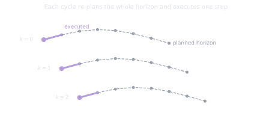

# 2.6 Model predictive control: a first look

**Status:** Code verified · **Prereqs:** lessons 1.4, 2.2 · **Time:** ~2 h · **Verified:** 2026-08-02, Python 3.13, NumPy ≥ 1.26

---

## A. Why this matters

PID reacts and MPC deliberates, and that difference is worth stating
precisely. At every control step, model predictive control asks which sequence
of inputs over the next \(N\) steps would minimise a cost without violating
any constraint, applies only the *first* input of the answer, and then throws
the rest away and asks again from the freshly measured state.

That receding-horizon loop is how quadrupeds decide where to place their feet,
how autonomous cars make lane changes that are simultaneously comfortable and
legal, and how any controller handles the thing PID fundamentally cannot,
which is **constraints**. Actuator limits, velocity ceilings, obstacle
clearances and rules such as "never exceed 2 m/s² of lateral acceleration"
become first-class objects that the optimiser is obliged to respect, rather
than clamps bolted on after the controller has already decided what it wants.

!!! note "Terms defined here"

    **Horizon**, \(N\) — how many steps into the future the optimiser plans.

    **Receding horizon** — re-solving the whole problem every step from the
    current measured state, so the horizon continually recedes ahead of the
    robot.

    **QP (quadratic program)** — an optimisation problem with a quadratic
    objective and linear constraints, solvable extremely fast and reliably.

    **Sampling-based MPC** — instead of solving the optimisation exactly, roll
    out many candidate input sequences through the model, score them, and take
    the best. Derivative-free and trivially parallel.

    **Infeasible** — no input sequence satisfies all the constraints, which is
    a situation the controller must have a designed answer for.

## B. Mental model

MPC is planning and control collapsed into a single loop. Where the capstone
plans a path slowly and then tracks it quickly with pure pursuit, MPC
re-plans a short trajectory at every control step, which amounts to planning
at control rate over a short horizon.

<figure class="rai-fig" markdown>
{.fig-light}
{.fig-dark}
<figcaption markdown>Each cycle solves for the whole horizon and executes one step of it. Almost all of the computed plan is discarded, which looks wasteful and is exactly where the feedback comes from.</figcaption>
</figure>

There are three dials. The **horizon** \(N\) sets how far ahead to think, and
too short makes the controller greedy so that it brakes late, while too long
costs compute and extends the plan into a region where your model is fiction
anyway. The **cost** trades state error against control effort through the
weights \(Q\) and \(R\), which are the same letters as in the Kalman filter of
lesson 3.1 and play the same "how much do I care" role, though in the opposite
direction. The **constraints** are the reason to use MPC at all, since
\(|u| \le u_{max}\) and \(|v| \le v_{max}\) become promises the optimiser
keeps rather than saturations discovered afterwards.

The obvious question is why one would discard most of the computed plan every
step rather than executing the whole optimal sequence. The answer is that the
model is wrong and the world is noisy, so the tail of the sequence is optimal
for a predicted trajectory that will not occur. Re-solving from the measured
state is precisely where feedback re-enters, which makes MPC feedforward
optimisation wearing feedback's loop.

## C. Mathematical formulation

\[
\min_{u_0 \dots u_{N-1}} \sum_{k=0}^{N-1} \Big( \|x_k - x_{ref}\|_Q^2 + \|u_k\|_R^2 \Big) + \|x_N - x_{ref}\|_{Q_f}^2
\]

subject to the dynamics \(x_{k+1} = f(x_k, u_k)\) and the constraint sets
\(u_k \in \mathcal{U}\) and \(x_k \in \mathcal{X}\).

When the model is linear, the cost quadratic and the constraints boxes, this
is a quadratic program, and production solvers such as OSQP or acados dispatch
it in microseconds. This lesson's exercise uses the honest but simpler
alternative, **sampling-based MPC**: roll a bank of candidate input sequences
forward through the model, score each one against the cost, and execute the
first input of whichever scored best. It is crude, derivative-free and
embarrassingly parallel, and it is the direct ancestor of MPPI, which real
legged robots run today.

## D. From ML to robotics

The receding horizon is beam search with re-rooting. You search, commit a
single step, and then search again from reality, which is the same
anytime-planning pattern as game-tree search or as language-model decoding
with lookahead.

The \(Q\) and \(R\) weights are loss-function engineering and terminal-cost
design is reward shaping, so the failure modes transfer intact, including
myopia when the horizon is too short and cost hacking when the objective
rewards something adjacent to what you meant.

Most usefully, sampling MPC is the bridge to Module 9. Replace "roll out
through the physics model" with "roll out through a *learned* model" and you
have the control loop of model-based reinforcement learning, which is what
MPPI and world-model methods do. One lesson demystifies a surprising fraction
of the modern robot-learning stack.

## E. Minimal implementation and practice

<code-exercise src="ctl-l6-mpc"></code-exercise>

## F. Robotics-framework implementation

Nav2's MPPI controller is sampling MPC serving as the local planner, rolling
out sequences of twists through the motion model and scoring them against
path-following, obstacle and smoothness costs. For arms and legged robots,
OCS2, acados and Crocoddyl solve the quadratic-program and differential-dynamic-programming
versions at kilohertz rates. The concepts in this lesson are the configuration
surface of every one of them, so the parameter names in those tools will read
as vocabulary you already have.

## G. Experiment — horizon and model error

Work on the exercise's constrained cart in two stages.

First sweep the horizon over \(N \in \{3, 10, 30\}\) and watch the short
horizon brake too late, because the constraint says stop while myopia says not
yet, and then watch the long horizon consume substantially more compute to
produce behaviour identical to the middle setting. The useful output is not
"longer is better" but the location of the knee, which is roughly where the
horizon first covers the braking distance.

Then break the model deliberately by simulating twenty per cent more mass than
the controller assumes, and watch re-planning quietly absorb the error. That
is feedback through re-optimisation, demonstrated rather than asserted, and it
is the most persuasive argument for why the discarded plan is not waste.

## H. Failure modes

**Horizon myopia** occurs when \(N\) is too short to see an approaching
constraint, and it surfaces either as infeasibility or as violent late
corrections. Question 2 makes the arithmetic of this concrete.

**Model-plant mismatch beyond what re-planning absorbs** allows a persistent
bias to accumulate in a direction the cost does not penalise. This is the
Kalman process-noise lesson from Module 3 in its control-theoretic form.

**Infeasibility** arises when constraints genuinely cannot all be satisfied,
for instance when an obstacle appears inside the braking distance. Production
MPC has explicit fallbacks, either softening constraints in a defined priority
order or handing off to a safety stop, and the essential point is that an
optimiser reporting no solution at 2 m/s needs a plan B that was *designed*
rather than discovered at runtime.

**Compute jitter** is the one people underestimate. An optimiser that usually
takes 5 ms and occasionally takes 80 ms breaks the real-time contract more
severely than one that reliably takes 20 ms, and Module 13's preoccupation
with p95 latency rather than the mean is already visible here.

## I. Questions

1. *(Concept)* Why apply only the first input of the optimal sequence instead
   of executing all \(N\)?
2. *(Calculation)* A cart at \(x = 0\) travelling at 2 m/s with
   \(u \in [-1, 1]\) m/s². What is the minimum stopping distance, and what is
   the shortest horizon at \(dt = 0.5\) s that can *see* a wall at
   \(x = 2.5\) m in time?
3. *(Debugging)* Your MPC tracks well but chatters between \(+u_{max}\) and
   \(-u_{max}\) on alternate steps. Which weight is wrong?
4. *(System design)* Split the capstone's navigation between A* and an MPC
   local controller. Who owns obstacles, who owns dynamics, and at what rates?

??? note "Answer sketches"
    **1.** Because the tail of the sequence is optimal for the *predicted*
    state trajectory, and the model is wrong, so executing it open-loop
    compounds model error and disturbances for \(N\) steps with no correction
    at all. Applying only \(u_0\) and re-solving from the freshly measured
    state is exactly where feedback re-enters, and the receding horizon is
    what converts an open-loop optimisation into a closed-loop controller.

    **2.** The stopping distance is \(v^2/(2 u_{max}) = 4/2 = 2\) m, so a wall
    at 2.5 m leaves half a metre of margin. Braking from 2 m/s at 1 m/s² takes
    2 s, which at \(dt = 0.5\) s is four steps, so a horizon shorter than
    about four steps literally cannot represent stopping in time — the
    optimiser cannot choose a plan it is unable to express.

    **3.** \(R\) is too small relative to \(Q\). With no meaningful price on
    control effort, bang-bang input is marginally the cheapest way to hold the
    state target and nothing in the cost penalises reversing sign every single
    step. Raise \(R\), or better, add an input-rate term
    \(\|u_k - u_{k-1}\|^2_{R_\Delta}\), which attacks the chatter directly
    without making the controller sluggish overall.

    **4.** A* owns the static map and the global route, re-planned at about
    1 Hz or whenever the map changes, while MPC owns the dynamics, the
    actuator and velocity limits, and near-field dynamic obstacles, running at
    control rate of 10–50 Hz over a one- to two-second horizon and tracking the
    A* path as its reference. The split follows the blind spots of each: A*
    has no dynamics model and cannot run at control rate, while MPC's horizon
    is far too short to reason its way out of a dead end.

### Interactive quiz

<quiz-bank src="control-l6-mpc"></quiz-bank>

## J. Annotated references

| Reference | Type | Difficulty | Why read it |
|---|---|---|---|
| Borrelli, Bemporad & Morari, *Predictive Control*, ch. 1 | book | intermediate | The clean formulation, with a freely available draft |
| Williams et al., *"MPPI"* (2016) | paper | intermediate | Sampling MPC done seriously, and the grown-up sibling of this lesson's exercise |
| [Nav2 MPPI controller docs](https://docs.nav2.org/configuration/packages/configuring-mppic.html) | docs | intermediate | The production sampling-MPC knobs, which map directly onto section B's three dials |

## K. Graded work and portfolio extension

**Graded:** MPC returns as an alternative capstone local controller, scored by
the same harness as pure pursuit.

**Portfolio:** swap the exercise's MPC in as the capstone's tracker and publish
the rubric comparison against pure pursuit — one harness, two controllers,
honest numbers. That is precisely the evaluated-rather-than-asserted evidence
this whole project exists to produce.
