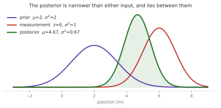
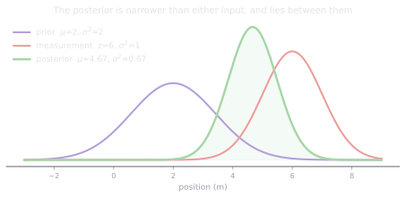
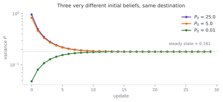
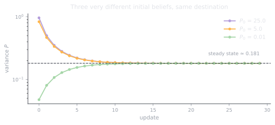

# 3.1 The Kalman filter: Bayes at 50 Hz

**Status:** Code verified · **Prereqs:** Module 1, lesson 1.4, probability basics · **Time:** ~3 h · **Verified:** 2026-08-01, Python 3.13, NumPy ≥ 1.26

---

## A. Why this matters

Lesson 0.1's third broken assumption was that the state is hidden and the
sensors lie, and this module is the answer to it. A robot never knows where it
is. What it maintains instead is a **belief**, meaning a probability
distribution over the states it might be in, and it revises that belief in two
distinct ways: by *predicting*, which pushes the belief forward through the
motion model and makes it less certain, and by *updating*, which folds in a
measurement and makes it more certain.

When the belief, the motion model and all the noise are Gaussian and linear,
that Bayesian recursion has a closed form, and the closed form is the Kalman
filter. It is arguably the most-deployed algorithm in robotics: your GPS and
IMU fusion is a Kalman variant, so is wheel-odometry smoothing, so is
essentially every object tracker you will meet in Module 7.

!!! note "Terms defined here"

    **Belief** — the robot's probability distribution over its own state, as
    opposed to a single best guess.

    **Prior** and **posterior** — the belief before and after incorporating a
    measurement.

    **Innovation** — the difference between the measurement you received and
    the measurement you expected, \(z - Hx\). Also called the residual.

    **Kalman gain**, \(K\) — how much of the innovation to believe, between 0
    (ignore the sensor) and 1 (ignore the model).

    **Process noise**, \(Q\) — your admission that the motion model is
    imperfect.

    **Measurement noise**, \(R\) — how noisy the sensor is.

    **NIS** (normalised innovation squared) — a consistency statistic that
    tells you whether the filter's claimed uncertainty matches the errors it
    is actually making.

## B. Mental model

The Kalman filter is a precision-weighted average, run recursively, and
almost everything else is bookkeeping to make that work for correlated,
multidimensional beliefs.

At any update you hold two opinions about the state. One is your prediction,
carrying covariance \(P\), and the other is your measurement, carrying
covariance \(R\). The posterior lies between them, closer to whichever is more
confident, and the Kalman gain is exactly that mixing weight: near zero when
the model is trusted and near one when the sensor is.

<figure class="rai-fig" markdown>
{.fig-light}
{.fig-dark}
<figcaption markdown>A prior with variance 2 combined with a measurement of variance 1 gives a gain of 0.667, so the posterior sits two-thirds of the way toward the measurement at 4.67, with variance 0.667. Note that the posterior is sharper than either input: combining independent evidence always adds precision.</figcaption>
</figure>

That last observation is worth pausing on, because it is the whole reason
filtering works. Two noisy opinions combine into something better than either,
provided they are independent, and "precision adds" is the one-line version of
why.

The rhythm to internalise:

```
predict:  x ← F x              P ← F P Fᵀ + Q     (uncertainty GROWS by Q)
update:   x ← x + K(z − H x)   P ← (I − KH) P     (uncertainty SHRINKS)
```

The innovation \(z - Hx\) is the measurement's surprise, and it is the single
most useful diagnostic in the whole module. A healthy filter produces
innovations that are small, zero-mean and white, and watching them is how you
debug a filter rather than guessing at it.

## C. Mathematical formulation

The model is \(x_k = F x_{k-1} + B u_k + w\) with \(w \sim \mathcal{N}(0, Q)\),
observed as \(z_k = H x_k + v\) with \(v \sim \mathcal{N}(0, R)\).

The update in full:

\[
\begin{aligned}
y &= z - H x && \text{(innovation)} \\
S &= H P H^\top + R && \text{(innovation covariance)} \\
K &= P H^\top S^{-1} && \text{(gain)} \\
x &\leftarrow x + K y, \qquad P \leftarrow (I - KH)\, P
\end{aligned}
\]

Read \(S\) as "how surprised should I expect to be", combining the uncertainty
of the prediction with the uncertainty of the sensor, and then read \(K\) as
the ratio of what the prediction contributes to that total. The gain is large
exactly when the prediction is the uncertain party.

The library uses the **Joseph form**,
\(P \leftarrow (I-KH) P (I-KH)^\top + K R K^\top\), which is algebraically
identical to the expression above but numerically self-symmetrising. The naive
form slowly loses symmetry and then positive-definiteness in floating-point
arithmetic, which is failure mode 3.

### Consistency

The **NIS** statistic \(y^\top S^{-1} y\) should average approximately the
dimension of the measurement, because it is chi-squared distributed with that
many degrees of freedom. This gives you something rare and valuable: a check
on whether the filter's *claimed* uncertainty is honest, computable at runtime
without ground truth. A filter with low RMSE but NIS far above its dimension
is overconfident, which means accurate today and dangerously certain tomorrow,
and lesson 3.6 builds the whole diagnostic apparatus on this idea.

### The covariance forgets where it started

One property surprises people and is worth seeing directly. For a fixed
\(Q\) and \(R\) the covariance converges to a steady-state value regardless of
what you initialised it to.

<figure class="rai-fig" markdown>
{.fig-light}
{.fig-dark}
<figcaption markdown>Three filters starting from wildly different initial beliefs — near-total ignorance, moderate confidence, and absurd overconfidence — converge to the same steady-state variance of 0.181 within about ten updates. The initial covariance matters much less than people expect; Q and R matter much more.</figcaption>
</figure>

The practical consequence is that agonising over \(P_0\) is usually wasted
effort, while agonising over \(Q\) and \(R\) is not, because those two set the
steady state the filter will actually live in.

## D. From ML to robotics

The Kalman filter is exact Bayesian inference in a linear-Gaussian
state-space model, which is the same model family as a Gaussian hidden Markov
model with continuous states. The predict and update steps correspond exactly
to the forward algorithm's transition and emission steps, evaluated in closed
form rather than by summation.

\(Q\) and \(R\) are hyperparameters, but unusually they are hyperparameters
with physical meaning. You can *measure* \(R\) by logging a stationary sensor
and taking the variance of its output, which is a rare luxury. \(Q\) is your
admission that the motion model is imperfect, and tuning it is a bias-variance
trade in the ordinary sense: a small \(Q\) gives a smooth but laggy estimate
with high bias, while a large \(Q\) gives a jittery but responsive one with
high variance.

Innovation monitoring is drift detection. Whitened residuals departing from
their expected distribution is precisely a data-drift alarm on the sensor
stream, and the NIS is the robotics equivalent of the monitoring dashboard you
would build for a served model.

## E. Minimal implementation

The library lives at
[`robotics_ai/estimation/kalman.py`](https://github.com/paulyonghaoli/robotics-for-ai-engineers/blob/main/robotics_ai/estimation/kalman.py),
implementing the Joseph-form update with an optional control input and NIS
reporting, tested on constant-velocity tracking with explicit consistency
checks.

### Practice — write and run code here

<code-exercise src="est-l1-kf-1d"></code-exercise>

<code-exercise src="est-l1-kf-cv"></code-exercise>

## F. Robotics-framework implementation

ROS 2's `robot_localization` package runs a fifteen-state extended Kalman
filter fusing wheel odometry, IMU and GPS, and its configuration file amounts
to declaring \(H\) and \(R\) for each sensor, so the vocabulary of this lesson
is the vocabulary of that YAML.

The capstone feeds this filter's output into the `map → odom` correction edge
from lesson 1.3, which is where the estimation and geometry halves of the
curriculum meet. The extended Kalman filter, which linearises \(F\) and \(H\)
about the current estimate, and the unscented variant, which propagates sigma
points instead, both arrive in lesson 3.3, while the particle filter for
genuinely non-Gaussian problems is the next lesson.

## G. Experiment — the four-quadrant tuning study

On the constant-velocity tracker, multiply your assumed \(R\) by 10 to
simulate a pessimistic sensor specification, and separately by 0.1 to simulate
an overconfident one, while the *actual* noise in the simulation stays fixed.

The pessimistic case degrades RMSE mildly and behaves the way you would
expect. The overconfident case is the instructive one, because RMSE degrades
somewhat while the **NIS explodes**, and that combination is the signature of
a filter that has stopped knowing how wrong it is. Then repeat the whole
exercise for \(Q\).

Those four quadrants — \(Q\) and \(R\), each over- and under-stated — are
essentially the entire craft of filter tuning, and having generated the
diagnostic signature of each one you will recognise them in the field.

## H. Failure modes

**Overconfidence**, from \(Q\) or \(R\) being too small, collapses the
covariance and drives the gain toward zero, after which the filter ignores
real measurements. It diverges politely, reporting a tiny uncertainty around a
state that is wrong, which is considerably worse than reporting a large
uncertainty around the same wrong state.

**Innovation bias**, meaning a consistently non-zero-mean innovation, is a
*modelling* error rather than a noise problem. A sensor bias, a miscalibrated
\(H\), or a wrong frame from Module 1 will all produce it, and no amount of
\(Q\) or \(R\) tuning fixes a bias, because the filter's model of the world is
simply wrong in a direction the noise model does not describe.

**Covariance asymmetry from the naive update** accumulates over hundreds of
thousands of steps until \(P\) stops being positive-definite and the filter
produces `NaN`. The remedies are the Joseph form or explicit re-symmetrisation
every step.

**Outliers** yank a linear-Gaussian filter hard, because nothing in the
formulation expects a measurement to be simply wrong. Production filters gate
on NIS, rejecting any measurement whose NIS exceeds a chi-squared threshold,
which is three lines of code that saves robots.

## I. Questions

1. *(Concept)* Why does uncertainty grow during predict and shrink during
   update, and what would it mean if a filter's \(P\) never shrank?
2. *(Calculation)* A scalar filter has prediction \(x = 5\), \(P = 4\), and
   receives measurement \(z = 6\) with \(R = 1\). Compute \(K\) and the
   posterior.
3. *(Debugging)* RMSE is low but NIS averages 8 on a one-dimensional
   measurement. What is wrong, and why is it dangerous?
4. *(System design)* GPS at 1 Hz with metres of noise and absolute position,
   plus an IMU at 200 Hz that drifts and is relative. Sketch the fusion, and
   explain why the combination beats either alone.

??? note "Answer sketches"
    **1.** Predict adds \(Q\) because time passes without any new information
    arriving and the motion model is imperfect, so the belief is pushed
    forward and smeared. Update is a precision-weighted average of two
    independent opinions, and combining precisions can only add, so \(P\)
    strictly shrinks — that is what the \((I-KH)\) factor encodes. A \(P\)
    that never shrinks means \(K \approx 0\), so the filter is ignoring its
    measurements, whether because \(R\) is absurdly large or because \(H\) is
    wrong or zero in the relevant rows, and it is running pure dead reckoning
    while pretending otherwise.

    **2.** \(K = 4/(4+1) = 0.8\), so \(x = 5 + 0.8(6-5) = 5.8\) and
    \(P = (1-0.8) \times 4 = 0.8\). The posterior sits eighty per cent of the
    way toward the measurement, because the measurement is four times more
    precise than the prediction.

    **3.** The expected NIS on a one-dimensional measurement is 1, so an
    average of 8 says that \(S = HPH^\top + R\) is roughly eight times too
    small and the filter is overconfident, with \(Q\) or \(R\) or both
    understated. The danger is that the low RMSE is on loan: the gain has
    collapsed toward zero, so the first genuine model error or unmodelled
    manoeuvre will be met by a filter that ignores precisely the measurements
    that would correct it, diverging while continuing to report a tiny
    covariance. Inflate \(Q\), or fix \(R\) if it was mismeasured, until NIS
    averages about 1.

    **4.** The IMU at 200 Hz drives the predict step, giving a smooth,
    low-latency estimate between fixes, but its bias makes position error grow
    like \(t^2\) so \(P\) inflates quickly. The 1 Hz GPS contributes an
    absolute-position update with a large \(R\) that resets that accumulated
    drift every second and, provided bias states are included in \(x\), makes
    the IMU biases observable rather than merely present. Neither works alone,
    since IMU-only drifts without bound while GPS-only is far too slow and too
    noisy for control and says nothing at all about attitude. The combination
    wins because the error structures are complementary — fast and relative
    against slow and absolute — which is exactly the pairing a
    precision-weighted average exploits best.

### Interactive quiz

<quiz-bank src="estimation-l1-kalman"></quiz-bank>

## J. Annotated references

| Reference | Type | Difficulty | Why read it |
|---|---|---|---|
| Thrun et al., *Probabilistic Robotics*, ch. 3 | book | intermediate | The canonical treatment, best read alongside this lesson rather than after it |
| Labbé, *Kalman and Bayesian Filters in Python* | book/notebooks | introductory | Free, runnable and unusually intuitive, and the best remedy if section C felt fast |
| Solà (2017), §3–6 | paper | advanced | The error-state formulation, which you should read before attempting real IMU fusion |
| Bar-Shalom et al., *Estimation with Applications to Tracking* | book | advanced | NIS and NEES consistency testing and gating, in the professional's reference |

## K. Graded work and portfolio extension

**Graded:** the Module 3 localisation project fuses odometry and landmark
observations on the 2D robot, scored on RMSE *and* on NIS consistency, so
accuracy without honesty fails the rubric.

**Portfolio:** the four-quadrant tuning study from section G, plotted as RMSE
and NIS against \(Q\) and \(R\) scaling. It demonstrates the rarest skill an
estimation interview probes for, which is knowing when a filter is lying to
you.
