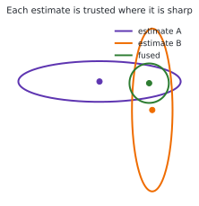
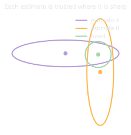

# 3.5 Multi-sensor fusion architecture

**Status:** Code verified · **Prereqs:** lessons 3.1–3.4 · **Time:** ~2 h · **Verified:** 2026-08-02, Python 3.13, NumPy ≥ 1.26

---

## A. Why this matters

By now you know the filters from lessons 3.1 to 3.3 and the sensors from
lesson 3.4. Fusion architecture is the system design that sits between them,
deciding which sensor updates which states, at what rate, and with what
protection against each other's bad days.

This is the point at which estimation stops being an algorithm and becomes
engineering, and it is also where your distributed-systems instincts earn
their keep, because the hard parts are rates, queues, timestamps and defensive
boundaries rather than mathematics.

!!! note "Terms defined here"

    **Innovation gating** — testing a measurement's surprise against a
    threshold before allowing it into the filter, and discarding it if it is
    too surprising to be credible.

    **Mahalanobis distance** — distance measured in units of the covariance,
    so that "far" means far relative to how uncertain you were. NIS is its
    square.

    **Graceful degradation** — losing a sensor and continuing with honestly
    widened uncertainty, rather than either failing outright or continuing to
    claim the old precision.

    **Sequential update** — folding sensors in one at a time rather than
    stacking them into a single measurement vector.

## B. Mental model

One filter, many observers. The state vector is the single source of truth,
and each sensor is a partial, asynchronous witness that contributes only the
rows of \(H\) it can genuinely testify about. Wheel odometry speaks to
velocity, GPS to absolute position, the gyroscope to angular rate, and
landmark observations to pose. The predict step runs at the fastest available
rhythm, usually driven by the IMU, and each measurement updates only what it
knows about, whenever it happens to arrive.

The reason this works at all is that each sensor is typically sharp in some
directions and vague in others, and the filter can take each one seriously
exactly where it is sharp.

<figure class="rai-fig" markdown>
{.fig-light}
{.fig-dark}
<figcaption markdown>Two estimates with complementary weaknesses. Neither is good on its own, and the fused result is sharper than either in both directions because information adds where the estimates are independent. This is the two-dimensional version of the precision-weighted average from lesson 3.1.</figcaption>
</figure>

Three architectural defences do most of the real-world work.

**Innovation gating** checks a measurement's NIS against a chi-squared
threshold before accepting it. A GPS multipath jump sitting eight standard
deviations from the prediction is not unlikely data, it is a lying sensor, and
rejecting it is three lines of code that constitute probably the single
highest-value robustness mechanism in estimation.

**Delay handling** matters because sensors report the past, with camera
pipelines typically running 50 to 150 ms behind. Fusing a stale measurement as
though it were current smears the estimate in exactly the way lesson 1.1's
stale-timestamp bug smears a map, and production filters keep a short history
of states so that updates can be applied at the moment they actually refer to.

**Health monitoring** tracks per-sensor innovation statistics over time,
because a sensor whose innovations become biased or inflated is failing, and
the fusion layer should notice that before the robot does.

## C. Mathematical formulation

There is deliberately nothing new here, which is the point of the lesson. Each
sensor \(s\) brings its own \(h_s\), \(H_s\) and \(R_s\), and the gate is

\[
y_s^\top S_s^{-1} y_s \;\le\; \chi^2_{d_s}(0.99)
\]

which for a two-dimensional measurement means a threshold of 9.21.

Sequential updating means processing each sensor's measurement through the
same filter one after another, and for independent sensor noises this gives
exactly the same posterior as a single batched update with all measurements
stacked. That equivalence is what makes the one-filter-many-observers
architecture legitimate rather than a convenient hack, and question 1 works
through both the proof and the assumption that breaks it.

## D. From ML to robotics

The fusion filter is a streaming feature store with schema enforcement:
heterogeneous producers, one consistent materialised state, and per-producer
validation at the boundary. Gating is input validation, health monitoring is
a data-quality dashboard, and the chi-squared threshold is an anomaly-detection
cutoff that happens to have actual theory behind it rather than a percentile
someone picked.

Rates and staleness are the event-time against processing-time problem in
another costume, and the measurement-delay fix of buffering, reordering and
re-applying is roughly watermarking, with harder deadlines.

Graceful degradation is ensemble thinking. Lose GPS and the system does not
fail; it *widens*, with covariance growing honestly along the directions that
are no longer observed. A fusion stack that continues to report tight
covariance after losing its absolute sensor is lesson 3.1's overconfident
filter at system scale, and it is considerably more dangerous there because
more consumers are downstream of it.

## E. Minimal implementation and practice

<code-exercise src="est-l5-gating"></code-exercise>

## F. Robotics-framework implementation

`robot_localization` is this lesson shipped as a package. By convention it
runs two EKF instances, one in the `odom` frame fusing only continuous sensors
and one in the `map` frame that adds the absolute ones, which is REP 105's
two-guarantee split from lesson 1.3 reappearing at the estimation layer rather
than the transform layer. Per-sensor `*_config` matrices choose which rows of
\(H\) each sensor contributes, and the `*_rejection_threshold` parameters are
precisely the chi-squared gates of section C.

## G. Experiment — find the gate's sweet spot, which is not where the rule says

Sweep the gate threshold from two to ten standard deviations under two
conditions — clean data, and data where five per cent of measurements carry a
±10 multipath jump — and score RMSE for each, twenty seeds per cell:

| Gate | Clean RMSE | Corrupted RMSE |
|---|---|---|
| 2σ | 0.458 | 0.941 |
| 3σ | 0.418 | 0.672 |
| 4σ | 0.411 | 0.544 |
| **6σ** | 0.411 | **0.421** |
| 10σ | 0.411 | 0.729 |
| no gate | 0.411 | 0.753 |

The clean column behaves as expected: tighter gates discard real information,
and from 4σ outward the gate costs nothing. The corrupted column is a U — but
its bottom sits at **6σ**, not at the 3σ that the χ²(0.99) convention
suggests, and the reason repays attention. These outliers land around 9σ, so
any gate below 8σ excludes them all; among gates that exclude them, *looser
is better*, because after any transient displacement of the state a tight
gate starts rejecting honest measurements too — a miniature of the death
spiral from section H — and recovers slowly, while the 6σ gate re-accepts
reality immediately.

The general rule that falls out: the optimal gate sits **just below wherever
your corruption actually lands**, and the χ²(0.99) ≈ 3σ convention is not
optimal but *safe* — it is what you choose when you cannot know in advance
whether the lies will be barely-outliers at 4σ or monsters at 9σ. If you have
characterised the failure mode (and lesson 3.4 says you should), you can buy
measurable accuracy by loosening toward it. One more reason gating parameters
belong in per-sensor configuration rather than in a constant.

Then kill the absolute sensor entirely partway through a run and verify that
the covariance *grows*. That is the honest-widening check, and a fusion stack
that fails it is lying in the most consequential way available to it.

## H. Failure modes

**Gating your way to blindness** happens when a too-tight gate rejects real
measurements after any transient, and a filter that rejects everything coasts
on dead reckoning while continuing to report whatever its covariance says.
Gate rejections must therefore be *monitored* rather than merely counted.

**The gate death spiral** is the chicken-and-egg version: the filter diverges,
so all measurements look like outliers and are gated, so the filter diverges
further. Production systems cap consecutive rejections and then either
force-accept or reinitialise.

**Double-counting correlated sensors** occurs when two supposedly independent
estimates derived from the same wheel encoders are fused as if independent,
which produces overconfidence for the reason question 1 identifies.

**Frame mixing**, such as fusing a `map`-frame position into an `odom`-frame
filter, is Module 1's convention discipline in its final boss form, and it
produces an error that grows with however far the two frames have diverged.

## I. Questions

1. *(Concept)* Why does sequential per-sensor updating equal the joint batched
   update, and what assumption breaks the equivalence?
2. *(Calculation)* A two-dimensional GPS innovation has NIS = 14, and the gate
   is \(\chi^2(0.99) = 9.21\). Accept or reject, and what does 14 mean in
   sigma terms?
3. *(Debugging)* After a hard bump, your robot's filter rejects every GPS fix
   for thirty seconds and then snaps two metres sideways. Reconstruct the
   sequence.
4. *(System design)* Design the fusion for the capstone robot gaining a
   magnetometer: which states does it update, what gate, and what happens near
   the loading dock's steel door?

??? note "Answer sketches"
    **1.** Each update is exact Bayesian conditioning, and conditioning on
    independent measurements factorises, since
    \(p(x \mid z_1, z_2) \propto p(z_1 \mid x)\, p(z_2 \mid x)\, p(x)\).
    Folding in sensor 1 and then using that posterior as the prior for sensor 2
    therefore lands on the same Gaussian as one stacked update with a
    block-diagonal \(R\). The assumption that breaks it is exactly that
    block-diagonality: correlated sensor noise, whether from two estimates
    derived from the same wheel encoders or from a shared clock or calibration
    error, gets counted twice and the filter emerges overconfident.

    **2.** Reject, since 14 exceeds 9.21. NIS is a squared Mahalanobis
    distance, so 14 corresponds to \(\sqrt{14} \approx 3.7\sigma\) against a
    gate sitting at \(\sqrt{9.21} \approx 3.0\sigma\). For two degrees of
    freedom the chi-squared tail is exactly \(e^{-x/2}\), giving
    \(P(\text{NIS} > 14) = e^{-7} \approx 9 \times 10^{-4}\), so under the
    assumed model this is roughly a one-in-1100 event, which is far better
    explained by a lying sensor than by unlucky data.

    **3.** The bump jolted the true state, so honest GPS fixes now look like
    outliers and the gate rejects them, which is the death spiral from failure
    mode 2. Dead reckoning then drifts about two metres over thirty seconds,
    until either an innovation happens to squeak under the gate or a rejection
    cap fires, at which point the filter lurches to reality in a single step.
    The fix is a consecutive-rejection cap combined with covariance inflation
    triggered by impact detection, so that the filter widens rather than
    stiffening after a shock.

    **4.** The magnetometer testifies to exactly one thing, which is yaw, so it
    receives a single row of \(H\) touching heading, influencing the gyro bias
    states only indirectly through the filter's own correlations, and it must
    never be permitted to nudge position or velocity. Gate it at the
    one-dimensional \(\chi^2(0.99) = 6.63\) on a *wrapped* angular residual,
    behind a hard pre-gate on field magnitude and inclination compared against
    the surveyed local field. Near the steel door the field bends, so the
    innovations become persistently biased rather than merely noisy and the
    gate begins rejecting, which is the correct behaviour: coast on the
    gyroscope and let yaw covariance widen honestly. Crucially the
    consecutive-rejection cap from failure mode 2 must *not* force-accept
    here, because the disturbance is a sustained bias rather than a transient,
    so disable the sensor through magnetic-anomaly detection or a mapped
    no-magnetometer zone instead.

### Interactive quiz

<quiz-bank src="estimation-l5-fusion"></quiz-bank>

## J. Annotated references

| Reference | Type | Difficulty | Why read it |
|---|---|---|---|
| Bar-Shalom et al., *Estimation with Applications to Tracking* | book | advanced | Gating, association and consistency at professional depth |
| [`robot_localization` wiki](https://docs.ros.org/en/melodic/api/robot_localization/html/index.html) | docs | intermediate | The architecture presented as a configuration surface |
| Moore & Stouch (2016), the `robot_localization` paper | paper | introductory | Short, and it explains the two-filter REP 105 convention directly |

## K. Graded work and portfolio extension

**Graded:** gating joins the localisation project as a stretch goal, in the
corrupted-measurement scenario.

**Portfolio:** the section G threshold-sweep U-curve, clean against corrupted.
It is a one-figure demonstration that you understand robustness as a tuned
trade rather than a checkbox, which is a distinction interviewers probe for and
few candidates can evidence.
