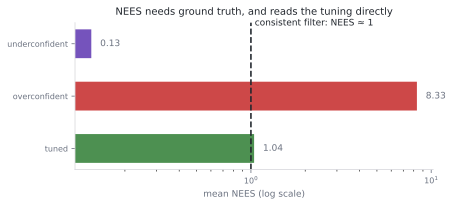
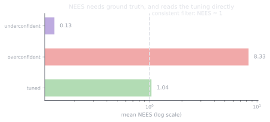

# 3.6 Lab: catching a lying filter

**Status:** Code verified · **Prereqs:** lessons 3.1–3.5 · **Time:** ~2 h · **Verified:** 2026-08-02, Python 3.13, NumPy ≥ 1.26

---

## A. Why this lab exists

Module 3's through-line has been that a filter's **accuracy** and its
**honesty** are different properties, and that the second one is what
downstream consumers actually depend on. A planner deciding whether it has
room to pass through a gap is not using your position estimate; it is using
your position estimate *and* the covariance you attached to it, and if that
covariance is a fiction then every decision built on it inherits the fiction.

This lab makes you the auditor. You are handed filters that all look
respectable by RMSE, and your job is to read their consistency statistics and
name the lie. It is the estimation counterpart of Module 1's frame-debugging
gauntlet, and it shares that lab's defining property: every filter here is
*correct* in the sense of implementing its equations faithfully.

!!! note "The two instruments"

    **NEES** (normalised estimation error squared),
    \((x - \hat{x})^\top P^{-1} (x - \hat{x})\), measures whether the actual
    error matches the claimed covariance. It requires ground truth, so it is a
    simulation-time tool, and for a consistent filter it averages the state
    dimension.

    **NIS** (normalised innovation squared), \(y^\top S^{-1} y\), measures
    whether measurements are as surprising as the filter expected. It needs
    only the measurements themselves, so it is a *runtime* tool and belongs on
    your production dashboard, and for a consistent filter it averages the
    measurement dimension.

Both are chi-squared distributed for a consistent filter, which gives you an
actual band rather than a vibe. Sitting above the band means the filter is
**overconfident**, with \(P\) too small, and this is the dangerous direction
because downstream consumers are trusting a lie. Sitting below means it is
**pessimistic**, with \(P\) too large, which is wasteful and masks real
information but harms nobody. A *biased* innovation mean is a third thing
entirely, signalling a modelling error that no amount of covariance tuning can
repair.

<figure class="rai-fig" markdown>
{.fig-light}
{.fig-dark}
<figcaption markdown>The same scalar filter run three times against identical data, differing only in the Q and R it assumes. Understating both by a factor of eight and overstating both by a factor of eight are both visible immediately in NEES, and neither is visible in a casual look at the state estimate.</figcaption>
</figure>

## B. The diagnostic table

| Observation | Diagnosis |
|---|---|
| NEES ≈ n, NIS ≈ m, innovations zero-mean and white | Healthy. Leave it alone |
| NEES ≫ n while RMSE looks fine | Overconfident, with \(Q\) or \(R\) too small. The deferred failure |
| NEES ≪ n | Pessimistic, with \(Q\) or \(R\) too large. Laggy and wasteful |
| NEES bad but **NIS perfectly fine** | The state is wrong in a way the measurements *cannot reveal* — an unobservable error, such as a constant sensor offset the filter has absorbed into its state. Runtime monitoring will never catch this, and only ground truth will |
| NIS fine, NEES bad, and the error is process-driven | Measurement trust is fine; the *process* model is at fault, so look at \(Q\) |
| Innovation mean persistently non-zero | A bias: sensor offset, wrong \(H\), or a frame bug. Go to Module 1, not to the tuning knobs |
| Innovations autocorrelated rather than white | Unmodelled dynamics; the filter is systematically late rather than merely noisy |

The fourth row is the one worth dwelling on, because it is the strongest
argument in the curriculum for simulation-time auditing. There exist errors
that runtime monitoring is structurally incapable of detecting, since the
measurements are exactly as surprising as expected while the state is
nonetheless wrong, and the only way to find them is to compare against a truth
you can only have in simulation.

## C. The gauntlet

### Case 1: audit four filters

<code-exercise src="est-l6-nees"></code-exercise>

### Case 2: fix the tuning until it passes the bands

<code-exercise src="est-l6-tune"></code-exercise>

## D. Diagnosis drills

<quiz-bank src="estimation-l6-drills"></quiz-bank>

## E. Debrief: the auditor's procedure

The procedure below is portable to any filter you will ever meet, and it is
worth running in this order rather than the order instinct suggests.

**Compute NIS from the logs first**, because it requires no ground truth and
can therefore be done on data from a real robot rather than only in
simulation. **Check the mean against the chi-squared band, and separately
check for bias and autocorrelation**, because those three failures have
different causes and different fixes, and a mean that looks acceptable can
hide a systematically drifting innovation. **Only then touch \(Q\) and
\(R\)**, having established which of them is implicated.

Keep the asymmetry in mind throughout: pessimism costs performance while
overconfidence costs trust, and every consumer downstream of \(P\) inherits
the lie. Given a choice between a filter that is slightly too cautious and one
that is slightly too confident, take the cautious one, because its failure
mode is visible and the other's is not.

In simulation, add NEES to the picture. On hardware you have only NIS, which
is why `robot_localization` exposes innovation monitoring as a first-class
output and why Module 10's fleet dashboards chart it continuously.

### The perfectly accurate liar

One result from lesson 3.1's tuning study belongs in this lab's closing
argument, because it is the strongest form of the accuracy-versus-honesty
distinction. Scale a filter's \(Q\) and \(R\) by the same factor — both ×10,
or both ×0.1 — and the Kalman gain, which depends only on their ratio, does
not change at all. The state trajectory is *bit-identical to the tuned
filter's*: RMSE 0.254 in all three cases. But the covariance is off by
exactly the common factor, and the consistency statistics read it exactly —
NIS 10.06 when both are understated, 0.10 when both are overstated, against
an expected 1.0.

So there exists a filter that no accuracy test can distinguish from a
perfectly tuned one — same estimates, same errors, same plots — that is
nonetheless reporting ten times too much or too little certainty to every
consumer downstream. The only instruments that can see it are the two on this
page. If you ever need one sentence for why consistency auditing is
mandatory rather than nice-to-have, that is the sentence.

## F. Graded work and portfolio extension

**Graded:** the localisation project's consistency stretch goal uses exactly
these bands, so a filter that is accurate but dishonest does not pass.

**Portfolio:** wire NIS monitoring into the capstone's particle-filter stack
and plot it across the failures recorded in the field notes. The max-range bug
documented there would have screamed on this chart long before it produced
sixteen metres of divergence, and monitoring that demonstrably would have
caught a real bug is the most persuasive possible argument for monitoring.

## G. Annotated references

| Reference | Type | Difficulty | Why read it |
|---|---|---|---|
| Bar-Shalom et al., *Estimation with Applications to Tracking*, ch. 5 | book | advanced | The professional reference for NEES, NIS and gating, including the exact chi-squared bands |
| Thrun et al., *Probabilistic Robotics*, ch. 3 | book | intermediate | The filtering background these statistics test |
