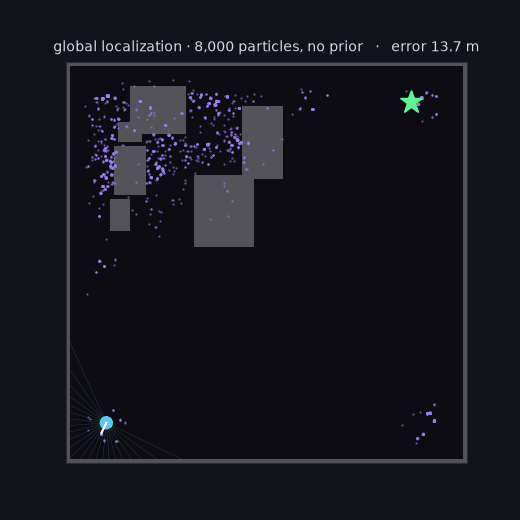
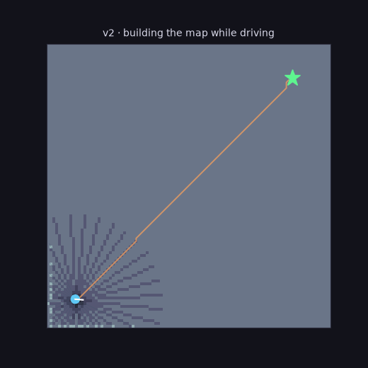
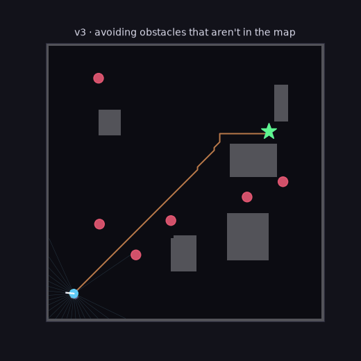
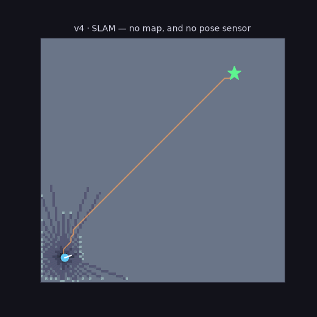

# Capstone · Autonomous 2D Mobile Robot

**Status:** v0–v4 live — at `projects/capstone_nav/` (`python -m eval run --stack ...`). It runs in pure Python and is not packaged for ROS 2; [Module 6](../06-ros2/index.md) teaches the architecture without requiring an installation, and packaging this stack would be a separate exercise rather than planned work.

<div markdown class="grid" style="display:grid;grid-template-columns:repeat(auto-fit,minmax(230px,1fr));gap:0.8rem;margin:1.2rem 0;">
<figure markdown style="margin:0">
{ width="100%" }
<figcaption markdown>**Global localization** — 8,000 particles from a uniform prior collapsing to 0.2 m</figcaption>
</figure>
<figure markdown style="margin:0">
{ width="100%" }
<figcaption markdown>**v2** — the world is unknown; the map is carved out by lidar while driving</figcaption>
</figure>
<figure markdown style="margin:0">
{ width="100%" }
<figcaption markdown>**v3** — six movers that aren't in the map, avoided by DWA</figcaption>
</figure>
<figure markdown style="margin:0">
{ width="100%" }
<figcaption markdown>**v4** — SLAM: the map is being built by a robot that doesn't know where it is</figcaption>
</figure>
</div>

**This is an assignment, not a demo.** `projects/capstone_nav/student_stack.py`
is the starter — it carries the stack contract, the build order, and which
version is allowed to look at what. `python -m eval run --stack student_stack`
is the autograder. The five reference stacks live in `solutions/`; reading them
is not cheating, but attempt each version first, because the
[engineering log](../../capstone-log.md) only means something to someone who
has been stuck.

These are rendered from **real evaluation episodes** (`python render.py all`) — the same code path `python -m eval run` scores. Whatever the robot does here is what it does when it's being graded.

| Stack | What it assumes | Result |
|---|---|---|
| **v0** `reference_stack` | Known map, noisy pose sensor | 20/20 episodes |
| **v1** `pf_stack` | Known map; **localizes from lidar** (pose sensor only seeds the belief) | 20/20, 6–11 cm RMSE |
| **v2** `mapping_stack` | **Nothing but the goal** — builds the map online from scans | 20/20 |
| **v3** `dynamic_stack` | Six **moving obstacles that are not in the map** — DWA local planning + dynamic-beam rejection | 18/18, 17/18 collision-free |
| **v4** `slam_stack` | **SLAM** — no map *and* no pose sensor after step 0; keyframe scan matching | 18/24, 0.39 m RMSE ([own envelope](#v4)) |

Each stage keeps the same evaluation contract, so the metrics are comparable across the whole climb:

```bash
python -m eval run --episodes 8 --stack dynamic_stack --dynamic 6
```

**v3's envelope, measured:** at 6 movers it is 18/18; at **10 movers it still reaches every goal but is collision-free only half the time.** That boundary is published rather than tuned away — and it's partly an artifact worth naming: these obstacles are non-cooperative, walking straight through the robot in a way real people don't.

<h3 id="v4">v4's envelope, measured</h3>

v4 gives up the pose sensor entirely and localizes by matching each scan against the map it is simultaneously building. It keeps v2's navigation **verbatim** — the only thing that changes is where the pose comes from — which makes the comparison clean: the same robot, given a pose sensor, scores 24/24.

| | success | collision-free | path ratio | loc RMSE |
|---|---:|---:|---:|---:|
| v2, handed a pose sensor | 1.000 | 1.000 | 0.94 | 0.14 m |
| **v4, SLAM** | **0.750** | **0.792** | **0.982** | **0.387 m** |

Doing it yourself costs a quarter of the episodes, and the arithmetic is not subtle: 0.39 m of drift against a **0.5 m goal tolerance** means a quarter of runs park just outside it *believing they arrived*. So v4 is scored against its own envelope rather than the bar written for stacks that were handed a map or a pose:

```bash
python -m eval run --episodes 24 --stack slam_stack --rubric slam
```

That gap does not close by tuning — it closes with **loop closure** ([lesson 4.4](../04-mapping/04-pose-graphs.md)), which v4 does not have. The [ablation harness](../../capstone-log.md#capstone-v4-slam-no-map-and-no-pose) shows why: under a systematic odometry bias, scan matching bounds the drift (2.31 m) but cannot remove it, because the map and the pose drift *together* and stay perfectly self-consistent.

Read the [engineering log](../../capstone-log.md) for the thirteen debugging campaigns behind those numbers, and [lesson 10.1](../10-evaluation/01-statistical-rigor.md) for what "18/18" does and does not entitle you to claim.

Everything in v0.1 integrates here: a simulated differential-drive robot with noisy wheel odometry and a range sensor, running

- particle-filter **localization** (Module 3)
- occupancy-grid **mapping**
- A* **global planning** and trajectory following with **PID control** (Module 5)
- packaged as **ROS 2 nodes** with TF, launch files, and bag logging (Module 6)

## Evaluation

The capstone is judged the way a real autonomy stack is judged — quantitatively:

| Metric | Definition |
|---|---|
| Goal success rate | fraction of runs reaching the goal within tolerance |
| Collision rate | collisions per run across randomized worlds |
| Localization RMSE | estimated vs ground-truth pose |
| Planning time | per-replan latency |
| Control error | cross-track error along the executed trajectory |
| End-to-end latency | sensor timestamp → actuation command |

Deliverables: architecture diagram, results table, failure analysis, demo video, reproducible Docker environment.
